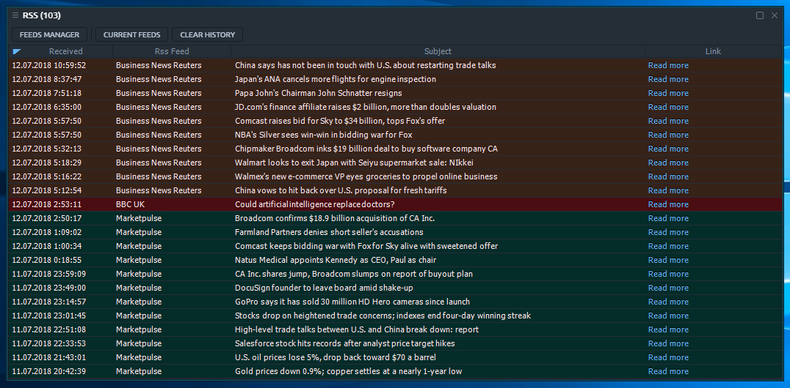

# RSS

### How to connect RSS

At first go to connection manager and find RSS connection

### Custom RSS channel

If necessary, you can add any nes source. To do this, specify a link to this source in the connection settings. Here you can see the list of currently available feeds. You can change the name or URL per each feed item. In case you would like to add a new feed, just press the **\[ + \]** button on the right top corner of feeds manager. This will add a blank row to the feeds list, where you can set up the required feed access settings.

This panel can be easily bond with others and also can be modified and saved as Template for further usage.

When you open RSS panel for the first time, you won’t have any feeds available in settings, so you will see the welcome screen where you can decide: whether you wish to set up your feeds list by yourself \(**\[FEEDS MANAGER\]** button\) or start usage by importing one of the proposed feeds.

If you decide to import the proposed feeds, just check the ones, you would like to import and press the **\[LOAD\]** button. After that, the selected feeds will be imported into your panel’s settings, and you will get to the news view.

## Feeds manager

In case you want to set up your personally favored feeds — use the Feeds manager \(it is situated on the corresponding tab of RSS panel settings\).


If you set up the incorrect feed URL, you will not see its news. Please be careful with providing the correct URL to RSS 2.0 feed.



You can import Twitter feed in RSS format via various converters \(for example [https://twitrss.me](https://twitrss.me)\)


## Manage news list

Once you have at least one feed in your settings, you will be able to see its news right in RSS panel's table. The table management is as default.

You will find some useful hot buttons on the panel's toolbar. **\[ FEEDS MANAGER \]** button opens a corresponding screen. **\[ CURRENT FEEDS \]** button allows you to filter the viewable news by the feeds. To hide some items from particular RSS feed — just uncheck it in Current feeds list.

The **\[ CLEAR HISTORY \]** button removes all of the previously imported news from the table.


You may apply the Table actions to the RSS panel. It can be convenient to color some rows, containing the particular word or by the feed source.


