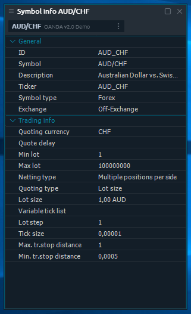
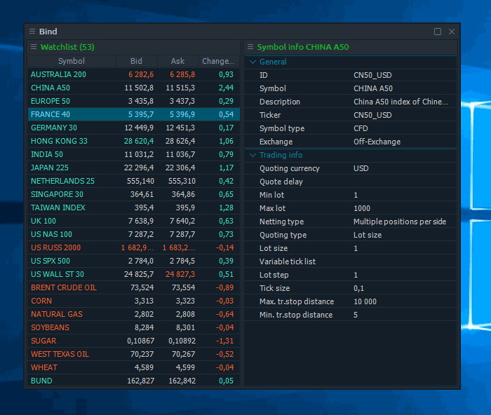

# Symbol Info

This panel shows the detailed information about the selected Symbol. The list of parameters varies depending on Vendor and Symbol type.

You can link this panel with others to synchronize the Symbol select. It works well in bind with Watchlist, Chart, and other Symbol-related panels.


A good practice is to link the Symbol info panel with watchlist and hide the toolbar containing Symbol lookup field. Thus you receive the watchlist with detailed info per each symbol.


