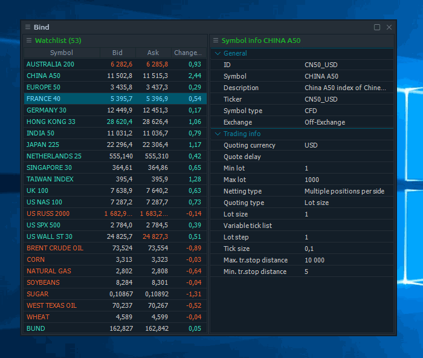

# Symbol Info

This panel shows detailed information about the selected Symbol. The list of parameters varies depending on the data provider (broker or data feed) and Symbol type.

<figure><figcaption>
Info about NQ futures symbol
</figcaption></figure>

You can link this panel with others to synchronize the Symbol selection. It works well in bind with Watchlist, Chart, and other Symbol-related panels.


A good practice is to link the Symbol info panel with watchlist and hide the toolbar containing the Symbol lookup field. Thus, you receive the watchlist with detailed info for each symbol.


