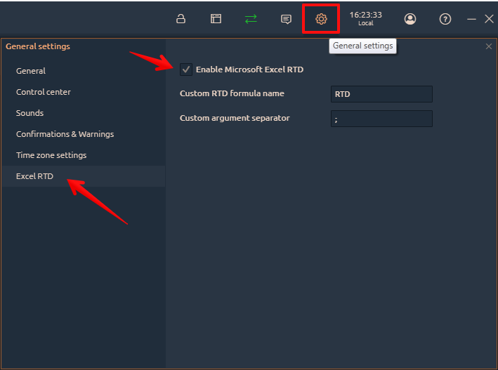
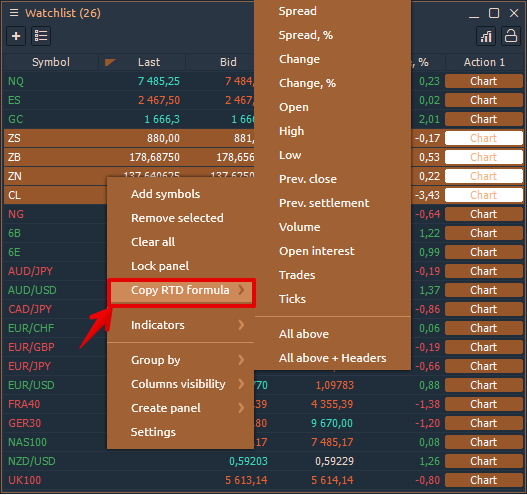
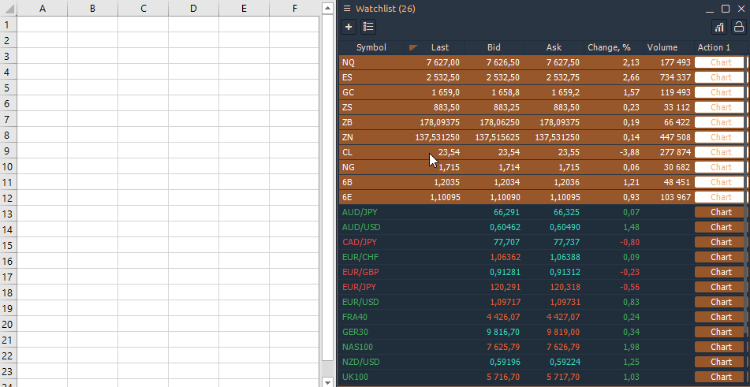
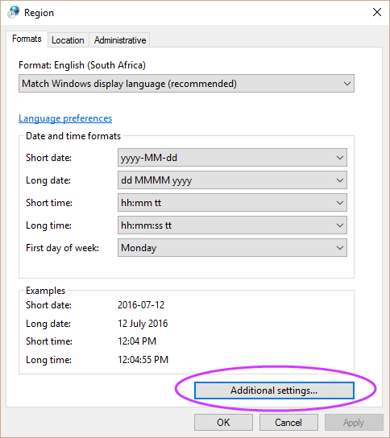
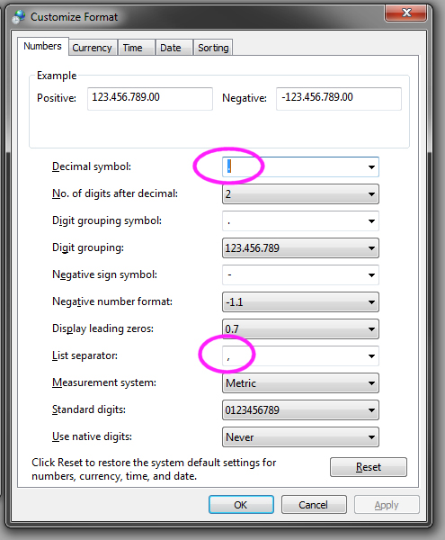

# Excel and RTD function

Start from version 1.39 Quantower supports **Real-Time Data \(RTD\)** for sending data and other market information to Microsoft Excel®. This feature opens up many opportunities for creating custom displays and other ways to better manage your workflow. 

RTD is a newer protocol that offers several advantages over DDE, including more flexibility and better performance and reliability.

We prepared the spreadsheet that outlines the basic syntax of RTD formulas with details more complex formulas. Included is a collection of popular RTD formulas, which you can simply copy and paste into your own spreadsheet. [**Download the sample file**](https://updates.quantower.com/misc/RTD/rtd_samples.xlsx)**.**

Here is the General Syntax for getting symbol info via RTD function:




## **How to activate RTD function in Quantower platform**


For the function to work properly, **Quantower platform and Excel must have the same version — 64 or 32 bit**


Launch Excel and after open the Task Manager to check the version of Excel \(32-bit or 64-bit\). The platform should have the same version in order to work with RTD function correctly.


Go to the [**General Settings**](../../general-settings/general-settings-1.md) of the platform, then to _section **Excel RTD**_ and tick off _**"Enable Microsoft Excel RTD"**_



Also in the settings, there are two important settings:

* **Custom RTD formula name** — depending on the language of your operating system, the name of the RTD function in Excel may be called differently. The original name of the function in the English version of Excel is RTD, but for the Russian version it's called "ДРВ".
* **Custom argument separator** — the separator that participates in the formula. It depends on the localization of your operating system. Get to know [how to check argument separator in your system](./#how-to-check-argument-separator).

## How to get the instrument data from Quantower?

### 1. Getting data through copying a formula

The easiest way to get data to Excel is to copy the necessary data through the panel context menu. For example, after activating RTD, an additional item in the context menu will appear in the Watchlist panel — **Copy RTD Formula**.

* Select a necessary symbol or multiple symbols, right-click and select **Copy RTD Formula**. You can copy formulas for specific columns or for all columns.



* Go to Excel and paste the copied formulas. Now the data will be updated automatically.




You may notice that the data is updated with some delay. This is a throttling interval that is set by default in Excel \(2000 milliseconds\). If you want to [increase the speed of updating data, read the instructions on how to do it](https://help.quantower.com/miscellaneous-panels/excel-rtd-trading/changing-rtd-throttle-interval-in-excel).


### 2. Getting data through writing a formula

When retrieving instrument data using RTD, you need to specify the ID of the instrument and the properties you want to retrieve.

RTD formula uses the following basic structure:

```text
=RTD("TradingPlatform";"";"Param1";"Param2";"Param3";....")
```


The second parameter is the name of the external server running the RTD Server. As the Quantower RTD Server always runs locally, you must omit a value for the second parameter or supply an empty string \(“”\). However, you must account for the parameter in the formula.


## **Frequently Asked Questions**

### **How to check argument separator?**

For Windows 10: 

* go to **Start &gt;type Control Panel  and press enter &gt; Region**
* click **Additional Settings**
* for **List Separator** check the argument. ****It must be the same as in RTD settings.





