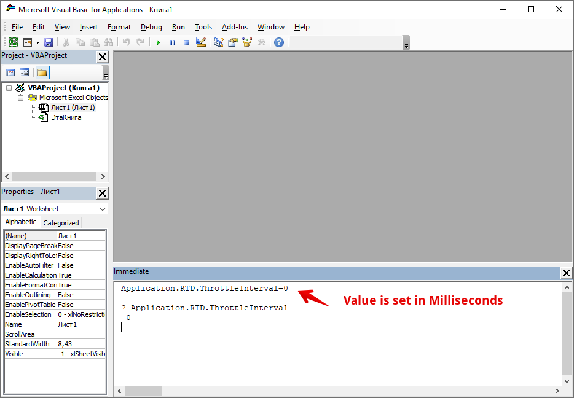

# Changing RTD Throttle Interval in Excel

The default throttle interval is set at 2000 milliseconds. To change it in the Excel, please follow steps below:

1. In Excel, go to the Visual Basic Editor by pressing **ALT + F11**.
2. Open the **Immediate Window**  and type this code:  **`Application.RTD.ThrottleInterval=0`**  \(**Note**: If the **Immediate Window** is not open, press **CTRL + G** to display the window.\)
3. Make sure your cursor is on the line that you just typed and then press **ENTER**. \(**Note**:  The '**\(0\)**' can be amended to adjust the desired rate.\)
4. To verify that it is set correctly, type this line of code on the **Immediate Window**:  
  
   **`? Application.RTD.ThrottleInterval`**

5. Make sure your cursor is at the end of this line and then press **ENTER**. The window should display 0; then you know that your throttle interval is set correctly.


Throttle Interval Value is set in milliseconds \(!\)


