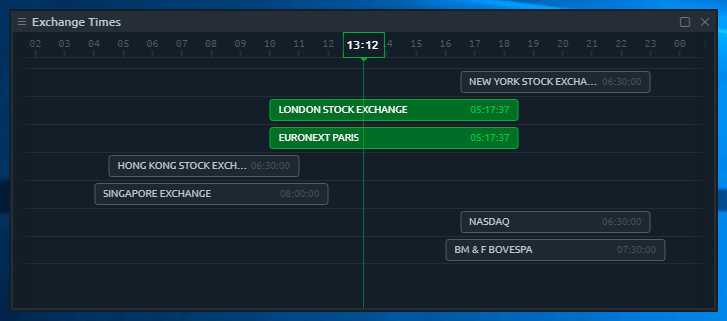
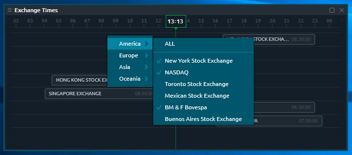

# Exchange times

## General

Many traders are watching several Exchanges in different time zones and need to convert their local time to Exchange time and back many times.

Currently, it allows to select any number of items from the list of 44 exchanges \(from America, Europe, Asia & Oceania\) and reorder them as you like. Each active item has “Name” & “Time last” values, while closed Exchanges has “Duration time” value together with “Name”.

_**Time last**_ — shows how much time left until the Exchange will be close for trading.   
_**Duration time**_ — shows how much time this Exchange is usually opened for trading.

## Add/remove

You can manage the list of exchanges as you like. Right-click on any visible exchange tile and select the required action to perform: 

* _**Move to the top**_. Places this exchange on top of the list. 
* _**Hide this bar**_. Hides exchange from list.

You may also add another exchanges from the list of available. Right-click on any place within panel and find the group of geo-categories: America, Europe, Asia, Oceania. Each category contains the list of corresponding Exchanges, that can be switched on/off by clicking on them. The list of exchanges can be changed later.

