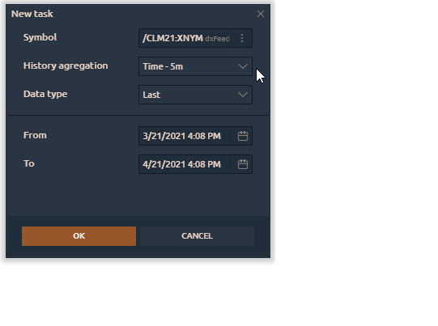

# History Exporter

This panel allows traders to download any available history data for any available symbol on their connection and save it in CSV format. You can use it for offline analysis in Excel or similar applications, for comparison or merge with other parts of history.

* \*\*\*\*[**How to export historical data via the History Exporter panel?**](history-exporter.md#how-to-export-historical-data-via-the-history-exporter-panel)\*\*\*\*
* \*\*\*\*[**How to export historical data via other panels?**](history-exporter.md#how-to-export-historical-data-via-other-panels)\*\*\*\*
* \*\*\*\*[**How to open a downloaded file?**](history-exporter.md#how-to-open-a-downloaded-file)\*\*\*\*

## How to export historical data via the History Exporter panel?

To export historical data to an external CSV file, please open the **History Exporter panel** from the main platform menu.

After you run this panel, you will be prompted to **Create a New Task** to export data.

Select the required instrument, timeframe, data type and date range for export.

You can add multiple symbols for exporting with different chart aggregation, data types and from different brokers or data feeds.

You can start loading only one selected or all symbols at once. The loading process is displayed on the status bar. If the download process takes a lot of time, you can click the **Pause** button to stop the download process. To remove a symbol from the list of tasks, click on the **Trash** icon.

You can also edit the settings for a selected symbol, like the data type or loading range, by clicking on the **Gear** icon.


You will not be able to change the settings of a task if it is already in the process of loading or paused. In this case, it must be removed from the list of tasks and re-add the required symbol with different settings.


## How to open a downloaded file?

Once the data export is complete, click on the **Folder** icon to view all downloaded files.

## How to export historical data via other panels?

By using Export data via the menu of Chart and other table panels \(Watchlist, T&S\) you can save the data to an external CSV file. You can save Price data, indicator values, values in tables.

After clicking the **Export data** option, a setting window will appear in front of you, where you can specify the data type for export, as well as the format of the external file:

Once all the necessary data is selected, click on the **Export file** button and specify a name and location for saving the file.

