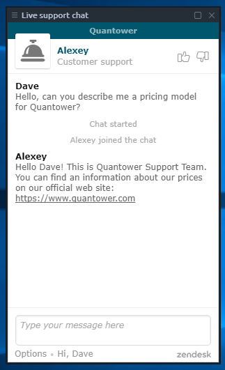

# Live Support

If you faced any troubles or questions while using terminal feel free to ask Quantower Live support about it. You can do it several ways:

* Live support panel in terminal 
* Live support on website [https://www.quantower.com](https://www.quantower.com) \(good for cases, when you have problems with application launch or don’t have one installed yet\)

The Live support panel in Quantower application is built in order allow integration of support channel into your workspace. This panel can be easily bond with others.

Once opened a panel you will get to the queue list for support and our managers will answer you as soon as possible. You may email the chat dialog to yourself using the “Options” button on the left bottom corner.

