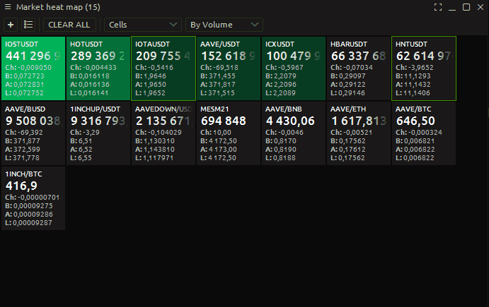

# Market Heat map

### What is the quantower Heat map

You can use these maps as an investment research tool to view the performance of various market indices, sectors, asset classes or individual stocks. You can compare the stock market of a particular country with that of another country.

Given the wide variety of data these maps provide, the data values are presented in different colors to help you quickly understand the information.

In addition to their attractive appearance, Quantower market heat maps have features that make investment research both informative and interesting

### How Quantower heat map works.

To get started, you need to specify which symbols or markets you are going to work with. You can choose a single symbol or all of the symbols at a given broker. I chose a few symbols at random to show you how it works.

You can change the Quantower heat map display. Setup - Threemap shows the fastest symbols with the largest size. The Sells setting sorts the symbols from largest to smallest value

You can choose the type of sorting by largest volume or percentage change.

