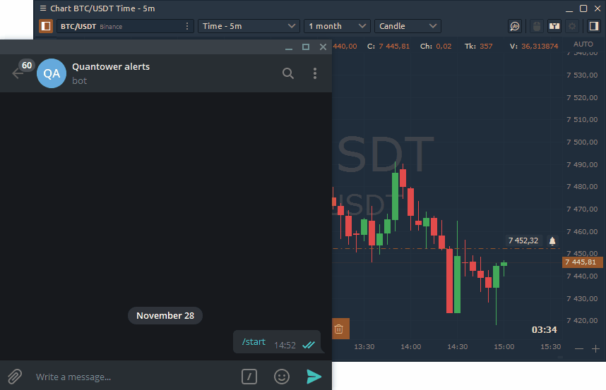

# Quantower Telegram Bot

Quantower Alert Bot will send a message to your Telegram account about all events that you set in the platform. For example, set a price alert on the chart, and when the price will reach this level, a notification to the messenger will be sent.

## How to add Telegram Bot to your account?

To add a bot to the Telegram, open the platform's **General Settings -&gt; Messengers -&gt; Duplicate alerts to Telegram**.

1. Specify your personal chat ID, which you can find out by clicking on the **Get ID** button. 
2. A new Chat ID Echo bot will open and it will show _**"Your Telegram Chat ID is: xxxxxxx".**_ Enter your chat ID in the corresponding field
3. Connect to the Quantower Alert Bot.

## How to get notifications from Telegram Bot?

Telegram Bot sends notifications about alerts that you have set on active Charts or through a Watchlist. If you don't have any alerts yet, the bot will be in standby mode.

Once your alert is triggered, you will receive a telegram notification with the following text: 

_**"Alert on ENQM21: price 13,379.00 reached."**_

If you activate the '**Duplicate Trading Notifications to Telegram'** option, all trading messages will be automatically forwarded to Telegram.

