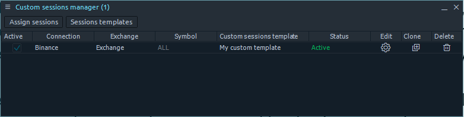

# Sessions manager

***

* <mark style="color:blue;">**General information**</mark>
* [**How to create a new session template**](sessions-manager.md#create-sessions-template)
* [**Assign the template to symbols/connections**](sessions-manager.md#assign-the-template-to-symbols-connections)
* [**Manage session assignments**](sessions-manager.md#manage-session-assignments)
* [**Apply the template via the panel settings**](sessions-manager.md#apply-the-template-via-the-panel-settings)
* [**How to set custom trading sessions for futures on CQG, Rithmic?**](sessions-manager.md#how-to-set-custom-trading-sessions-for-futures-on-cqg-rithmic)
* [**How to show/hide ETH or RTH sessions on the chart?**](sessions-manager.md#how-to-show-hide-eth-or-rth-sessions-on-the-chart)

***

## General information

You can find a new Sessions manager screen in the **Miscellaneous** section of Quantower's control center. Once launched, you will see a table where Quantower will display the list of custom sessions assignments. Initially, we added only two sessions for AMP and Rithmic connection for the most popular symbols (ES, NQ, etc.). Generally, Sessions manager functionality is based on the work with sessions templates — creation and assignment — so its flow is simple: create a template and then assign it to some symbol (exchange, connection).

 (2) (1) (1) (1).png>)

## Create sessions template

<figure><figcaption></figcaption></figure>

Click the <mark style="background-color:blue;">**Sessions templates**</mark> button on the toolbar and <mark style="background-color:blue;">**Create new**</mark> to open the Session template creation screen. Here you can set up a new template's parameters, such as:&#x20;

* Sessions template name
* Timezone&#x20;
* sessions list&#x20;
  * session name&#x20;
  * type: pre-market, main, post-market&#x20;
  * start and end time days of the week when is valid

You may create as many sessions per one template as you need, but be attentive to avoid intersection sessions (the platform will notify you about it). Once you finish setting the session template, click the <mark style="background-color:blue;">**Save**</mark> button and proceed to the assignment process.

## Assign the template to symbols/connections

.png>)

To assign previously created templates to some symbol, you need to call the Sessions assignment screen by clicking the "Assign sessions" button on the toolbar. The following screen allows you to specify the "accuracy" of the assignment based on the symbol's hierarchy levels:

* Connection (all connections or the specific one)&#x20;
* Exchange (all or specific exchanges of the selected connection)&#x20;
* Symbol (all or specific symbols of the selected exchange of the selected connection)

## Manage session assignments

Next, select the Sessions template to assign and click the "Assign" button. From this moment, you will find a new row in a Sessions manager screen, stating that there is an active custom sessions assignment available in your Quantower. Here you can:&#x20;

* quickly Enable/Disable this assignment (using the checkbox) and see how the corresponding Status column value changes;&#x20;
* open the assignment parameters;&#x20;
* create a copy of the current assignment and modify it;&#x20;
* completely delete some assignments.

**To edit the Sessions templates**, click the corresponding button and find them below the "Create new" option in the context menu. By clicking on the existing template, you will find its editing screen and the possibility to update or delete it.

## Apply the template via the panel settings

.png>)

While the above workflow is about the centralized session's assignment, we left a possibility to quickly assign some sessions templates on a panel basis. Just open the panel's settings and find the Custom session parameter (usually in the General section). Initially, it is set up to Default mode, meaning that the panel will use the Sessions manager setting or the defaults provided by the vendor. Still, you can easily override it and use any available sessions template (use the Sessions manager to manage your templates).

The new Sessions Manager screen significantly raises the level of custom session control, bringing you outstanding possibilities and ease of use. We put considerable effort into covering possible scenarios of using the custom sessions but are still sure that you can find even more ideas on this functionality, so please share them in the comments or write on our socials.

## **How to set custom trading sessions for futures on CQG, Rithmic?**

Due to the fact that data providers do not provide information about trading sessions for trading assets, traders may face the problem of incorrect display of [volume analysis data](../analytics-panels/chart/volume-analysis-tools/) for **Regular trading hours (RTH)** and for **Electronic trading hours (ETH)**. To solve this problem, a trader can set up the necessary sessions for an individual instrument, exchange, or the entire connection to the provider.

As an example, let's set the time of RTH and ETH sessions for CME Indexes:

* Open Sessions Manager panel in the Misc section
* Click the <mark style="background-color:blue;">**Sessions templates**</mark> button on the toolbar and <mark style="background-color:blue;">**Create new**</mark> to open the Session template creation screen.

 (1).png>)

* Set up a new template's parameters, such as: **Template's name, Timezone, Session's name, Time** and **Days.** Once you finish setting the sessions template, click the <mark style="background-color:blue;">**Save**</mark> button.



<figure><figcaption>
Custom trading session for CME Indexes for Regular Trading Hours (Central Time)
</figcaption></figure>



<figure><figcaption>
Custom trading session for CME Indexes for Electronic Trading Hours (Central Time)
</figcaption></figure>



<figure><figcaption>
Custom trading session for CME Indexes for Full trading day (ETH+RTH) (Central Time)
</figcaption></figure>



To assign previously created templates to some symbol, you need to call the Sessions assignment screen by clicking the <mark style="background-color:blue;">**Assign sessions**</mark> button on the toolbar.

 (1).png>)

* Apply or switch between different sessions on desired panels (chart, DOM trader, TPO etc.). Just open the panel's settings and find the <mark style="background-color:blue;">**Custom session**</mark> parameter (usually in the General section).

.png>)

## **How to show/hide ETH or RTH sessions on the chart?**

Sometimes, you may want to display data on the chart only for **RTH (Regular Trading Hours)** or **ETH (Extended Trading Hours)** session and hide all data that falls outside the specified session time. To do this, open the chart settings, go to the View section, and **uncheck the "**<mark style="background-color:green;">**Show out of session history**</mark>**"** option. This way, you'll see only the data relevant to the selected session.

<figure><figcaption>
Uncheck the <strong>"Show out of session history"</strong> option to display RTH or ETH session
</figcaption></figure>
