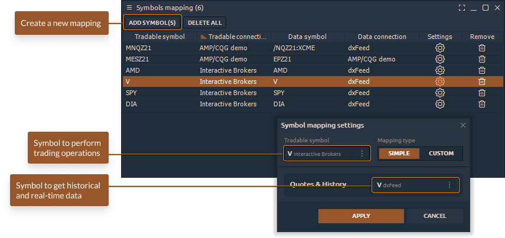

# Symbol Mapping Manager

For example, Interactive Brokers doesn't provide the necessary data for using Cluster chart. But a trader can use dxFeed data provider which offers such data and a trader can use it for trading on IB. Watch the video for more details



### General overview of Symbol Mapping panel

The panel is a table where the trader adds symbols for trading, and also selects from which connection and which symbol to receive quotes for analysis. After creating a mapping, the trader must open the chart of the symbol that he will trade (for example, from Interactive Brokers connection). In this case, all data for this symbol will come from the second connection (for example from IQFeed or from dxFeed).

### How to create a mapping between two symbols?

* Launch the **Symbol Mapping** panel from the Control Center. The panel is located in the _Misc_ category.

 (1) (1).png>)

* Add a symbol where all trade operations (orders, positions) will be sent.

 (1) (1) (1) (1) (1) (1).png>)

* Select the symbol for getting historical and real-time data (Level1 and Level2)

 (1) (1) (1) (1) (1).png>)


_**Mapping Type has two modes:**_

**Simple mode** where you can select 1 symbol for all real-time quotes (Level1 and Leve2 data) + Historical data (bars and volume)

**Custom mode** where you can select different symbols for different quotes and historical data. For example, you can set the real-time data from one data provider, but historical data from another source.



* After the mapping of symbols is set up, you need to open the trading panel with the desired symbol to start trading

 (1) (1).png>)
