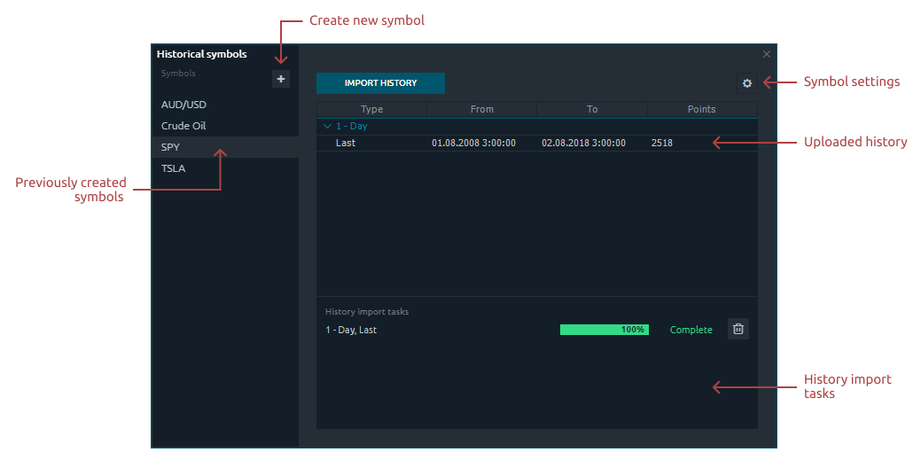
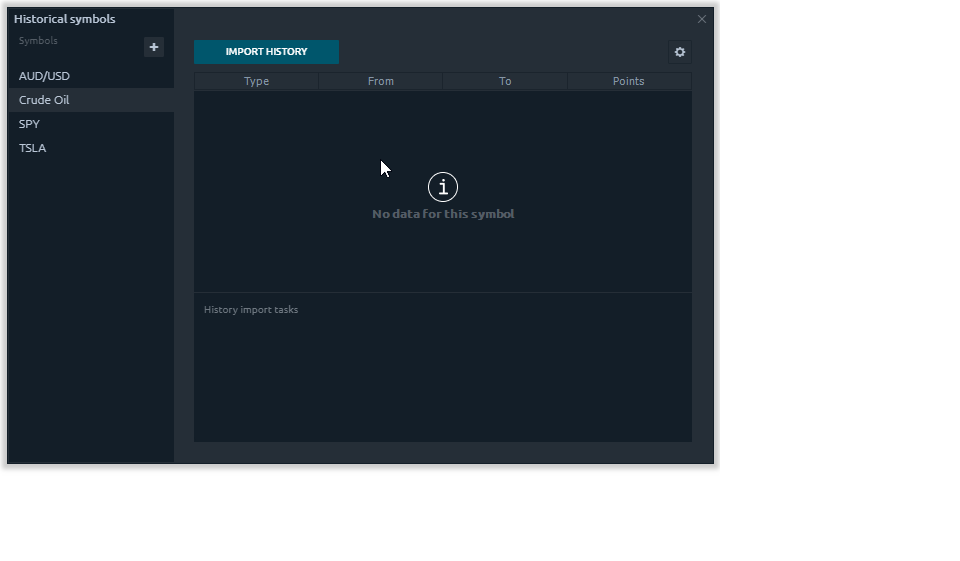
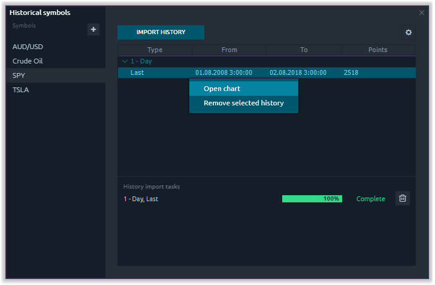
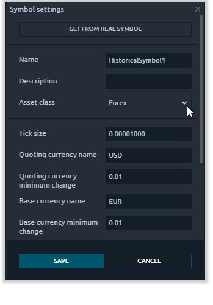

# Historical Symbols

If you need to import trading quotes to Quantower from a third-party data provider for performing a backtest or technical analysis, Historical Symbols will be indispensable in this case. For example, you can download any price data from Quandl, IQFeed, NASDAQ or Yahoo and test your trading idea on them.

Let's take a brief look at how it works.

### How to add a new historical symbol?

* First, you need to [configure parameters](https://help.quantower.com/portfolio-panels/historical-symbols#symbol-settings) of the symbol that you want to load. If you want to perform backtesting, it is important to correctly set all the parameters - asset class, tick size, etc. You can borrow parameters from an existing symbol.
* Import historical quotes from a .csv file or from an existing symbol. For example, download the trading history of Crude Oil from Quandl.

* Press “Import History” button, select “Import from file” and specify the path to the required file.
* After you have imported the file, you need to parse it. In the settings, carefully select the Separator, Date / Time format, specify all the necessary columns \(OHLC, Volume\).


You can modify **Date/Time** format manually according to format in the file.


* Select the aggregation \(Tick, Minute, Day\) and the data type \(Ask, Bid, Last\) at the bottom of the table.
* After the import is completed you can work with this history -  performing a backtesting through History Player or make your technical analysis.

To view the chart of the imported history right from the Historical Symbols panel, right-click on the data line and open the chart.


If the chart does not load, check the selected Data type on the chart. It must match to the loaded history.


### **How to change or remove a historical symbol?**

To change a trading symbol settings, you need to select the desired symbol and click on the gear icon.

To delete a trading symbol, you need to select the required symbol and click on the trash bin icon. You can also delete only the imported history for the selected symbol. To do this, right-click on the imported data and select _**"Remove selected history"**_.

### Symbol settings

To correctly perform the backtesting, you need to configure parameters of the symbol that you want to load. If the requiring history refers to the existing trade symbol in Quantower, then the settings can be simply borrowed by pressing _**“Get from real symbol”**_ button.

| **Name** | The name of the loading symbol. It can be a ticker or a name that you understand. |
| :--- | :--- |
| **Description** | Brief description of a symbol or its full name |
| **Asset Class** | Available asset types - Forex, CFD, Equities, Futures, Crypto |
| **Tick size** | It’s a minimum price fluctuation of the selected trading symbol |
| **Base currency name** | The name of the base currency for the loaded symbol \(USD, EUR, CHF\) |
| **Base currency minimum change** | It’s a minimum price fluctuation of the selected trading symbol in money value per tick.  |
| **Quoting currency name** | The name of the quoting currency for the loaded symbol \(USD, EUR, CHF\) |
| **Quoting currency minimum change** | It’s a minimum price fluctuation of quoting currency for the selected trading symbol in money value per tick. |
| **Quoting type** | Available quoting type - Lot size, Tick cost |
| **Lot Size** | The minimum available trade size for placing an order. For example, for currencies the standard lot is equal to 100,000 units of the base currency. |
| **Lot Step** | The minimal step of changing the trading lot. For FX market lot step = 0,01 or less. For futures lot step = 1 |
| **Min Lot** | The minimum number of lots available for trading |
| **Max Lot** | The maximum number of lots available for trading |

  

