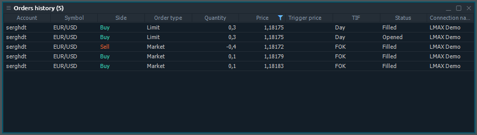
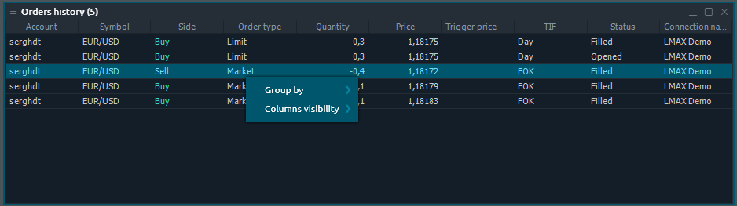

# Orders History

 Order History panel is related to Portfolio group of Control Center sidebar.

## Available columns

| **Account** | login name of an account that made a trade |
| :--- | :--- |
| **Symbol** | A traded symbol |
| **Description** | Comments for symbol |
| **Symbol type** | A symbol's market category \(CFD, spot, stocks, etc.\) |
| **Expiration date** | Date of contract expiration |
| **Strike price** | Price of option contract performance |
| **Side** | Type of trade \(BUY or SELL\) |
| **Order type** |  |
| **Quantity** | Amount of a order, either in lots or in units, depending on what is selected in the Settings dialog box |
| **Price** | Price at which the order was executed. |
| **Trigger Price** |  |
| **TIF** | The order's time in force |
| **Status** | Order status |
| **Date/Time** | Date and time when a order was placed |
| **Order ID** | A unique number that the trading system assigns to each order |
| **Order group ID** |  |
| **Connection name** |  |

## Context menu actions

By right-clicking on each row of Order History panel, you will get a context menu with the following functions:

### Common actions

| **Group by** | Groups all rows by the selected column |
| :--- | :--- |
| **Columns visibility** | Allows to toggle the columns visibility |

