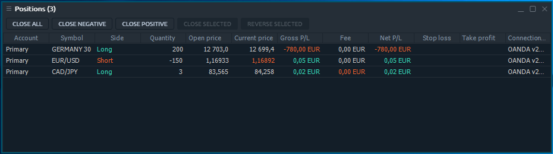
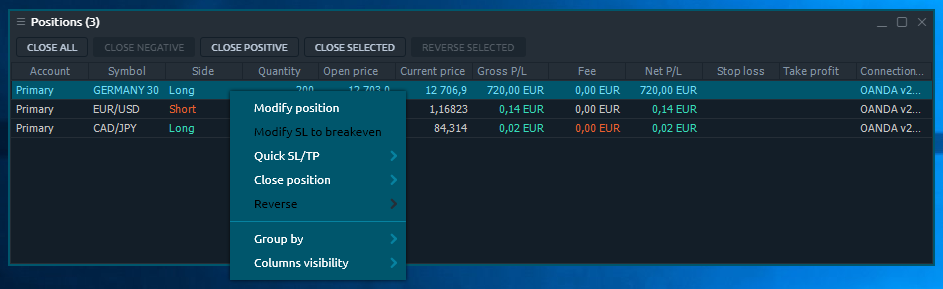

# Positions

Positions panel displays all currently opened positions. Once you open a new position, it appears in this panel and becomes available to be managed. Positions panel is related to Portfolio group of Control Center sidebar. 

## Available columns

| **Account** | login name of an account that opened a position |
| :--- | :--- |
| **Symbol**  | a traded symbol |
| **Description** | comments for symbol |
| **Symbol type** | a symbol's market category \(CFD, spot, stocks, etc.\) |
| **Expiration date** | date of contract expiration |
| **Position ID** | a unique number that the trading system assigns to each position |
| **Side**  | type of trade \(BUY or SELL\) |
| **Open price** | price at which a position was opened |
| **Current price** | a market price obtainable from a broker |
| **Quantity** | amount of a position, either in lots or in units, depending on what is selected in the Settings dialog box |
| **Date/Time** | date and time when a position was opened |
| **Gross P/L** | profit/loss in account currency, calculated on base of price difference |
| **Gross P/L, ticks** |  |
| **Net P/L** | profit/loss for a position excluding fee |
| **Position exposure** | exposure of a position, in the account currency. Calculated on base of an open price |
| **Position value \(open price\)** | open value of a position. Calculated on base of an open market price |
| **Position value \(current price\)** | current value of a position. Calculated on base of a current market price |
| **Fee** | shows total commission amount taken for a position |
| **Swaps**  | amounts collected/paid out by a broker when a position is rolled over to a new value date |
| **Expiration date** | date of contract expiration |
| **Strike price** | price of option contract performance |
| **Stop loss** | Stop loss price set for a position |
| **Take profit** | Take profit price set for a position |

## Context menu actions

By right-clicking on each row of Positions panel, you will get a context menu with the following functions:

### Selected position\(s\) actions

| **Modify position** | Invokes the modification screen, allowing to add SL/TP orders to selected position manually |
| :--- | :--- |
| **Modify SL to breakeven** |  |
| **Quick SL/TP** | allows quick adding SL/TP orders to selected position |
| **Close position** | Options: close all selected positions, all positions by selected symbol, all positions for selected account, all positions |
| **Reverse** | allows reversing all selected positions, all positions by selected symbol, all positions by selected account, all positions |

### Common actions

| **Group by** | Groups all rows by the selected column |
| :--- | :--- |
| **Columns visibility** | Allows to toggle the columns visibility |

## Hot buttons toolbar

In order to manage your position efficiently, there is a Hot buttons toolbar in Positions panel. It allows trader to perform the most crucial actions with each, several or all available opened positions in one click. 


Depending on the panel settings, hot buttons can proceed without confirmation screen. Please be careful while using them.


### Hot buttons list

| **Breakeven** |  |
| :--- | :--- |
| **Close all** | closes all opened positions |
| **CLX all** | closes all opened positions and cancels all orders |
| **Reverse all** | reverses all positions |
| **Close negative** | closes the positions with negative P/L |
| **Close positive** | closes the positions with positive P/L |
| **Close long** | closes the positions with Side = Long |
| **Close short** | closes the positions with Side = Short |
| **Close** | closes all positions by selected symbol and account |
| **Close selected** | closes all selected positions |
| **Reverse** | reverses positions by selected symbol and account |
| **Reverse selected** | reverses all selected positions |
| **CLX** | closes opened positions and cancels orders by selected symbol and account |

### Hot buttons visibility

By default, not all of the available Hot buttons are displayed on Positions panel's toolbar. You can manage visibility of that buttons using the context menu: right-click with your mouse and toggle the desired buttons.


Hot buttons are situated on panel's toolbar, so become unavailable once you disable toolbar for specific panel in panel's settings.


