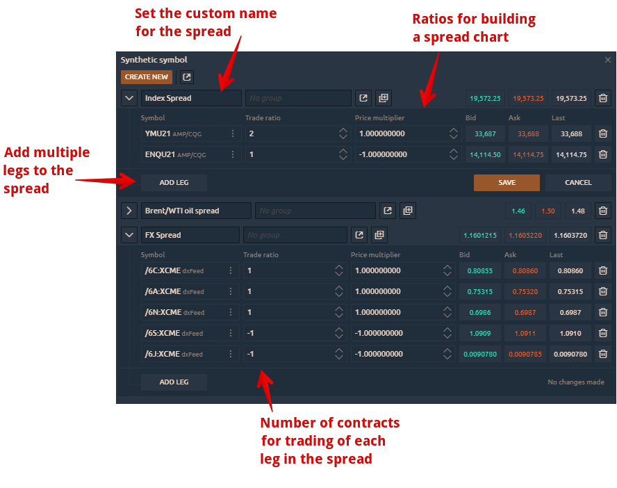
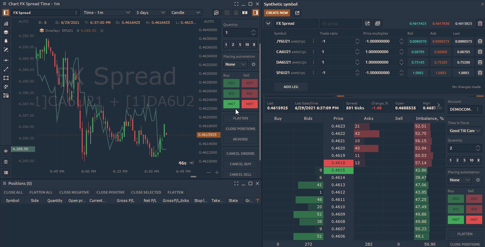

# Synthetic Symbols

### What is Synthetic Symbols

**Synthetic Symbols** panel allows to create any non-standard instruments \(symbols\) or spreads that you can both trade and use as an indicator of the current market situation or market divergences.



Spread trading is a strategy that simultaneously creates a long and short position for different assets, in order to reduce the risk of the entire portfolio. Each side of the spread is called a "Leg", which is necessary to set the weighting factor for, i.e. the number of contracts for buy or sell. A market-neutral position, which does not depend on whether the market will go up or down is obtained with a proper selection of these coefficients.

### How to Create a Custom Spread in Quantower?

For example, let's build an FX spread with multiple forex pairs \(we will use futures contracts on the CQG connection\).

* Open the Synthetic Symbols panel and click "**Create Synthetic**".

* Set the name for your spread and select a trading instrument.

* Click "**Add Leg**" to add another instrument. You can add an unlimited number of instruments by creating new "legs"


**Trade Ratio** these are the number of contracts for trading of each leg in a spread. They are responsible for trading only!

**Price Multiplier** these are the coefficients for building the spread chart. They are responsible for the spread chart view only!


* Set the **Price Multiplier** for each leg to build a chart for our spread. In our example, we set the following ratios:   1 negative coefficient for JY6U21 \(Japanese Yen\)    1 positive coefficient for CA6U21 \(Canadian Dollar\)   1 positive coefficient for DA6U21 \(Australian Dollar\)   1 negative coefficient for SF6U21 \(Swiss Franc\) 
* Click the "**Save**" button to calculate the received spread.

* Open the Chart panel and select your spread from the list of instruments or open the spread directly from the Synthetic symbol panel.

### How to place orders for custom spread?


**Note:** Currently, the platform does not support placing limit orders for synthetic spreads, but only market orders.


When you open a position for a selected synthetic spread, the platform will open positions for each instrument that are included in this spread. The size and the side of the position corresponding to the set values in the **"Trade Ratio"** field.


**Trade Ratio** these are the number of contracts for trading of each leg in a spread. They are responsible for trading only!


