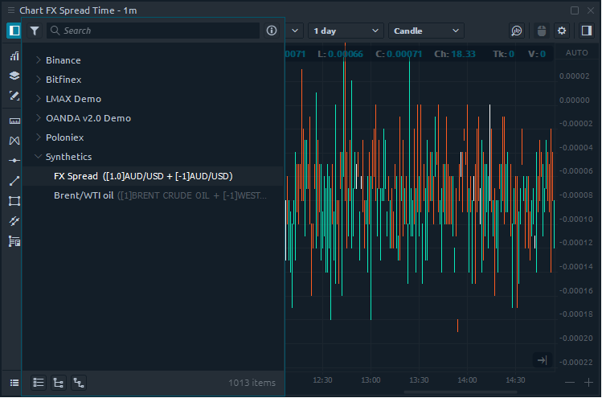
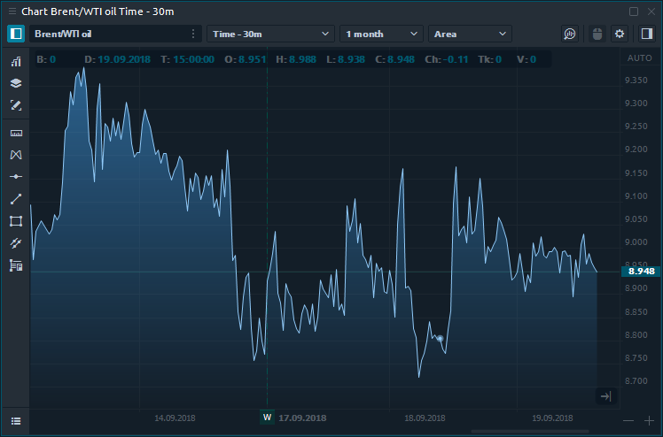

# Synthetic Symbols

### What is Synthetic Symbols

**Synthetic Symbols** panel allows to create any non-standard instruments \(symbols\) or spreads that you can both trade and use as an indicator of the current market situation or market divergences.



Spread trading is a strategy that simultaneously creates a long and short position for different assets, in order to reduce the risk of the entire portfolio. Each side of the spread is called a "Leg", which is necessary to set the weighting factor for, i.e. the number of contracts for buy or sell. A market-neutral position, which does not depend on whether the market will go up or down is obtained with a proper selection of these coefficients.

### How to Create a Custom Spread in Quantower?

For example, let's build a spread between different brokers within the same asset and see if there is a difference in prices. This is a classic example of Broker arbitrage.

* Open the Synthetic Symbols panel and click "**Create Synthetic**".

* Set the name for your spread and select a trading instrument.
* Click "**Add Leg**" to add another instrument. You can add an unlimited number of instruments by creating new "legs"


**Trade Ratio** these are the number of contracts for trading of each leg in a spread. They are responsible for trading only!

**Price Multiplier** these are the coefficients for building the spread chart. They are responsible for the spread chart view only!


* Set the **Price Multiplier** for each leg to build a chart for our spread.  In our example, we set 1 positive coefficient for AUD/USD from the LMAX broker and set 1 negative coefficient for AUD/USD from the OANDA broker. This means that we will subtract the second instrument from the first instrument, i.e. build the difference in prices between them.
* Click the "**Save**" button to calculate the received spread.
* Open the Chart panel and select your spread from the list of instruments.

