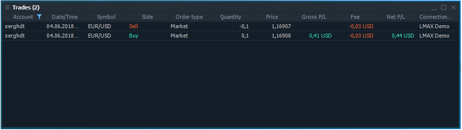
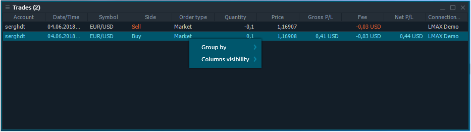

# Trades

Trades panel is related to Portfolio group of Control Center sidebar.

## Available columns

| **Account** | login name of an account that made a trade |
| :--- | :--- |
| **Date/Time** | Date and time when a trade was made |
| **Symbol** | A traded symbol |
| **Description** | Comments for symbol |
| **Symbol type** | A symbol's market category \(CFD, spot, stocks, etc.\) |
| **Expiration date** | Date of contract expiration |
| **Strike price** | Price of option contract performance |
| **Side** | Type of trade \(BUY or SELL\) |
| **Order type** |  |
| **Quantity** | Amount of a trade, either in lots or in units, depending on what is selected in the Settings dialog box |
| **Price** | Price at which a trade was filled |
| **Gross P/L** | Profit/loss in account currency, calculated on base of price difference |
| **Fee** | Shows total commission amount taken for a trade |
| **Net P/L** | Profit/loss for a trade excluding fee |
| **Trade value** |  |
| **Trade ID** | A unique number that the trading system assigns to each trade |
| **Order ID** | A unique number that the trading system assigns to each order |
| **Connection name** |  |

## Context menu actions

By right-clicking on each row of Trades panel, you will get a context menu with the following functions:

### Common actions

| **Group by** | Groups all rows by the selected column |
| :--- | :--- |
| **Columns visibility** | Allows to toggle the columns visibility |

