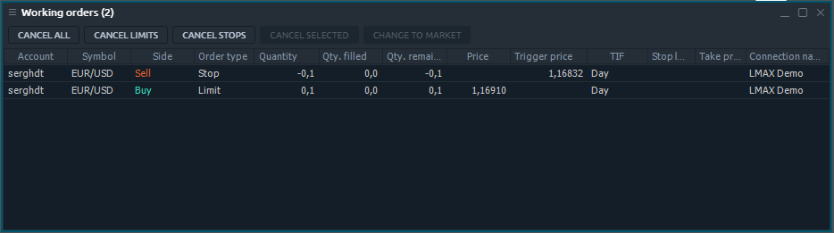
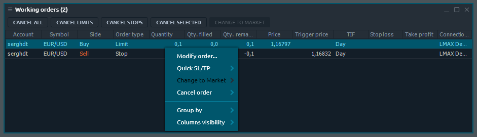

# Working Orders

Once you places a new order, it appears in this panel and becomes available to be managed. Working orders panel is related to Portfolio group of Control Center sidebar.

## Available columns

| **Account** | Login name of an account that placed order |
| :--- | :--- |
| **Symbol** | A traded symbol |
| **Description** | Comments for symbol |
| **Symbol type** | A symbol's market category \(CFD, spot, stocks, etc.\) |
| **Expiration date** | Date of contract expiration |
| **Strike price** | Price of option contract performance |
| **Side** | Type of trade \(BUY or SELL\) |
| **Order type** | Type of order |
| **Quantity** | Amount of a order, either in lots or in units, depending on what is selected in the Settings dialog box |
| **Qty. filled** | Executed quantity of the order, in case of partial filling |
| **Qty. remaining** | Difference between quantity and executed quantity, in case of partial filling |
| **Price** | Price at which the order is to be executed. |
| **Trigger price** |  |
| **TIF** | The order's time in force |
| **Status** | Order status |
| **Current price** | Current market price for order's symbol |
| **Stop loss** | Stop loss price set for a order |
| **Take profit** | Take profit price set for a order |
| **Date/Time** | Date and time when a order was placed |
| **Order ID** | A unique number that the trading system assigns to each order |
| **Order group ID** |  |
| **Connection name** |  |

## Context menu actions

By right-clicking on each row of Working orders panel, you will get a context menu with the following functions:

### Selected order\(s\) actions

| **Modify order** | Invokes the modification screen, allowing to modify orders parameters |
| :--- | :--- |
| **Quick SL/TP** | Allows quick adding SL/TP orders to selected orders |
| **Change to Market** | Change order type to Market for selected orders |
| **Cancel order** | Allows canceling all selected orders, all orders by selected symbol, all orders by selected account, all orders |

### Common actions

| **Group by** |  Groups all rows by the selected column |
| :--- | :--- |
| **Columns visibility** |  Allows to toggle the columns visibility |

## Hot buttons toolbar

In order to manage your orders efficiently, there is a Hot buttons toolbar in Working orders panel. It allows trader to perform the most crucial actions with each, several or all available order in one click.


Depending on the panel settings, hot buttons can proceed without confirmation screen. Please be careful while using them.


###  Hot buttons list

| **Cancel all** | Cancel all orders |
| :--- | :--- |
| **Cancel buy** | Cancel all buy orders |
| **Cancel sell** | Cancel all sell orders |
| **Cancel limits** | Cancel all limit orders |
| **Cancel stops** | Cancel all stop orders |
| **Cancel days** | Cancel all orders with TIF Day |
| **Cancel GTCs** | Cancel all orders with TIF GTC |
| **Cancel selected** | Cancel all selected orders |
| **Cancel &lt;Symbol&gt;** | Cancel all orders by selected Symbol |
| **Modify order** | Show Modify order screen for selected orders |
| **Change to Market** | Change order type to Market for selected orders |

### Hot buttons visibility

By default, not all of the available Hot buttons are displayed on Working orders panel's toolbar. You can manage visibility of that buttons using the context menu: right-click with your mouse and toggle the desired buttons.


Hot buttons are situated on panel's toolbar, so become unavailable once you disable toolbar for specific panel in panel's settings.


