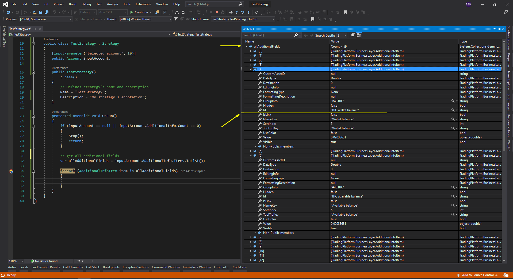

# Access to crypto account and balances

While developing a trading strategy, you will definitely need information about the current balance of the selected account. To get this value, you need to use the **Balance** property of [Account ](https://api.quantower.com/docs/TradingPlatform.BusinessLayer.Account.html)class. 

```csharp
public class TestStrategy : Strategy
{
    [InputParameter("Selected account", 10)]
    public Account inputAccount;
          
    protected override void OnRun()
    {
        if (inputAccount != null)
        {
            Log("Currency name: " + inputAccount.AccountCurrency);
            Log("Balance: " + inputAccount.Balance);
        }
    }
}
```

But what about crypto balances? For example, if we have some crypto connection and we need to get all available balances of ‘BTC’ currency, or ‘ETH’ currency or both. How do we get these values? The answer is ‘Easy”\)

## **CryptoAccount class**

Quantower API supports a special [**CryptoAccount**](https://api.quantower.com/docs/TradingPlatform.BusinessLayer.CryptoAccount.html) class for most crypto connections.  This class is derived from the base [Account](https://api.quantower.com/docs/TradingPlatform.BusinessLayer.Account.html) class and extends its functionality with additional property - [**Balances**](https://api.quantower.com/docs/TradingPlatform.BusinessLayer.CryptoAccount.html#TradingPlatform_BusinessLayer_CryptoAccount_Balances) and special [**BalanceUpdated**](https://api.quantower.com/docs/TradingPlatform.BusinessLayer.CryptoAccount.html#TradingPlatform_BusinessLayer_CryptoAccount_BalanceUpdated) event. In your code, you need to make sure the account you choose implements the [**CryptoAccount**](https://api.quantower.com/docs/TradingPlatform.BusinessLayer.CryptoAccount.html) ****class.

```csharp
public class TestStrategy : Strategy
{
    [InputParameter("Selected account", 10)]
    public Account inputAccount;
    
    private CryptoAccount cryptoAccount;
               
    public TestStrategy()
        : base()
    {
        // Defines strategy's name and description.
        this.Name = "TestStrategy";
        this.Description = "My strategy's annotation";
    }
         
    protected override void OnRun()
    {
        // 
        if (inputAccount == null)
        {
            Log("Input account is null", StrategyLoggingLevel.Error); 
            Stop();
            return;
        }
    
        // check if selected account implements 'CryptoAccount' class
        if (inputAccount is CryptoAccount)
        {
            // cast to 'CryptoAccount' type and store as a variable
            cryptoAccount = (CryptoAccount)inputAccount;
            
            // subscribe to 'BalanceUpdated' event
            cryptoAccount.BalanceUpdated += CryptoAccount_BalanceUpdated;
            
            // log coin name and available balance
            foreach (CryptoAssetBalances coin in cryptoAccount.Balances)
            {
                Log($"Coin name: " + coin.AssetId);
                Log($"Avalilable balance: " + coin.AvailableBalance);
            }
        }
    }
    
    protected override void OnStop()
    {
        // unsubscribe from 'BalanceUpdated' event
        if (cryptoAccount != null)
        {
            cryptoAccount.BalanceUpdated -= CryptoAccount_BalanceUpdated;
            cryptoAccount = null;
        }
        
    }
    
    private void CryptoAccount_BalanceUpdated(object sender, CryptoAccountEventArgs e)
    {
        if (e.Reason == AccountBalanceEventReason.Update)
        {
            Log("Updated coin name: " + e.Balances.AssetId);
            Log("Updated available balance: " + e.Balances.AvailableBalance);
        }
    }
}
```

The [**Balances**](https://api.quantower.com/docs/TradingPlatform.BusinessLayer.CryptoAccount.html#TradingPlatform_BusinessLayer_CryptoAccount_Balances) property is an array that contains info about all available crypto coins and their states in this moment of time. Each item of this collection is an instance of [**CryptoAssetBalances**](https://api.quantower.com/docs/TradingPlatform.BusinessLayer.CryptoAssetBalances.html) class.

## CryptoAssetBalances class

Let's take a look at the main properties of [**CryptoAssetBalances**](https://api.quantower.com/docs/TradingPlatform.BusinessLayer.CryptoAssetBalances.html) class:

* **AssetId** - base currency identifier
* **TotalBalance** - total amount of currency
* **ReservedBalance** - amount of reserved currency \(submitting limit orders etc.\)
* **AvailableBalance** - amount of available currency \(TotalBalance - ReservedBalance\)
* **TotalInBTC** - converted total amount of currency in ‘BTC’
* **TotalInUSD** - converted total amount of currency in ‘USD’

## If crypto connection doesn't support CryptoAccount class

Unfortunately, not all crypto connections support [**CryptoAccount** ](https://api.quantower.com/docs/TradingPlatform.BusinessLayer.CryptoAccount.html)class. The main reason for this is imperfection current broker API. For such connections, information about crypto balances is stored in a special **AdditionalInfo** collection.

All you need to do:

1. Run **Debug**-mode and find the required element in **AdditionalInfo** collection.
2. Store identifier\(**Id** property\) of this element as a constant. 
3. Use '**TryGetItem**' method with stored identifier to get required element.

Below is an example how to find the "BTC wallet balance" element for an **Bybit**-account.



Now, we can store this identifier as a constant and use it to get required additional field. Example below:

```csharp
public class TestStrategy : Strategy
{
    // const
    private const string BYBIT_BTC_WALLET_BALANCE = "BTC wallet balance";
    
    // input parameter
    [InputParameter("Selected account", 10)]
    public Account inputAccount;
    
    public TestStrategy()
       : base()
    {
        // Defines strategy's name and description.
        Name = "TestStrategy";
        Description = "My strategy's annotation";
    }
    
    protected override void OnRun()
    {
        if (inputAccount == null)
        {
            Log("Input account is null", StrategyLoggingLevel.Error);
            Stop();
            return;
        }
        
        if (inputAccount.AdditionalInfo == null || inputAccount.AdditionalInfo.Count == 0)
        {
            Log("AdditionalInfo collection is empty", StrategyLoggingLevel.Error);
            Stop();
            return;
        }
        
        // try to get 'BTC wallet balance' item       
        if (inputAccount.AdditionalInfo.TryGetItem(BYBIT_BTC_WALLET_BALANCE, out AdditionalInfoItem btcWalletBalance))
        {
            Log("Coin name: BTC");
            Log("Walet balance: " + btcWalletBalance.Value);
        }
    }
}
```

