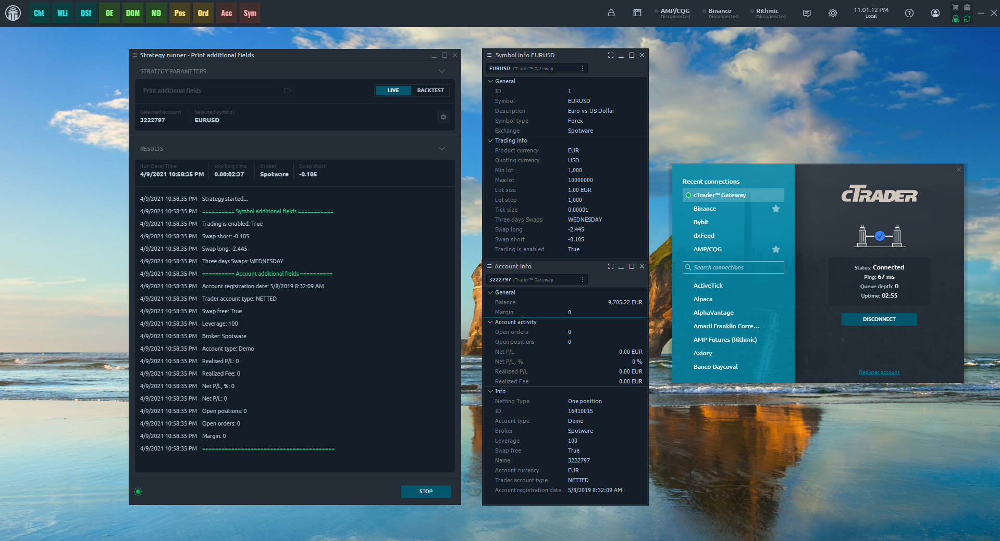
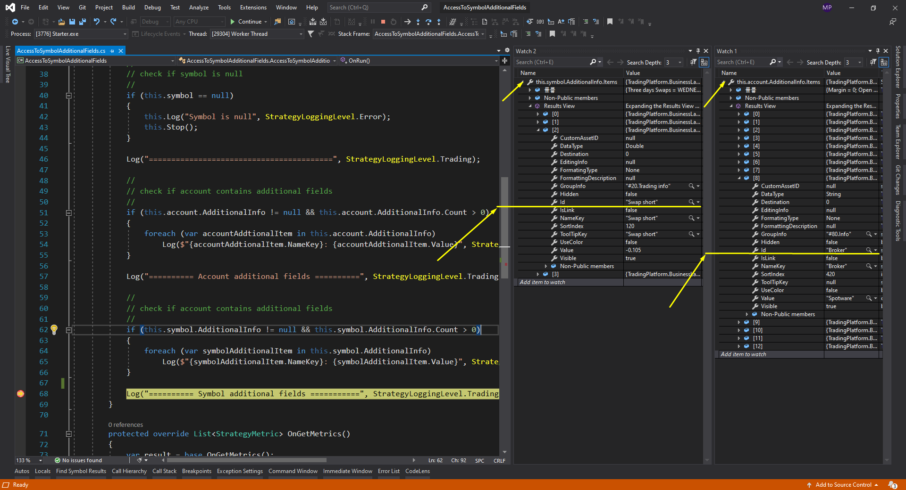

# Access to symbol/account additional fields

## Theory

Quantower terminal contains lot of useful panels. There are complex panels that display data and allow you to manipulate it. But also, there are simple panels that simply display data. For example, **Symbol Info** and **Account info** panels. Their goal is to provide all available information on the selected symbol and account.

The Quantower API divides the information they display into two categories - **basic** information and **additional** information.

### Basic information

The basic information includes fields without which the selected object cannot exist. For successfull integration with Quntower each broker must provide these fields. For example, each symbol must have **Id**, **Name**, **Tick size**, **Product/Quoting currencies,** **Min lot** etc. Also each account must have **Id**, **Name**, **Balance**, **Asset** etc.

Quantower API supports [**Symbol** ](https://api.quantower.com/docs/TradingPlatform.BusinessLayer.Symbol.html)and [**Account**](https://api.quantower.com/docs/TradingPlatform.BusinessLayer.Account.html) ****classes and you can get all the basic information using their properties members.

### Additional information

The additional information includes fields which are specific for selected broker/data feed. At any time, the broker can stop sending these fields, and if it happens, you can continue to use this connection without any problems. For examle, **Bybit** crypto-connection provides for each symbols **Maker** and **Taker fees** fields. 

Since these fields may be unique to concrete broker, we don’t add new properties to our objects, but we store them in a special collection. 

Each Account and Symbol object contains an **AdditionalInfo** collection, which stores instances of the **AdditionalInfoItem** class. Let's take a look at the main properties of this class.

* **Id** - unique identifier
* **NameKey** - display name
* **Value** - value of this field
* **DataType** - enum, defines value type \(Int, String, Double etc.\)
* **GroupInfo** - name of group
* **Visible** - if true, it can be displayed in plugins

So, If you find required field in Symbol Info panel and you want to use it in your code:

1. Try to find the corresponding property
2. Try to find the corresponding **AdditionalInfoItem** element in **AdditionalInfo** collection.

## Practice

In this part of acticle we will create a strategy script which will show all additional fields of selected symbol and account. As example we will use **cTrader** connection.



### Input parameters

First, let’s define input parameters. We want to customize symbol and account

```csharp
[InputParameter("Selected account", 10)]
public Account account;

[InputParameter("Selected symbol", 20)]
public Symbol symbol;
```

### OnRun method

Here we check the input parameters and display the elements of the **AdditionalInfo** collections.

```csharp
protected override void OnRun()
{
    //
    // check if account is null
    //
    if (this.account == null)
    {
        this.Log("Account is null", StrategyLoggingLevel.Error);
        this.Stop();
        return;
    }

    //
    // check if symbol is null
    //
    if (this.symbol == null)
    {
        this.Log("Symbol is null", StrategyLoggingLevel.Error);
        this.Stop();
        return;
    }

    Log("=========================================", StrategyLoggingLevel.Trading);

    //
    // check if account contains additional fields
    //
    if (this.account.AdditionalInfo != null && this.account.AdditionalInfo.Count > 0)
    {
        foreach (var accountAddtionalItem in this.account.AdditionalInfo)
            Log($"{accountAddtionalItem.NameKey}: {accountAddtionalItem.Value}", StrategyLoggingLevel.Info);
    }

    Log("========== Account additional fields ==========", StrategyLoggingLevel.Trading);

    //
    // check if symbol contains additional fields
    //
    if (this.symbol.AdditionalInfo != null && this.symbol.AdditionalInfo.Count > 0)
    {
        foreach (var symbolAdditionalItem in this.symbol.AdditionalInfo)
            Log($"{symbolAdditionalItem.NameKey}: {symbolAdditionalItem.Value}", StrategyLoggingLevel.Info);
    }

    Log("========== Symbol additional fields ===========", StrategyLoggingLevel.Trading);
}
```

### OnGetMetrics method

In metrics, let's output one additional field for each input objects. But, here we have a problem. Well, if we want to get concrete element form **AdditionalInfo** collection we need to know its correct identifier.

At this moment, the easiest way to do this:

1. Run script in **Debug**-mode and find the required element in **AdditionalInfo** collection.
2. Store identifier\(**Id** property\) of this element as a constant. 
3. Use '**TryGetItem**' method with stored identifier to get required element.

Ok, let's find '**Broker**' and '**Swap short**' elements in **AdditionalInfo** collections.


Pay attention. These elements are provided by **cTrader** connection. Another words, we will find them only if we will use symbol and account from cTrader connection as script input parameters.




We found them. Now we need save this identifiers as string constants.

```csharp
private const string CTRADER_SWAP_SHORT_SYMBOL_ADDITIONAL_FIELD_ID = "Swap short";
private const string CTRADER_BROKER_ACCOUNT_ADDITIONAL_FIELD_ID = "Broker";
```

Done. Now we can add needed metrics.

```csharp
protected override List<StrategyMetric> OnGetMetrics()
{
    var result = base.OnGetMetrics();

    if (symbol != null && symbol.AdditionalInfo.TryGetItem(CTRADER_SWAP_SHORT_SYMBOL_ADDITIONAL_FIELD_ID, out var accAdditionalItem))
    {
        result.Add(new StrategyMetric()
        {
            Name = accAdditionalItem.NameKey,
            FormattedValue = accAdditionalItem.Value.ToString()
        });
    }

    if (account != null && account.AdditionalInfo.TryGetItem(CTRADER_BROKER_ACCOUNT_ADDITIONAL_FIELD_ID, out var symbolAdditionalItem))
    {
        result.Add(new StrategyMetric()
        {
            Name = symbolAdditionalItem.NameKey,
            FormattedValue = symbolAdditionalItem.Value.ToString()
        });
    }

    return result;
}
```

