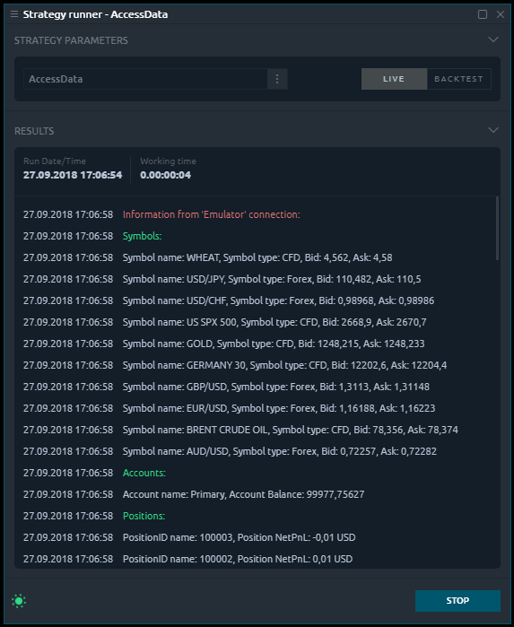

# Access to trading portfolio

Usually, an algorithm of trading strategy requires an access to various trading information for making decisions. It can be your current opened positions, placed orders or history of your trades. Sometimes you may need also detail information about your account or symbol, you are going to trade on. Quantower API provides you full access to all this information and even more. In this topic, we will show how to retrieve it and use in your strategies or indicators

## Core - main entry point for all data

[Core](http://api.quantower.com/docs/TradingPlatform.BusinessLayer.Core.html) object, which is always accessible from your scripts provides you a wide set of different data and functions. You can read full details about this class in our [API documentation](http://api.quantower.com/index.html), here we will provide an example of access to the most important and useful data.

You should always remember that Quantower is a trading platform, which provides [multi-connection](https://help.quantower.com/~/edit/drafts/-LNQMn7Ysijevbuw-ICT/getting-started/connections-manager) possibility. From one side - it means you can have access to different connections simultaneously and make really professional strategies, such as arbitraging and others. But from another side, when you need to find required symbol or account you have to specify a little more information than just a name - you should provide a connection id in case you have more than one. Quantower store all data from separate connections in special assigned storages and Core object provide you aggregated data from all your current connections.

Here are the main properties from Core object, that will be enough to create the most of classic strategies:

### **Connections**

Gives you an access to all your connections and possibility to manage them. You can get the current state of [connection](http://api.quantower.com/docs/TradingPlatform.BusinessLayer.Connection.html), its name, broker/data feed identifier or all data from this particular connection.

### **Accounts**

Provides you an access to all your accounts from all connections. You can search for the required account and retrieve [full information](http://api.quantower.com/docs/TradingPlatform.BusinessLayer.Account.html): Name, Balance, Currency, and others.


Don't forget that different brokers may provide you with different information their accounts: from very basic to really full and detailed.


### **Symbols**

Provides you an access to all symbols from all connections. Each [symbol ](http://api.quantower.com/docs/TradingPlatform.BusinessLayer.Symbol.html)has many properties you can use them in your algorithms: Name, LotStep, Description, MinLot, MaxLot, and many others.

### **Positions**

Provides you an access to all positions from all connections. If you need to get positions only from specific connections you can filter them using ConnectionID property, which each position provides among [other data](http://api.quantower.com/docs/TradingPlatform.BusinessLayer.Position.html): Quantity, Fee, NetPnl, etc. You can also search for a particular position by its id using **GetPositionById** method.

### **Orders**

Provides you an access to all [orders ](http://api.quantower.com/docs/TradingPlatform.BusinessLayer.Order.html)from all connections. And you also can filter your orders by some connection id if it needed.

### **Trades**

Provides you an access to the history of all trades from all connections since login. Each trade contains [information ](http://api.quantower.com/docs/TradingPlatform.BusinessLayer.Trade.html)about its symbol, price, fee, time of execution and others.

This is only the main properties from [Core](http://api.quantower.com/docs/TradingPlatform.BusinessLayer.Core.html). You can check our [API documentation](http://api.quantower.com/index.html) and found many other interesting's ones: Symbol types, Assets, Reports. Actually, you can get all data that are used by Quantower trading platform, as we use the same API during development our plugins.

## An example of using trading data

And as usual, let's create a simple example to show possibilities of an API. We will display the main information about your active connections and main objects: accounts, symbols, and positions. It will be quite easy to implement using our explanations above. We need only to iterate through all connections and retrieve the required data. Just, for example, we will use **Log** function to display this data, but you can use it in any way you need in your scripts. This is source code for our example:

```csharp
protected override List<StrategyMetric> OnGetMetrics()
{
    //
    // Warning:
    // We placed our code in OnGetMetrics method just for an example
    //

    // Iterate through all connected connections
    foreach (Connection connection in Core.Connections.Connected)
    {
        // Display information about positions                
        foreach (Position pos in Core.Positions)
        {
            // Use positions only from current connection
            if (pos.ConnectionId == connection.Id)
                Log($"PositionID name: {pos.Id},  Position NetPnL: {pos.NetPnL.ToString()}");
        }
        Log($"Positions:", StrategyLoggingLevel.Trading);

        // Display information about accounts                
        foreach (Account account in Core.Accounts)
        {
            // Use accounts only from current connection
            if (account.ConnectionId == connection.Id)
                Log($"Account name: {account.Name},  Account Balance: {account.Balance.ToString()}");
        }
        Log($"Accounts:", StrategyLoggingLevel.Trading);
               
        // Display information about symbols             
        foreach (Symbol symbol in Core.Symbols)
        {
            // Use symbols only from current connection
            if (symbol.ConnectionId == connection.Id)
                Log($"Symbol name: {symbol.Name},  Symbol type: {symbol.SymbolType.ToString()}, Bid: {symbol.Bid}, Ask: {symbol.Ask}");
        }
        Log($"Symbols:", StrategyLoggingLevel.Trading);

        // Display connection name
        Log($"Information from '{connection.Name}' connection:", StrategyLoggingLevel.Error);
    }

    // Standard metrics
    List<StrategyMetric> result = base.OnGetMetrics();            
    return result;            
}
```

And this is the result of this script displaying in the StrategyRunner Panel.



In this topic, we showed how to get and analyze main trading data - which is always required by strategies. Another important and necessary part of any strategy is trading operations which will be covered in our next article.

