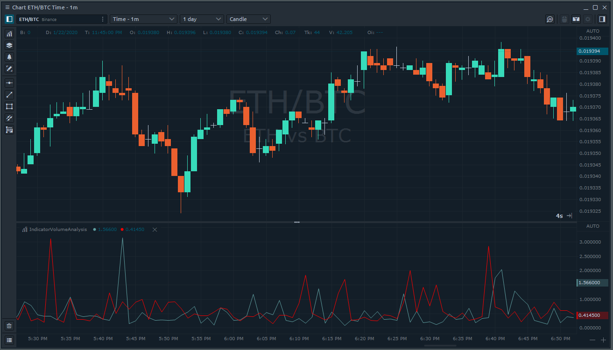

# Access Volume analysis data from indicators

Quantower trading platform has a wide set of [**Volume analysis tools**](https://www.quantower.com/volumeanalysistools), an advanced analytical functionality, which allows you to see the traded volume at each price level, assess the balance between buyers and sellers and understand the intentions of traders regarding the future price. 

You can easily access all volume analysis data from your indicator. By default charts does not loading such data, as it requires time to get full trades history. You need to notify chart, that your indicator need it for calculations and you can do this by implementing a special Interface **IVolumeAnalysisIndicator**:

```csharp
public class IndicatorVolumeAnalysis : Indicator, IVolumeAnalysisIndicator
{       
    ...
```

It contains only one method **VolumeAnalysisData\_Loaded** and it will be called, when all required data finish loading:

```csharp
public void VolumeAnalysisData_Loaded()
{
    // Add your logic here
}
```

If you need to know current state of loading, you may use **VolumeAnalysisCalculationProgress** from **HistoricalData**. If loading was started, this object will be set and you may know current state or even percent of loaded data:

```csharp
if (HistoricalData.VolumeAnalysisCalculationProgress.State != VolumeAnalysisCalculationState.Finished
    Core.Instance.Loggers.Log(HistoricalData.VolumeAnalysisCalculationProgress.ProgressPercent.ToString());
```

When loading is finished **Total** object will be available for each **HistoryItem** from **HistoricalData** which provide access to aggregated volume analysis data:

```csharp
HistoricalData[0].VolumeAnalysisData.Total.Volume
HistoricalData[0].VolumeAnalysisData.Total.Trades
HistoricalData[0].VolumeAnalysisData.Total.AverageBuySize 
```

List of all available data types:

| Data type | Description |
| :--- | :--- |
| Volume | The total size of all positions that executed at each price level or price range  |
| BuyVolume | The total size of all Buy positions that executed at each price level or price range |
| SellVolume | The total size of all Sell positions that executed at each price level or price range |
| Trades | The number of contracts \(trades\) that executed at each price level. |
| BuyTrades | The number of Buy trades that executed at each price level |
| SellTrades | The number of Sell trades that executed at each price level |
| BuyVolumePercent | Shows how many percent of the total volume relates to Buy trades |
| SellVolumePercent | Shows how many percent of the total volume relates to Sell trades |
| Delta | Shows the difference in traded Volume between Buyers and Sellers. It allows evaluating who controls the price on the market at a given time |
| DeltaPercent | Shows the difference \(%\) in traded Volume between Buyers and Sellers. It allows evaluating who controls the price on the market at a given time |
| AverageSize | The average volume of the position that was executed at a certain price or price range |
| AverageBuySize | The average volume of a Buy position that was executed at a specific price or price range |
| AverageSellSize | The average volume of a Sell position that was executed at a specific price or price range |
| MaxOneTradeVolume | Shows the maximum volume of a single trade that has executed at a certain price or price range |
| MaxOneTradeVolumePercent | Shows the maximum \(%\) volume of a single trade that has executed at a certain price or price range |

Except **Total** \(aggregated\) information you have access to Volume analysis data for each price from the bar. It is available in PriceLevels dictionary and contains same data types as Total:

```csharp
this.HistoricalData[0].VolumeAnalysisData.PriceLevels[1.2564].Volume
```

As an example let's create a simple indicator, that will draw 2 lines in the separate window of the chart. First one will show AverageBuySize and second AverageSellSize. This is full source code:

```csharp
using System;
using System.Drawing;
using TradingPlatform.BusinessLayer;
using TradingPlatform.BusinessLayer.Modules.Indicators;

namespace IndicatorVolumeAnalysis
{   
	public class IndicatorVolumeAnalysis : Indicator, IVolumeAnalysisIndicator
    {
        public IndicatorVolumeAnalysis()
            : base()
        {
            // Defines indicator's name and description.
            Name = "IndicatorVolumeAnalysis";
            Description = "My indicator's annotation";

            // Defines line on demand with particular parameters.
            AddLineSeries("AverageBuySize", Color.CadetBlue, 1, LineStyle.Solid);
            AddLineSeries("AverageSellSize", Color.Red, 1, LineStyle.Solid);

            // By default indicator will be applied on main window of the chart
            SeparateWindow = true;
        }

        public void VolumeAnalysisData_Loaded()
        {
            // Set value to all previous indicators points
            for (int i = 0; i < this.Count; i++)
            {
                SetValue(this.HistoricalData[i].VolumeAnalysisData.Total.AverageBuySize, 0, i);
                SetValue(this.HistoricalData[i].VolumeAnalysisData.Total.AverageSellSize, 1, i);
            }
        }
        
        protected override void OnUpdate(UpdateArgs args)
        {            
            // Volume analysis data not loaded yet
            if (this.HistoricalData.VolumeAnalysisCalculationProgress == null || this.HistoricalData.VolumeAnalysisCalculationProgress.State != VolumeAnalysisCalculationState.Finished)
                return;

            // Example of access Volume Analysis data
            SetValue(this.HistoricalData[0].VolumeAnalysisData.Total.AverageBuySize, 0);
            SetValue(this.HistoricalData[0].VolumeAnalysisData.Total.AverageSellSize, 1);            
        }               
    }
}
```

When we build this indicator and add on the chart we can see next result:



In this topic, we showed you the simple example of indicator based on volume analysis data. You may improve it and create really advanced and complex indicator, similar to Volume Analysis tools from Quantower, for example Cluster Chart. In our next topics we will provide an example of drawing volume profiles on the chart.

