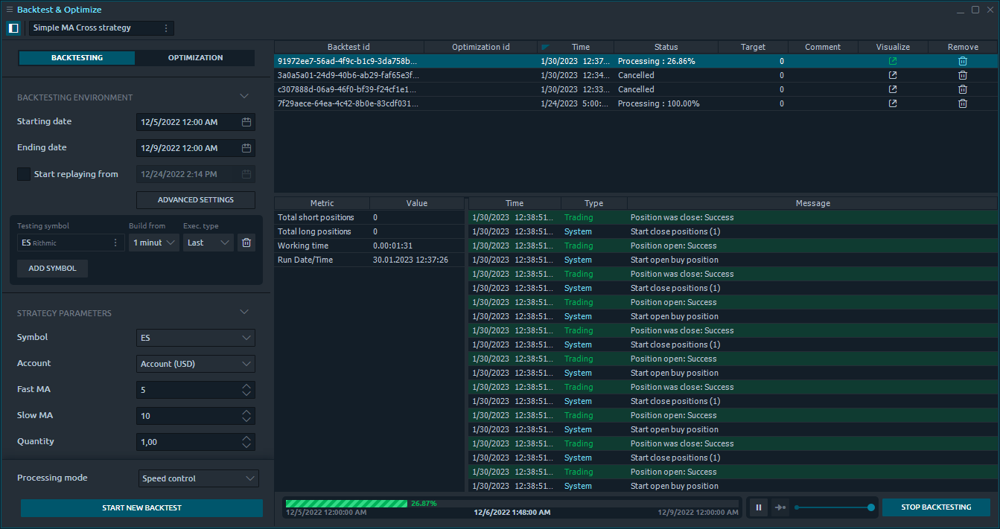
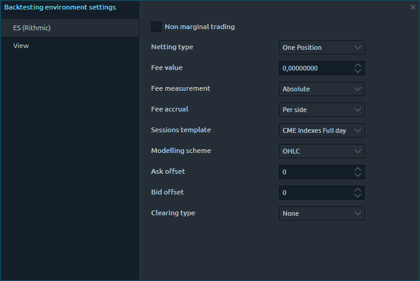
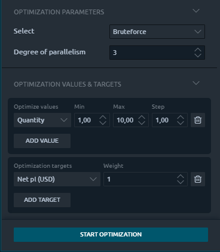
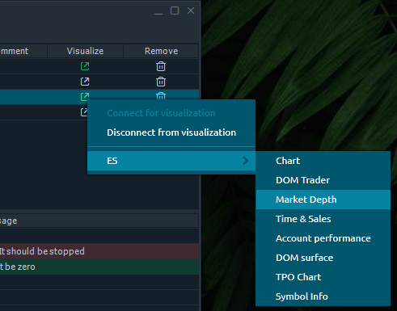
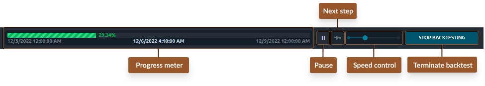

# Backtest & Optimize

Previously a part of the "Strategy runner" panel's functionality, strategies backtesting is integral to any algo-trading development process. With the latest Quantower update, we separated this feature into an individual panel called the "Backtest & Optimize." Let's learn more about this tool and its new features and enhancements.

### <mark style="color:red;">▶️</mark> Video manual about Backtesting


A short video manual about the Backtest & Optimize panel


## Start & general view

Once you launch the Backtest & Optimize (B\&O) panel, you should select a strategy using the lookup screen. You are required to run a new instance of the B\&O panel for every new strategy you would like to test; you can also change it later via the main toolbar.

<figure><figcaption>
Backtest &#x26; optimize panel general view
</figcaption></figure>

The B\&O panel consists of two main sections:&#x20;

* **Configuration section**, where you specify parameters for backtesting or optimization tasks and start them.
* **Backtests tasks history**, where the panel will store testing/optimization tasks and their history.


Please note. To test various parameters' values, you can create as many backtesting tasks as you wish for the selected strategy via the Configuration section.


You can hide the Config section anytime using the <mark style="background-color:blue;">**\[ Hider ]**</mark> button on the toolbar to save space and concentrate on created tasks.

## Configuration section

As mentioned earlier, a Config section of the B\&O panel is for creating backtest tasks. At the top of it, you can choose whether to create backtest tasks manually one by one (<mark style="color:yellow;">Backtesting mode</mark>) or generate them using one of the optimization algorithms (<mark style="color:yellow;">Optimization mode</mark>).

Depending on the mode you select, you will see a set of various parameters divided into several categories:

* Backtesting environment (both modes)
* Strategy parameters (both modes)
* Optimization parameters (Optimization mode)
* Optimization values and targets (Optimization mode)

### Backtesting environment

<mark style="color:blue;">**Backtesting environment**</mark> parameters specify what the testing (emulated) environment should be and contain the following items:

* **Starting and ending dates** are a period in history used by the backtester to emulate the trading data.
* **Start replaying from** the date (within the Start-End period). Select the "start replaying from the date" option if your strategy needs preliminary historical data during initialization. In this case, your strategy will receive quotes from the "start replaying from" date, while your Backtesting environment will contain data beginning from the "Starting date."
* **Testing symbol**(s). Allows to specify one or multiple symbols the strategy will use in a testing environment.
*   **Advanced settings**. Opens a screen with extra environment emulation parameters per each symbol selected for testing:\

    <figure><figcaption>
Advanced settings of the backtesting environment
</figcaption></figure>

    * Non-marginal trading; useful for emulating Crypto-assets behavior.
    * Netting type: one position, multiple positions, multiple by side.
    * Fee value; the amount of charging a fee.
    * Fee measurement: absolute, absolute per lot, percent; how to calculate fees.
    * Fee accrual: per side, per round; when to charge a fee.
    * Sessions template; allows applying a predefined sessions template.
    * Modeling scheme: OHLC, open, close.
    * Ask offset; price offset.
    * Bid offset; price offset.
    * Clearing type: none, close, swap, delivery; whether to clear opened positions on the session end and how to do this. Close - closes on session end with a possibility to generate clearing quotes. Swap - transfer positions to the next session, and apply additional fees. Delivery - emulate asset delivery on close.

### Strategy parameters

The <mark style="color:blue;">**strategy parameters**</mark> section contains a list of parameters the selected strategy requires.&#x20;


Please note. The selected strategy will use one of the specified backtesting environment symbols as an operating symbol.


### Processing mode

Being in a Backtesting mode, just before launching the new task, you can select the <mark style="color:blue;">**processing mode**</mark> (the way how backtester will replay history) from the following list:

* **Speed control.** Allows you to interactively adapt the history replay speed or pause during the task processing. You can also visualize the history replay in one of the Quantower panels and see your strategy behavior over time.
* **Step by step.** Backterster will process history playback tick by tick based on the used symbol’s timeframe settings.
* **Background.** In this mode, the backtester will process your task with the highest possible speed, and you will only see the results after it ends.

### Optimization

When you enable Optimization mode in the configuration section, you will get additional parameters for setting the optimization logic.

<figure><figcaption>
Optimization parameters, values &#x26; targets
</figcaption></figure>

**Optimization parameters** specify the algorithm of automated strategy settings modification. Currently, there are Brute Force, Monte-Carlo, Las-Vegas, and Particles swarm algorithms.

**Optimization values and targets** are the set of Values (strategy parameters to auto-modify per task) and Targets (strategy results to be reached). The Optimizator will use that to understand what parameters of the strategy should be changed to achieve the best results for the specified target(s).

Being in Optimisation mode, you can only start the processing in the background. After you click <mark style="background-color:blue;">**\[ Start optimization ]**</mark>, an automated system will begin creating backtesting tasks with various parameters to test your strategy.


Please note. You can launch optimization once per strategy until it finishes or stops manually.


### <mark style="color:red;">▶️</mark> Video manual about Optimization


Video manual covering the Optimization process of Backtest & Optimize panel


## Backtest tasks history

The Backtests history manager section consists of the tasks list and task results (Metrics and Logs related to the selected backtesting). The list of tasks has several columns with general data and management buttons as follows:

* Backtest ID. A unique ID per every task that you create.
* Optimization ID. A unique ID is created per each Optimizer launch for grouping automatically created tasks by one optimization process.
* Time. A time when you started the backtest task.
* Status. Current status of a backtest. It can be “Processing” (an ongoing task), “Finished” (a finished one), or “Canceled” (Manually stopped by the user).
* Target. Bactester will fill it with the target value after Optimizator’s tasks finish.
* Comment. You can fill it by yourself to mark some results for the future.
* Visualize. This function allows you to see the backtesting progress in other panels (e.g., see on the chart) when processing a backtest in Speed control and Step-by-step modes. If the task is processing in background mode, you can visualize the results only after it finishes.
* Remove. Delete a task from the list and erase all related results info.

### Visualizer

You can see the history replay process via applicable panels (Chart, DOM Trader, Market Depth, Time\&Sales, Account performance, DOM Surface, TPO Chart, Symbol info) in Speed control & Step-by-step processing modes.&#x20;

<figure><figcaption>
Backtest results Visualizer options
</figcaption></figure>

In Background mode, you can Visualize only the final results of processing. In this case, a Visualizer icon will become activated after completing the task. You should click on the Visualize icon, then "Connect for visualization" (to load the results in memory). Click that icon once more and select the required panel from the dropdown list of the tested Symbol.

### Backtest task context menu

Once you right-click on a row in a tasks list, you will find additional functions, as follows:

* **Add live strategy with the same parameters**. Launches a Strategies manager panel and adds the selected strategy with parameters used in this backtest.&#x20;
* **Apply environment settings**. Copies environment settings from selected task to Config section.
* **Apply strategy settings**. Copies strategy parameters from selected task to Config section.
* **Visualize**. Operations with Visualizer.
* **Remove**. Deletes current task.
* **Remove all**. Removes all tasks from the list.
* **Group by & Column visibility** are the regular table data operations.
* **Settings**. Opens B\&O panel’s settings

### Task processing controls

When you've started a new manual backtesting task, you may select it in the tasks list to see its Metrics and Logs below. In this state, you will also find a Task controls toolbar in the footer containing the following:

<figure><figcaption>
Backtest progress controls
</figcaption></figure>

* Progress meter, showing history playback progress in percent and Start - Current - End date times.&#x20;
* Speed controls, with a <mark style="background-color:blue;">\[ pause ]</mark> button, <mark style="background-color:blue;">\[ next step ]</mark> button (when paused), and a history playback speed slider (0/pause to 100% speed).
* \[ Stop backtesting ] button, allowing an instant termination of a selected task.


Please note. Once finished, the backtester won't stop the manually created task until you click the <mark style="background-color:blue;">\[ Stop backtesting ]</mark> button in the bottom right corner. Until this, the backtester will store all task results in memory. After the manual stop, the backtester will save all results to the filesystem, where you can get them (or visualize them) later.

