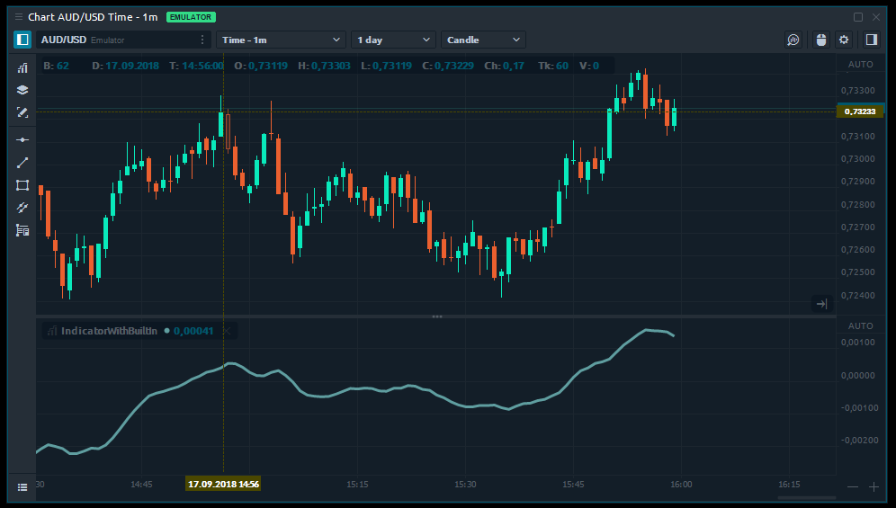

# Built-In indicators access

## General

During development of your own indicators or strategy, you may require using some standard indicators, for example Moving Averages. You don't need to write any code for this, as Quantower trading platform provides you a wide set of predefined indicators. At the moment there are about 50 built-in indicators, among them: 

* EMA
* ADX
* Keltner
* ROC
* RSI
* KAMA
* AROON
* and many others

## Access built-in indicators

You can access built-in indicators using **Core.Indicators.BuiltIn** class. A good place to initiate such indicators is in an **OnInit** method of your script:

```csharp
Indicator AC;

protected override void OnInit()
{
    // An example of creation AC indicator
    AC = Core.Indicators.BuiltIn.AC();                
}
```

An indicator can provide some parameters and you can specify them during creation:

```csharp
Indicator EMA;

protected override void OnInit()
{
    // An example of creation EMA indicator with parameters: 
    // Period = 10
    // PriceType = Open
    EMA = Core.Indicators.BuiltIn.EMA(10, PriceType.Open);         
}
```

You can create a few copies of one indicator or a few different indicators if needed:

```csharp
Indicator fastEMA;
Indicator slowEMA;

protected override void OnInit()
{
    // An example of creation a few EMA indicators with different parameters     
    fastEMA = Core.Indicators.BuiltIn.EMA(12, PriceType.Open);         
    slowEMA = Core.Indicators.BuiltIn.EMA(26, PriceType.Open);         
}
```

Now we need to assign the created indicator to our current script — which means it will use symbol and quotes from its parent. You can do this via **AddIndicator** method:

```csharp
Indicator EMA;

protected override void OnInit()
{
    // Create EMA indicator
    EMA = Core.Indicators.BuiltIn.EMA(10, PriceType.Open);
             
    // Add created EMA indicator as a child to our script
    AddIndicator(EMA);
}
```

Everything is ready to use this indicator in our calculations. After receiving new quotes it will be calculated automatically. You can access its values via [**GetValue** ](http://api.quantower.com/docs/TradingPlatform.BusinessLayer.Indicator.html#TradingPlatform_BusinessLayer_Indicator_GetValue_System_Int32_System_Int32_TradingPlatform_BusinessLayer_SeekOriginHistory_)method:

```csharp
/// <summary>
/// Calculation entry point. This function is called when a price data updates. 
/// </summary>
protected override void OnUpdate(UpdateArgs args)
{
     // Get EMA value for current bar from first line
     double valueFromEMA = EMA.GetValue();
     
     // Using EMA value in parent indicator
     SetValue(valueFromEMA);            
}
```

In case you need to access value for previous bars or value from other indicators line you can use the offset and a **lineIndex** parameter of a [**GetValue**](http://api.quantower.com/docs/TradingPlatform.BusinessLayer.Indicator.html#TradingPlatform_BusinessLayer_Indicator_GetValue_System_Int32_System_Int32_TradingPlatform_BusinessLayer_SeekOriginHistory_) ****method:

```csharp
/// <summary>
/// Calculation entry point. This function is called when a price data updates. 
/// </summary>
protected override void OnUpdate(UpdateArgs args)
{
     // Get EMA value for current bar from second line
     double valueFromEMA = EMA.GetValue(5, 1);
     
     // Using EMA value in parent indicator
     SetValue(valueFromEMA);            
}
```

This is a total source code of our example. We use two EMA indicators with different period and display their difference on the chart:

```csharp
using System.Drawing;
using TradingPlatform.BusinessLayer;


namespace IndicatorWithBuiltIn
{   
	public class IndicatorWithBuiltIn : Indicator
    {
        /// <summary>
        /// Built in indicators
        /// </summary>
        Indicator fastEMA;
        Indicator slowEMA;

        /// <summary>
        /// Indicator's constructor. Contains general information: name, description, LineSeries etc. 
        /// </summary>
        public IndicatorWithBuiltIn()
            : base()
        {
            // Defines indicator's name and description.
            Name = "IndicatorWithBuiltIn";

            // Defines line on demand with particular parameters.
            AddLineSeries("line1", Color.CadetBlue, 1, LineStyle.Solid);

            // By default indicator will be applied on main window of the chart
            SeparateWindow = true;
        }

        /// <summary>
        /// This function will be called after creating an indicator as well as after its input params reset or chart (symbol or timeframe) updates.
        /// </summary>
        protected override void OnInit()
        {
            // Create first instance of EMA indicator with Period 12
            fastEMA = Core.Indicators.BuiltIn.EMA(12, PriceType.Open);
            AddIndicator(fastEMA);

            // Create second instance of EMA indicator with period 26
            slowEMA = Core.Indicators.BuiltIn.EMA(26, PriceType.Open);
            AddIndicator(slowEMA);

        }

        /// <summary>
        /// Calculation entry point. This function is called when a price data updates. 
        /// </summary>
        protected override void OnUpdate(UpdateArgs args)
        {
            // Calculate difference
            double difference = fastEMA.GetValue() - slowEMA.GetValue();

            // Use difference as a value for parent indicator
            SetValue(difference);
        }
    }
}

```

And a result of this indicator on the chart:



As you can see it was not really difficult to create this indicator. Before starting writing your own code, check first, maybe the required calculations are already available in a built-in set. Quantower team is constantly working on adding new built-in indicators. If you have any ideas and proposals, what we should add — feel free to [contact us](https://www.quantower.com/contact-us).

