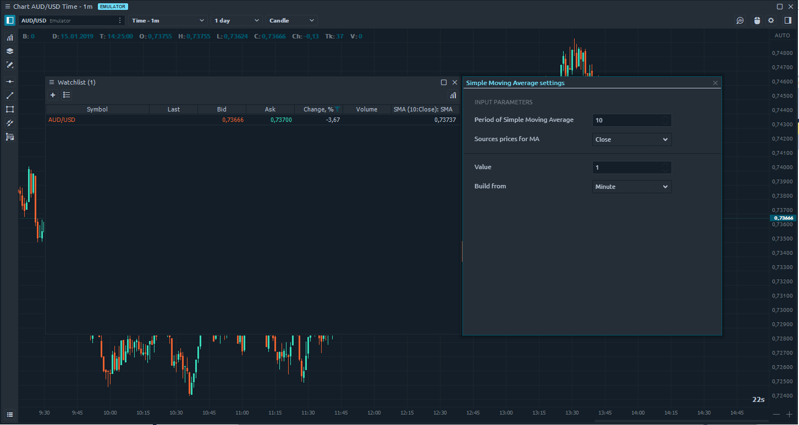

# Adding a custom indicator to Watchlist

### **How to make an indicator compatible with 'Watchlist’**

Ok, let’s imagine, you have created a custom indicator and it works correctly when you add it to the ‘Chart’. But you want to add it to the ‘Watchlist’ panel too. Yes, Quantower supports this [**feature**](https://help.quantower.com/analytics-panels/watchlist#indicators). Open ‘Watchlist’ -&gt; click on ‘Indicators lookup’ -&gt; and… you can’t find it. Hmm, something is wrong. And two questions come up: _“Why I can’t see it on the list?”_ and _“How can I add my indicator to the list?”_.

Well, the reason is that your indicator doesn’t implement special **"IWatchlistIndicator"** interface. This is the marker which is used for filtering content into ‘Indicators lookup’ in ‘Watchlist’.

```csharp
public class Best_Indicator : Indicator, IWatchlistIndicator
    {
    	… Best_Indicator code.
    }
```

**For example:** Quantower platform has the built-in "_Price Action Zones_" indicator. It’s designed only for work on the ‘Chart’ panel because it uses [**custom drawing**](https://help.quantower.com/quantower-algo/indicator-with-custom-painting-gdi). It doesn’t implement this interface, and you can’t use it in the ‘Watchlist’.

Ok, let’s remember. Before adding the indicator to the chart you need to select [‘**TimeFrame’ and ‘Depth of history**’](https://help.quantower.com/analytics-panels/chart#top-toolbar). But after adding an indicator to the ‘Watchlist’ you can customize input parameters and timeframe only. Hmm… “How does the Watchlist understand how deep the history needs to be downloaded?”.



**‘IWatchlistIndicator’** interface provides ‘_**MinHistoryDepths**_’ property which must return a minimal history depths value for the current indicator. You need to implement it correctly and that’s all.

```csharp
public class DoubleSMA: Indicator, IWatchlistIndicator
    {
        [InputParameter("First SMA period", 0, 1, 999, 1, 1)]
        public int FirstPeriod = 5;

        [InputParameter("Second SMA period", 1, 1, 999, 1, 1)]
        public int SecondPeriod = 10;

       public int MinHistoryDepths => this.FirstPeriod  + this.SecondPeriod ;

       … DoubleSMA indicator code
}
```

