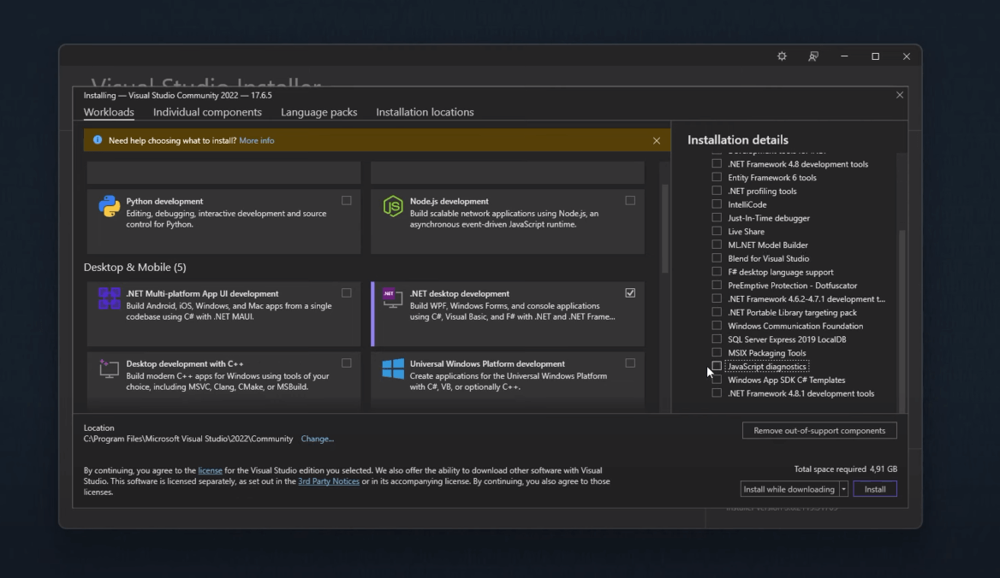
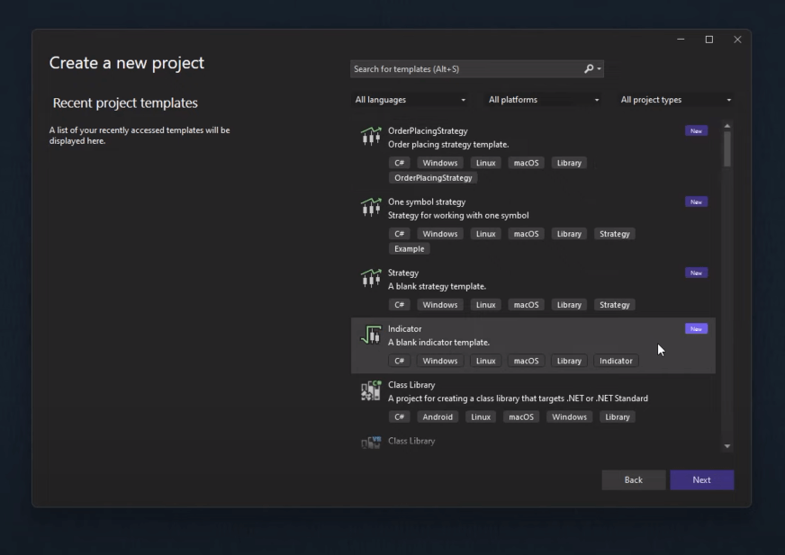
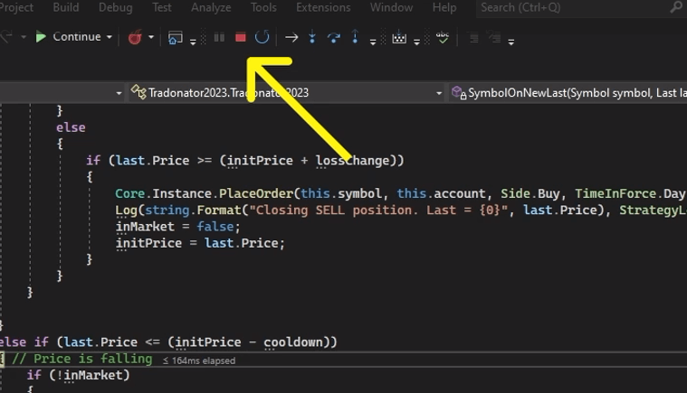

# Debugging in VS 2022

## Video manual about debugging



## Debugging setup

In order to begin debugging, it is necessary to have both a running Quantower terminal and an open strategy project in Visual Studio. Prior to starting, debugging must be configured by accessing the Quantower Algo settings in the VS Tools menu and navigating to the Algo tab within the Quantower terminal general settings screen.

<figure><figcaption>
Quantower Algo settings in Studio (left) and Algo settings in Quantower terminal (right)
</figcaption></figure>

To connect Visual Studio with Quantower Algo, we need to enable the "<mark style="background-color:yellow;">**Allow connection from Visual Studio**</mark>" option in the terminal settings and ensure that the connection port matches the one in the Quantower Algo settings.&#x20;


Enabling this option might trigger a firewall or antivirus warning, which you should <mark style="background-color:green;">allow</mark> to establish the connection.


## Start debugging

1. &#x20;Press the <mark style="background-color:yellow;">Debug mode launch button</mark> and wait for Visual Studio to establish the debugging environment. One of the critical elements of this environment is a specialized console process (black background application) that connects your code editor and Quantower terminal.

<figure><figcaption>
Debug mode launch button
</figcaption></figure>


In case you haven't opened the Backtest & Optimize panel yet, Quantower will remind you to do so and select your strategy.&#x20;


2. Configure the backtesting environment and locate the "<mark style="background-color:yellow;">**Start in debug mode**</mark>" button at the bottom of the sidebar. Click on this button to begin debugging your strategy.&#x20;

<figure><figcaption>
Start in debug mode button
</figcaption></figure>

3. Locate the specific line in your Visual Studio editor where the algorithm needs to be paused and set a breakpoint there.

<figure><figcaption>
Visual Studio Community 2022 editor with an active Breakpoint halt
</figcaption></figure>

## Stop debugging

To exit Debug mode, simply click on the <mark style="background-color:yellow;">**Stop**</mark> button - a red square icon located to the right of the Continue button on the Visual Studio debug toolbar. This will close the binding console process and disconnect Visual Studio from the Quantower terminal.&#x20;

<figure><figcaption>
Stop the Debugging mode in Visual Studio
</figcaption></figure>
