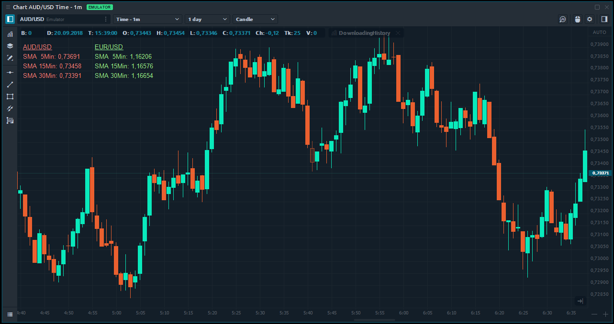

# Downloading history

Most of the indicators require history for their calculation only from the main symbol or symbol from the chart where they were added. But sometimes it may need history data from another time frame or another symbol. For example, if you need to calculate a correlation between symbols, or if you want to compare the results of Moving Average calculations on different time frames. In this topic, we will show you how to do it using Quantower API and its possibilities.

The start point for receiving history is symbol object and method **GetHistory**. The most simple way is to specify the required Period, history type and date range:

```csharp
// Download 15 min bars for august 2018
IHistoricalData historicalData = Symbol.GetHistory(Period.MIN15, HistoryType.Bid, new DateTime(2018, 8, 1, 0, 0, 0, DateTimeKind.Utc), new DateTime(2018, 8, 31, 0, 0, 0, DateTimeKind.Utc));
```

If you specify exactly left and right border — you will receive the required history for this range. But if you want download history from some time in the past till now and receive real-time data, you can skip right border parameter definition:

```csharp
// Download 15 min bars for last day with real time data
IHistoricalData historicalData = Symbol.GetHistory(Period.MIN15, HistoryType.Bid, DateTime.UtcNow.AddDays(-1));
```

The main object that represents history is **IHistoricalData** interface. It contains a collection of bars or ticks and main information about downloaded history: symbol, history type, a total count of items, period, etc. You can access particular item from the collection and receive **IHistoryItem** object, which provides you information about bar or tick: prices, time, volume and other. We use different classes for bars, ticks and lasts history presentation, so to get access to full data you need to convert your object to appropriate class:

```csharp
// Downloading bars history
IHistoricalData historicalData = Symbol.GetHistory(Period.MIN15, HistoryType.Bid, DateTime.UtcNow.AddDays(-1));

// An example of access data from the bar:
double openPrice = ((HistoryItemBar)historicalData[0]).Open;
double closePrice = ((HistoryItemBar)historicalData[0]).Close;
double volume = ((HistoryItemBar)historicalData[0]).Volume;
DateTime leftBorderOfBar = ((HistoryItemBar)historicalData[0]).TimeLeft;
```

In case of tick history:

```csharp
// Downloading ticks history
IHistoricalData historicalData = Symbol.GetHistory(Period.TICK1, HistoryType.Bid, DateTime.UtcNow.AddDays(-1));

// An example of acces  data from the tick:
double bidPrice = ((HistoryItemTick)historicalData[0]).Bid;
double askPrice = ((HistoryItemTick)historicalData[0]).Ask;
```

If you need to download history from a current symbol of indicator, you can use its property Symbol. If you need history from another symbol, that should be specified in settings - you can use **InputParameter** attribute and our article describing this. 

It is a time to create some practical example using knowledge from the current topic. Let's assume we need an indicator that downloads 5min,15 min and 30 min history for the main symbol and for an additional one, that can be specified by the user. Then calculates simple moving average on this history and displays results on the chart. 

At first, we need to specify variables for required indicators and Symbol variable and mark it with **InputParameter**:

```csharp
/// <summary>
/// SMA indicators for different timeframes and symbols
/// </summary>
Indicator sma5MinCurrent;
Indicator sma15MinMainCurrent;
Indicator sma30MinMainCurrent;
Indicator sma5MinAdditional;
Indicator sma15MinAdditional;
Indicator sma30MinAdditional;

[InputParameter()]
Symbol AdditionalSymbol;
```

In **OnInit** of the indicator method we will download all required history and add indicators:

```csharp
protected override void OnInit()
{   
    // Download history for current symbol for different timeframes and apply SMA indicator

    // 5 min
    IHistoricalData data5MinCurrent = this.Symbol.GetHistory(Period.MIN5, HistoryType.Bid, DateTime.UtcNow.AddDays(-1));            
    data5MinCurrent.AddIndicator(sma5MinCurrent = Core.Indicators.BuiltIn.SMA(10, PriceType.Close));

    // 15 min
    IHistoricalData data15MinCurrent = this.Symbol.GetHistory(Period.MIN15, HistoryType.Bid, DateTime.UtcNow.AddDays(-1));            
    data15MinCurrent.AddIndicator(sma15MinMainCurrent = Core.Indicators.BuiltIn.SMA(10, PriceType.Close));

    // 30 min
    IHistoricalData data30MinCurrent = this.Symbol.GetHistory(Period.MIN30, HistoryType.Bid, DateTime.UtcNow.AddDays(-1));            
    data30MinCurrent.AddIndicator(sma30MinMainCurrent = Core.Indicators.BuiltIn.SMA(10, PriceType.Close));
            
    // Download history for additional symbol (if specified) for different timeframes and apply SMA indicator

    if (AdditionalSymbol != null)
    {
        // 5 min
        IHistoricalData data5MinAdditional = this.AdditionalSymbol.GetHistory(Period.MIN5, HistoryType.Bid, DateTime.UtcNow.AddDays(-1));
        data5MinAdditional.AddIndicator(sma5MinAdditional = Core.Indicators.BuiltIn.SMA(10, PriceType.Close));

        // 15 min
        IHistoricalData data15MinAdditional = this.AdditionalSymbol.GetHistory(Period.MIN15, HistoryType.Bid, DateTime.UtcNow.AddDays(-1));
        data15MinAdditional.AddIndicator(sma15MinAdditional = Core.Indicators.BuiltIn.SMA(10, PriceType.Close));

        // 30 min
        IHistoricalData data30MinAdditional = this.AdditionalSymbol.GetHistory(Period.MIN30, HistoryType.Bid, DateTime.UtcNow.AddDays(-1));
        data30MinAdditional.AddIndicator(sma30MinAdditional = Core.Indicators.BuiltIn.SMA(10, PriceType.Close));
    }
}
```

In **OnPaint** method we simply display result using GDI+:

```csharp
public override void OnPaintChart(PaintChartEventArgs args)
{
    Graphics gr = Graphics.FromHdc(args.Hdc);
    Font f = new Font("Arial", 10);

    // Draw results for main symbol            
    gr.DrawString(this.Symbol.Name, new Font(f, FontStyle.Underline), Brushes.LightCoral, 10, 35);
    gr.DrawString("SMA  5Min: " + this.Symbol.FormatPrice(sma5MinCurrent.GetValue()), f, Brushes.LightCoral, 10, 55);
    gr.DrawString("SMA 15Min: " + this.Symbol.FormatPrice(sma15MinMainCurrent.GetValue()), f, Brushes.LightCoral, 10, 75);
    gr.DrawString("SMA 30Min: " + this.Symbol.FormatPrice(sma30MinMainCurrent.GetValue()), f, Brushes.LightCoral, 10, 95);

    // Draw results for additional symbol (if specified)
    if (this.AdditionalSymbol != null)
    {
        gr.DrawString(this.AdditionalSymbol.Name, new Font(f, FontStyle.Underline), Brushes.LightGreen, 160, 35);
        gr.DrawString("SMA  5Min: " + this.AdditionalSymbol.FormatPrice(sma5MinAdditional.GetValue()), f, Brushes.LightGreen, 160, 55);
        gr.DrawString("SMA 15Min: " + this.AdditionalSymbol.FormatPrice(sma15MinAdditional.GetValue()), f, Brushes.LightGreen, 160, 75);
        gr.DrawString("SMA 30Min: " + this.AdditionalSymbol.FormatPrice(sma30MinAdditional.GetValue()), f, Brushes.LightGreen, 160, 95);
    }
}
```

And the results on the chart:



In this topic, we showed you the trivial example of downloading and using history. But if needed, you can use it any ways: as a source for indicators, for comparison, for displaying on the chart as overlays, for exporting data.

