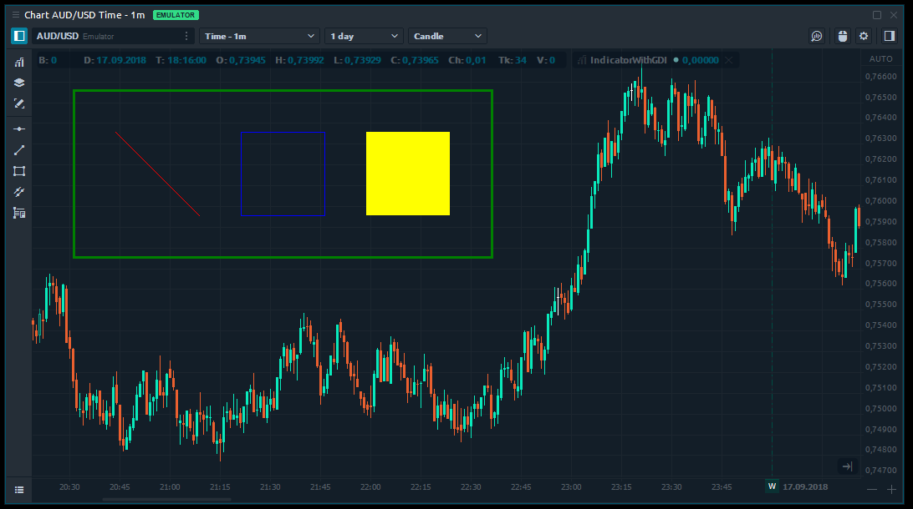
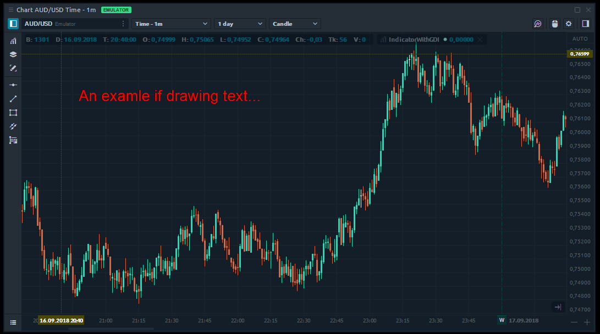
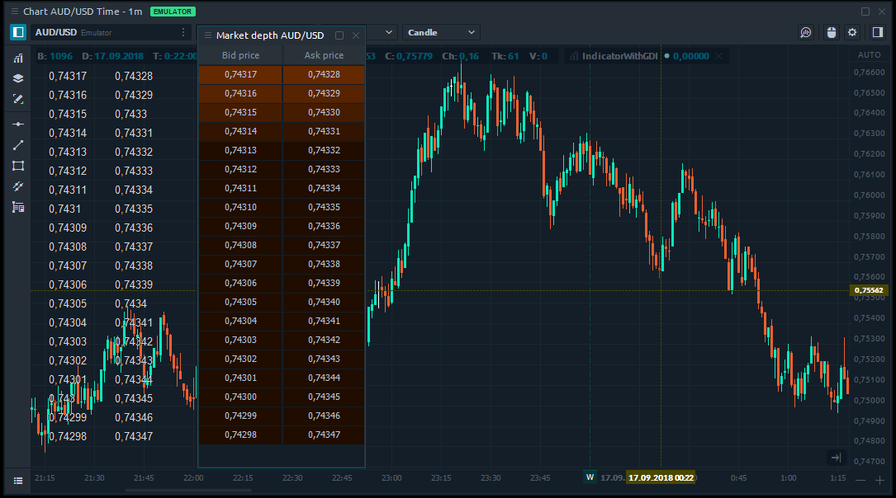

# Indicator with custom painting \(GDI\)

## Introduction

In this topic, we will show you how to use a really great possibility of scripts in Quantower — a custom painting on the Chart. You can draw anything you need via GDI+ — a graphical subsystem of Windows. In C\# all features from GDI+ are encapsulated in class Graphics. It is a set of functions allowing to create graphical primitives and splines using brushes and pens, Images, etc. More information you can find on the [Microsoft documentation site](https://docs.microsoft.com/ru-ru/dotnet/api/system.drawing.graphics?redirectedfrom=MSDN&view=netframework-4.7.2).

## Access Graphics object

Let's start. To get access to Graphics object of the chart you need to override **OnPaint** method and use **Hdc** value from its parameters:

```csharp
public override void OnPaintChart(PaintChartEventArgs args)
{
    // Use args.Hdc to create Graphics which give us acces to chart canvas
    Graphics gr = Graphics.FromHdc(args.Hdc);                        
    
    // Add your custom drawings here...
}
```

That's all - now you have full access to chart's canvas and can draw anything you want. For drawing in C\# you need to call special methods with graphical parameters: coordinates, color, width, etc.:

```csharp
public override void OnPaintChart(PaintChartEventArgs args)
{
    Graphics gr = Graphics.FromHdc(args.Hdc);
            
    // Draw a line using predefined Red pen
    gr.DrawLine(Pens.Red, 100,100,200,200);

    // Draw a rectangle using predefined Blue pen
    gr.DrawRectangle(Pens.Blue, 250, 100, 100, 100);

    // Fill a rectangle using predefined yellow brush
    gr.FillRectangle(Brushes.Yellow, 400, 100, 100, 100);            

    // Create a custom pen and use it for drawing
    Pen myPen = new Pen(Color.Green, 3);
    gr.DrawRectangle(myPen, 50, 50, 500, 200);
}
```

If we build this indicator - we can see the result on the chart window:



## Drawing a simple text

Let's try to draw a text — it is very similar. We need to specify text, font, and coordinates:

```csharp
public override void OnPaintChart(PaintChartEventArgs args)
{
    Graphics gr = Graphics.FromHdc(args.Hdc);

    // Draw the text with specified font and color
    gr.DrawString("An examle if drawing text...", new Font("Arial", 20), Brushes.Red, 100, 100);    
}
```

Build this and check your chart:



## Market depth levels on chart

Ok, it is interesting but quite useless. Let's do something more serious — for example, display all levels of market depth on the chart. This is source code:

```csharp
protected override void OnInit()
{
    // Subscribe for level 2 quotes            
    this.Symbol.Subscribe(SubscribeQuoteType.Level2);
}
        
public override void OnPaintChart(PaintChartEventArgs args)
{
    Graphics gr = Graphics.FromHdc(args.Hdc);

    // Create a font
    Font font = new Font("Arial", 10);

    // Request current Level2 data
    var level2Collections =  this.Symbol.DepthOfMarket.GetDepthOfMarketAggregatedCollections();
            
    // Draw bids
    for (int i = 0; i < level2Collections.Bids.Length; i++)
        gr.DrawString(level2Collections.Bids[i].Price.ToString(), font, Brushes.LightGray, 20, 23 * i + 30);
            
    // Draw asks
    for (int i = 0; i < level2Collections.Asks.Length; i++)
        gr.DrawString(level2Collections.Asks[i].Price.ToString(), font, Brushes.LightGray, 100, 23 * i + 30);
}
```

And this is how our chart looks now. You can compare results with Market Depth panel in Quantower:



It is a great possibility of chart features extending, isn't it? You can add your own Info Window, Track Cursor or even Volume Analysis visualization. There are no limitations in our API, only your fantasy.  


