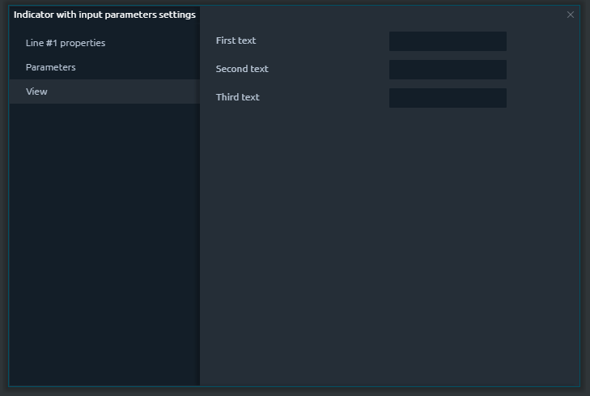
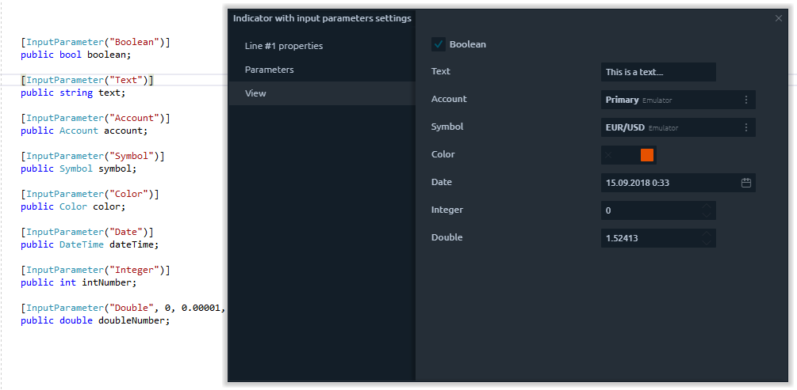

# Input Parameters

In previous topic we showed you how to create a basic indicator using Visual Studio with Quantower Algo extension and use it on the chart in trading platform. We created a Simple Moving Average indicator with hardcoded parameters. But what if we need to change this parameters? For example we want to use Open prices instead of Close or use another Period. It is not very convenient to recompile your indicator each time and we provide you a possibility of easy tuning your scripts via so called Input Parameters.

**What is input parameter?** 

After adding indicator on chart you can find Setting menu item on it, which display you "Settings" window. Indicators usually have some common settings, for customizing lines, and specific settings, that related to their algorithm or calculations.

You can create any amount of input parameters you need in your scripts. They can be used both for indicators and strategies.

From technical point of view, Input Parameter is usual variable marked with special attribute. At the moment we support main basic types: string, number, date time, account, symbols, list with options and others.

We will show in details how to declare each type of input parameters and how to customize them.

**Text**

Sometimes you may need user to provide some text information, for example for displaying on the chart. For this you need to declare string variable and mark it with **InputAttribute.** You need to specify the name of input parameter, which will be displayed in Settings screen:

```csharp
[InputParameter("Text")]
public string text;
```

If you call settings screen you will see text box, which you can use to enter value. That's all - your first input parameter is ready:


If you have a few input parameters and want to arrange them in appropriate order, you can SortIndex parameter of InputParameter:

```csharp
[InputParameter("First text", 1)]
public string firstText;

[InputParameter("Second text", 2)]
public string secondText;

[InputParameter("Third text", 3)]
public string thirdText;
```

  
As you can see, parameters displayed in specified order:




**Boolean**

In case you need simple switcher, for example for enability, you can use bool variable with InputParameter attribute:

```csharp
[InputParameter("Boolean")]
public bool boolean;
```

**Number**

The one of the most important type of input parameters is numbers. Input parameters can be applied to int, double, long and decimal variables:

```csharp
[InputParameter("Integer")]
public int intNumber;
```

You can specify additional parameters - minimal/maximal value, increment and decimal places.

```csharp
[InputParameter("Double", 0, 0.00001, 10, 0.00001, 5)]
public double doubleNumber;
```

**Symbol**

Sometimes you may need possibility so select symbol, for example in case of calculation of correlation between symbol from the chart and another symbol. And again - all you need just declare variable and mark in with **InputParameter** attribute:

```csharp
[InputParameter("Symbol")]
public Symbol symbol;
```

**Account**

If your script is executing some trading operation you need to provide an account settings. Use variable of Account type for this:

```csharp
[InputParameter("Account")]
public Account account;
```

**DateTime**

Usually DateTime settings are using to specify some range of history, for example left and right border of downloaded history:

```csharp
[InputParameter("Date")]
public DateTime dateTime;
```

**Color**

Color Input Parameters store color value in RGB format:

```csharp
[InputParameter("Color")]
public Color color;
```

**List with options**

To do...

To summarize all said above, we gathered all types of Input Parameters to show you can how they look in settings screen:



These basic types of Input parameters are enough to create complex indicators and strategies with wide list of settings. Despite this we are constantly adding support of new Input Parameters. Feel free to contact us and propose your variants - we are open to our users feedback.

