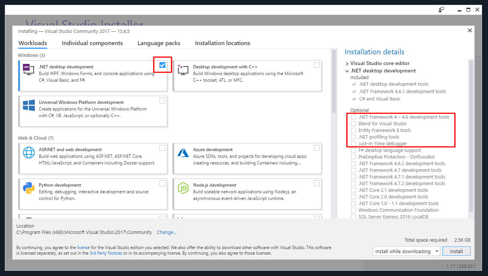
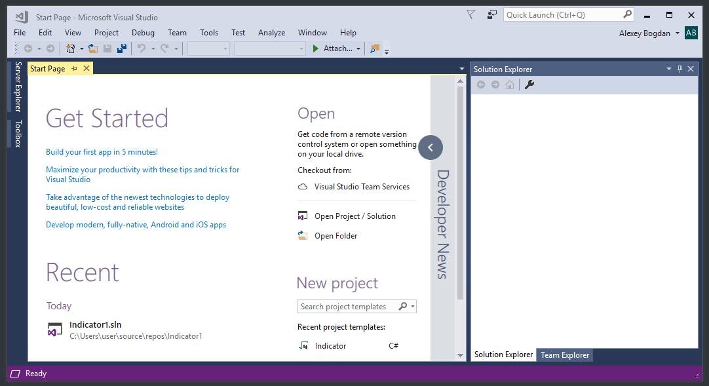
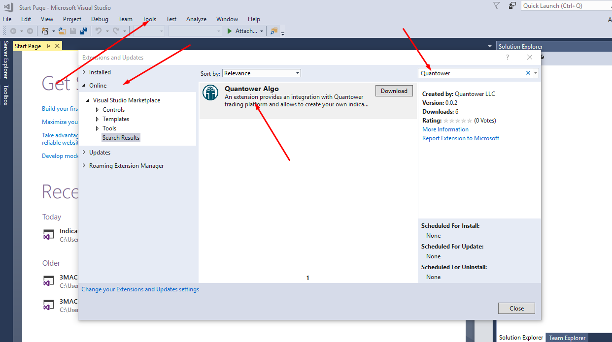

# Install for Visual Studio

**Visual Studio** — is an integrated development environment \(IDE\) from Microsoft, which includes a code editor with IntelliSense, debugger, supporting source control systems, and many other professional features. **The currently supported Visual Studio version is 2019**. 


We recommend you to use the most basic version of **Visual Studio — the Community edition**, which is available free of charge.


You can [**download Visual Studio from an official website**](https://visualstudio.microsoft.com/ru/thank-you-downloading-visual-studio/?sku=Community&rel=16). It requires about 10 minutes to install and 2.5 Gb of free space on your hard drive.



Download the web installer and run it. After initialization, you will be prompted to select the required components. For using with Quantower Algo extension we need only the "**NET desktop development**" workload. You can uncheck optional components also, to reduce installation size:

Continue installation and in a few minutes, after downloading and applying required packages, Visual Studio will start automatically:

Now we need to install Quantower Algo extension from Visual Studio Marketplace. Use "_**Tools -&gt; Extension and Updates...**_" main menu item to open Extensions Manager. Type "_**Quantower**_" into the search box of **Online tab** and you will find a required extension:

Click "**Download**". Visual Studio will ask you for restarting to finish the extension installation process.

To check whether Quantower Algo is installed successfully click "_**File -&gt; New -&gt; Project**_" menu item, type "Indicator" and you will see a special project type for the blank indicator:

Now everything is ready to [create your first indicator](simple-indicator.md).

