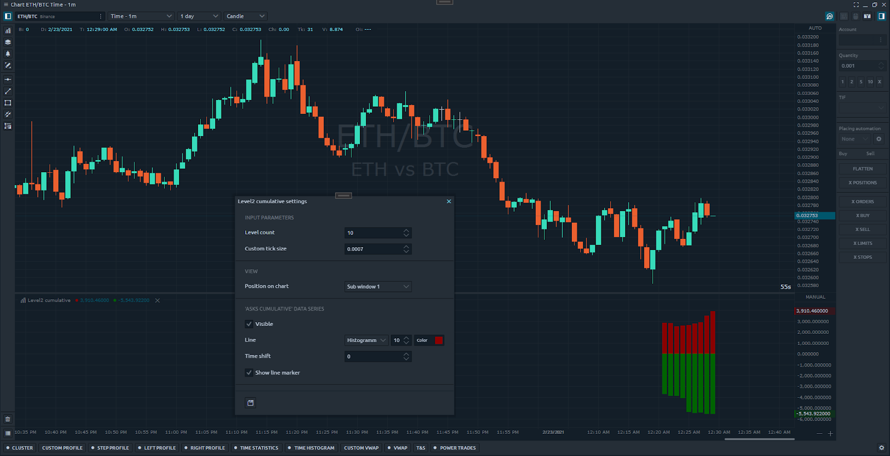

# Level2 data

## **Theory**

Order book \(or level2\) is a collection of buy and sell orders for specific instruments organized by price level. Each level has three important values - price, size and side. This collection is dynamic, in other words, it is constantly updated in real time during the day. 

Many professional traders develop their strategies using order book data. Quantower API provides users an easy way to get aggregated and non-aggregated order book snapshots. ****To use it you just need to execute the "[GetDepthOfMarketAggregatedCollections](https://api.quantower.com/docs/TradingPlatform.BusinessLayer.DepthOfMarket.html#TradingPlatform_BusinessLayer_DepthOfMarket_GetDepthOfMarketAggregatedCollections_TradingPlatform_BusinessLayer_GetDepthOfMarketParameters_)" method and pass the parameters you need. This method is located at the "[DepthOfMarket](https://api.quantower.com/docs/TradingPlatform.BusinessLayer.DepthOfMarket.html)" class. Each instrument has its own "[DepthOfMarket](https://api.quantower.com/docs/TradingPlatform.BusinessLayer.DepthOfMarket.html)" object.

#### Overloads

There are two method overloads:

```csharp
public DepthOfMarketAggregatedCollections GetDepthOfMarketAggregatedCollections(GetLevel2ItemsParameters parameters = null)
```

This method takes the “[GetLevel2ItemsParameters](https://api.quantower.com/docs/TradingPlatform.BusinessLayer.GetLevel2ItemsParameters.html)’-object with properties:

* [**AggregatedMethod**](https://api.quantower.com/docs/TradingPlatform.BusinessLayer.AggregateMethod.html) **-** enum, type of aggregation \(“Price level” by default\)
* **CustomTickSize -** aggregation step \(cannot be less than symbol tick size\)
* **LevelsCount -** number of levels required
* **CalculateCumulative -** set ‘true’ if you need cumulative value for each price level.

```csharp
public DepthOfMarketAggregatedCollections GetDepthOfMarketAggregatedCollections(GetDepthOfMarketParameters parameters)
```

This method takes the “[GetDepthOfMarketParameters](https://api.quantower.com/docs/TradingPlatform.BusinessLayer.GetDepthOfMarketParameters.html)”-object with properties:

* [**GetLevel2ItemsParameters**](https://api.quantower.com/docs/TradingPlatform.BusinessLayer.GetLevel2ItemsParameters.html) **-** the object described above.
* **CalculateImbalancePercent -** set ‘true’ if you need ‘imbalance’ value for each price level.

These methods return a ‘[DepthOfMarketAggregatedCollections](https://api.quantower.com/docs/TradingPlatform.BusinessLayer.DepthOfMarketAggregatedCollections.html)’ object with two lists - ‘Asks’ and ‘Bids’. Each collection contains instances of [‘Level2Item’](https://api.quantower.com/docs/TradingPlatform.BusinessLayer.Level2Item.html) class. There are our price levels.

## **Practice**

In this topic we will develop a simple indicator which will draw ‘Cumulative’ values as histogram.



### **Input parameters**

First, let’s define input parameters. We want to manage the number of levels and set custom tick size.

```csharp
[InputParameter("Level count", 10, 1, 9999, 1, 0)]
public int InputLevelsCount = 10;

[InputParameter("Custom tick size", 30, 0.0001, 9999, 0.0001, 4)]
public double InputCustomTicksize = 0.0001;
```

### **Class constructor**

Populate constructor of our class. Define name and add line series.

```csharp
Name = "Level2 cumulative";

AddLineSeries("Asks cumulative", Color.DarkRed, 10, LineStyle.Histogramm);
AddLineSeries("Bids cumulative", Color.DarkGreen, 10, LineStyle.Histogramm);

SeparateWindow = true;
```

### **OnInit method**


Pay attention! In the ‘OnInit’ method we need to subscribe to the ‘NewLevel2’ event. This is necessary for the terminal to send a 'order book' subscription request to the vendor. The ‘Symbol\_NewLevel2Handler’ method we leave empty.


```csharp
protected override void OnInit()
{
     this.Symbol.NewLevel2 += Symbol_NewLevel2Handler;
}

private void Symbol_NewLevel2Handler(Symbol symbol, Level2Quote level2, DOMQuote dom)
{

}
```

### OnUpdate method

In the ‘OnUpdate’ method we skip the historical part and then get a level2 snapshot. Be sure to check that the ask/bid collections have values. Then we get the required levels and set ‘Cumulative’ values into our indicator buffers.

```csharp
protected override void OnUpdate(UpdateArgs args)
{
    // skip historical part
    if (args.Reason == UpdateReason.HistoricalBar)
       return;

    // get current 'order book' snapshot
    var dom = this.Symbol.DepthOfMarket.GetDepthOfMarketAggregatedCollections(new GetLevel2ItemsParameters()
    {
        AggregateMethod = AggregateMethod.ByPriceLVL,
        LevelsCount = this.InputLevelsCount,
        CalculateCumulative = true,
        CustomTickSize = this.InputCustomTicksize
    });

    if (dom.Asks.Length > 0)
       SetValue(dom.Asks.Last().Cumulative, 0);

    if (dom.Bids.Length > 0)
       SetValue(-dom.Bids.Last().Cumulative, 1);
}
```

### OnClear method

In the ‘OnClear’ don’t forget to unsubscribe from the ‘NewLevel2’.

```csharp
protected override void OnClear()
{
    this.Symbol.NewLevel2 -= Symbol_NewLevel2Handler;
}
```

