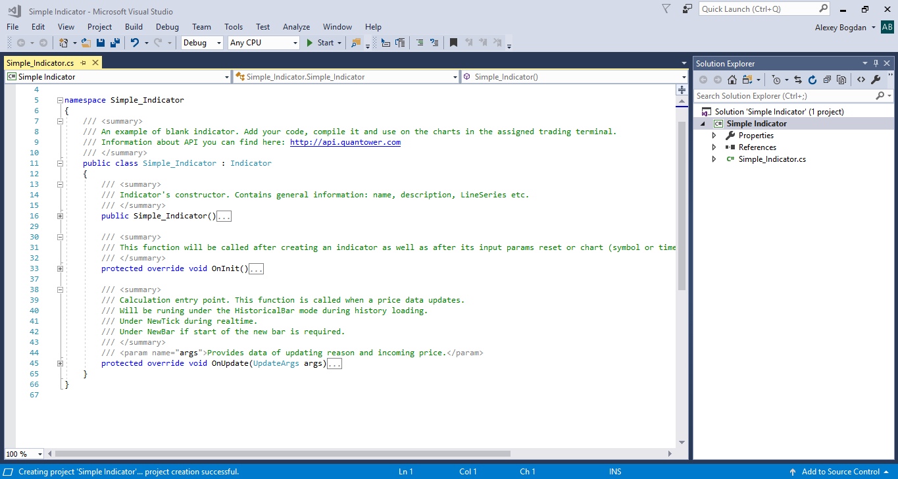
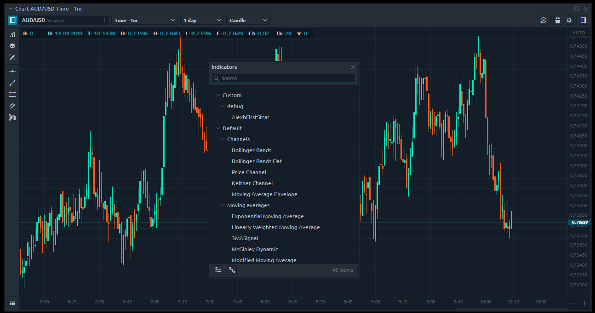
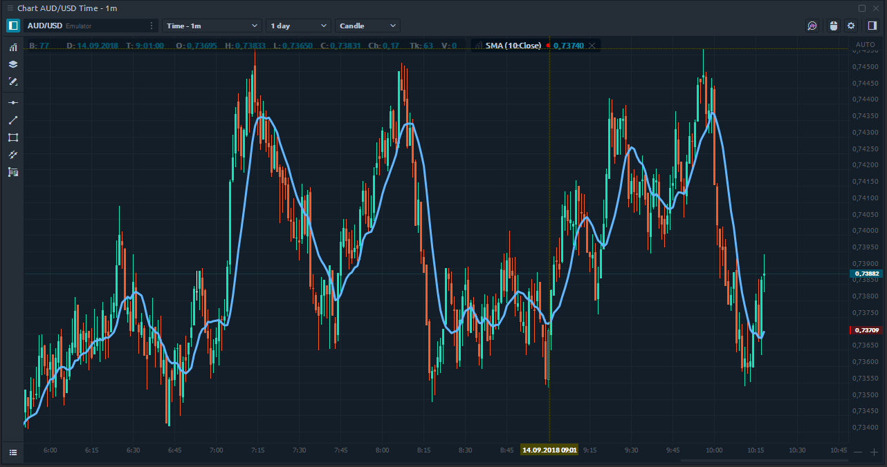

# Simple Indicator


We will use Quantower Algo extension for Visual Studio, but main principles are valid for all development environments. If you don't have Visual Studio or Quantower Algo extension installed you can read [How to install Quantower Algo](installing-visual-studio.md) manual.  
  
See examples of some strategies, integrations and indicators in our [Github repository](https://github.com/Quantower/Examples)


## So, what is indicator in general?

An indicator is mathematical calculations based on a symbol's price or volume. The result is used for displaying on the chart and to help trader make a correct decision. From technical point view Indicator in Quantower is a set of lines with buffers. Each element of the buffer is assigned to a historical bar or tick on the chart. All you need is to make a required calculations and put the result into this buffer.

Sounds not very difficult, doesn't it? Let's start! As for example we will write a code that will implement algorithm of Simple Moving Average indicator.

Use "_**File -&gt; New project**_" in the main menu of Visual Studio to open "**New project**" window. Type "Indicator" and you will see special project type for blank indicator:

At first, you need to create a new project for the indicator. Quantower Algo provides you predefined templates for an empty indicator as well as a few examples of real indicators with source code:


A minimum required source code will be generated automatically and contains the main Indicator functions:



## Indicator code structure

### Common settings

It is time to go deep into the code. In a **constructor** method, you can specify name of the indicator, short name for displaying on the charts and whether you indicator require a separate window on the chart. The most important here is specifying the amount of lines and their default style: Solid/Dot/Histogram, color, and width. In our example, we need only one line, but you can add any amount:

```csharp
/// <summary>
/// Indicator's constructor. Contains general information: name, description, LineSeries etc. 
/// </summary>
public SimpleIndicator()
    : base()
{
    // Defines indicator's name and description.
    Name = "SimpleIndicator";
    Description = "My indicator's annotation";

    // Defines line on demand with particular parameters.
    AddLineSeries("line1", Color.CadetBlue, 1, LineStyle.Solid);

    // By default indicator will be applied on main window of the chart
    SeparateWindow = false;
}
```

### Getting data

The **"OnUpdate"** method will be called each time on history changing - here we need to add our calculations. Most of the indicators are using prices or volumes in their algorithms. Quantower API provides you a few ways to retrieve this data - you can access Open, High, Low, Close and others data from a current bar or from previous bars if it required. 

Common method [**GetPrice**](http://api.quantower.com/docs/TradingPlatform.BusinessLayer.Indicator.html#TradingPlatform_BusinessLayer_Indicator_GetPrice_TradingPlatform_BusinessLayer_PriceType_System_Int32_) allows to retrieve all type of the data:

```csharp
// To get Low price of the current bar
double low = GetPrice(PriceType.Low);
// To get Volume price for the fifth bar before the current
double volume = GetPrice(PriceType.Volume, 5);    
```

And a few simplified ways to retrieve the data:

```csharp
// To get Close price of the current bar
double close = Close();
// To get High price of the current bar
double high = High();
// To get Open price for the fifth bar before the current
double open = Open(5);   
```

You can find more information about "**Indicator"** class in our [API documentation](http://api.quantower.com).

### Setting data

Now we know how to get prices, but as we told before, we need also to put results into indicator buffer. We can use "[**SetValue**](http://api.quantower.com/docs/TradingPlatform.BusinessLayer.Indicator.html#TradingPlatform_BusinessLayer_Indicator_SetValue_System_Double_System_Int32_System_Int32_)**"** method for this:

```csharp
// Put value into current bar for first line of indicator
SetValue(1.43);
// Put value into current bar for second line of indicator
SetValue(1.43, 1);
// Put value into fifth bar before the current bar for second line of indicator
SetValue(1.43, 1, 5);
```

All this is enough to finish our first indicator. Let's add calculations into "**OnUpdate"** method using standard C\# possibilities. This is our total code:

```csharp
/// <summary>
/// Calculation entry point. This function is called when a price data updates. 
/// </summary>
protected override void OnUpdate(UpdateArgs args)
{
    int Period = 10;

    // Checking, if current amount of bars
    // more, than period of moving average. If it is true
    // then the calculation is possible
    if (Count <= Period)
        return;

    double sum = 0.0; // Sum of prices
    for (int i = 0; i < Period; i++)
        // Adding bar's price to the sum
        sum += GetPrice(PriceType.Close, i);

    // Set value to the "SMA" line buffer.
    SetValue(sum / Period);
}
```

As you can see, we use only Close prices for calculations and hard code Period value. In the real case, you will allow a user to specify this values. In our next topic, we will show how to use the Input Parameter for your scripts.

### Build

Indicator is ready to use in trading platform. We need to compile it - use "_**Build -&gt; Build Solution**_" in the main menu or hot key **F6**. Quantower Algo extension will automatically copy your indicator to assigned Quantower trading platform and you will see it in the "Indicators" lookup on the chart:



If you decide to make some corrections in your calculations, you can rebuild your indicator and you even don't need to re-add it again on the chart - it will be updated automatically and you will see results immediately:



As you can see it did not take a lot of time to get the first results. Using this basic example you can easily create your own indicator — all power of C\# language is available for you. In the next topic we will show you how to add possibility of [customizing of your indicator via Input Parameters](input-parameters.md).

