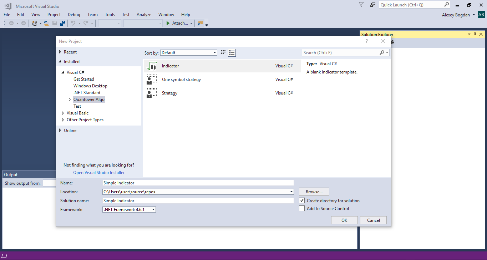

# Simple Indicator

In this topic we will show you how simple is writing indicators in Quantower. We will use Quantower Algo extension for Visual Studio, but main principles are valid for all development environments. If you don't have Visual Studio or Quantower Algo extension installed you can read our topic which will help you with this.

So, what is indicator in general?

Indicator is mathematical calculations based on a symbol's price and/or volume. The result is used for displaying on the chart and to help trader make a correct decision. From technical point view Indicator in Quantower is set of lines with buffers. Each element of buffer is assigned to historical bar or tick on the chart. All you need  is to make required calculation for each bar and put the result into this buffer.

Sounds not very difficult, doesn't it? Let's start!

At first you need to create a new project for indicator. Quantower Algo provide you predefined templates for empty indicator as well as a few examples of real indicators with source code.

Use "File-&gt;New project" in the main menu of Visual Studio to open "New project" window. Find "Quantower Algo" group and select "Indicator" template:

A minimum required source code will be generated automatically and contains the main Indicator functions:

In a constructor method you can specify name of indicator, short name for displaying on the charts and whether you indicator require separate window on the chart. The most important here is specifying the amount of lines and their default style: Line/Dot/Histogram, color, width. In our example we need only one line, but you can add any amount you need:

