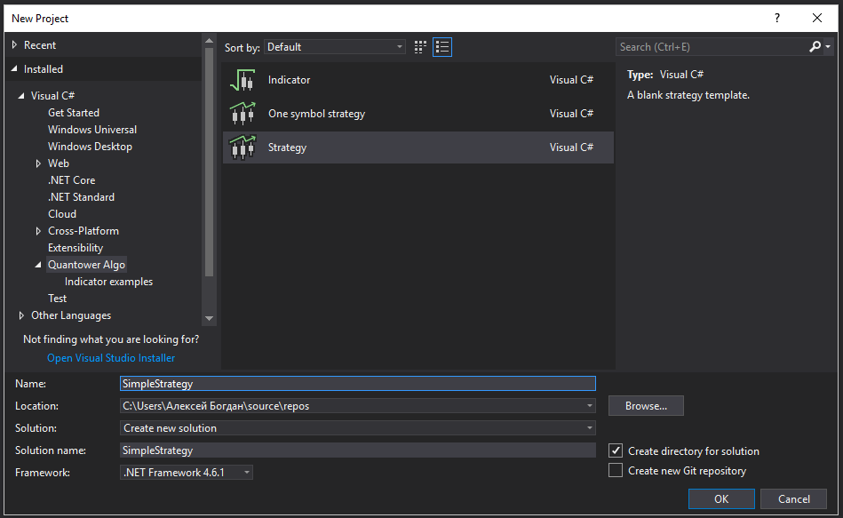

# Simple strategy

In our previous articles we showed you how to use Quantower Algo extension and write your own indicators. Now we show you how to create you first strategy and run it the Quantower trading platform.

### What is strategy?

We use name "Strategy" for code, that can implement absolutely any logic and can be executed in Quantower. You can use strategies for realization of trading algorithms, specific logic of controlling closing orders \(for example Trailing stop\), for arbitrage between different connections, etc. We don't have any restrictions or limitations for this, moreover we provide you access to almost all functions from our trading core.

Quantower Algo provides you two predefined templates of strategies. We will start from blank template, which contains only basis functions. Use "File -&gt; New project" in the main menu of Visual Studio to open "New project" window. Find "Quantower Algo" group and select Strategy" template:

You will get generated code with a few empty functions:

As you can see, this blank version is not related to any trading functionality - it is a just general code-basis. It is inherited of class Strategy, by this Quantower recognize that you code is compatible and can be executed in Quantower. Let's go deep into the code - it contains a few methods:

**OnCreated**

Will be called when user select required strategy from Strategy lookup. Use this method to implement logic, that need to be executed once on creation.

**OnRun**

Will be called when user press Run button in Strategy Runner panel. Use this method to set initial values before running.

**OnStop**

Will be called when user press Stop button in Strategy Runner panel. Use this method to clear state of your strategy \(if required\).

OnRemove

Will be called when user close Strategy Runner Panel or select another strategy. Use this method for final clearing used resources

**OnGetMetrics**

Via this method you can display required information in Strategy Panel and control your strategy. For example you can display how many quotes were processes, or how many but or sell orders were send, etc.  

You don't need to add logic to all this methods, the most often used is pair of **OnRun**/**OnStop** methods.

The most popular case is when you use strategy to implement some trading algorytthm and you need only one instrument and one account for this. For this we have a predefined template - you can use it as a basis. Use "One symbol strategy" in "New project" window:

Now our strategy contains Symbol and Account input variables, which we described before. It subscribes on all type of quotes on start and you can add your code directly in this methods:  

Let's create a trivial example and run it in the Quantower platform. We will talk about retrieving current trading information and trading operations in our next articles, for current moment we will just simply display logs.

Strategy Panel displays all logs generated by strategy in special part. You can use Log method to write new log. You can specify type of logs: info, error or trading.

Just for example we add a counter for each type of quotes and add a strategy metrics for displaying:

Build your project, and if your Quantower Algo is properly assigned to your instance of Quantower you will see your first strategy in Strategy Lookup:

And after selecting input parameters and running you will see logs and updated metrics:

It is a very simple example, but in our further lessons we will show you how to add trading logic into your strategy and how to analyze current placed orders or opened positions.

