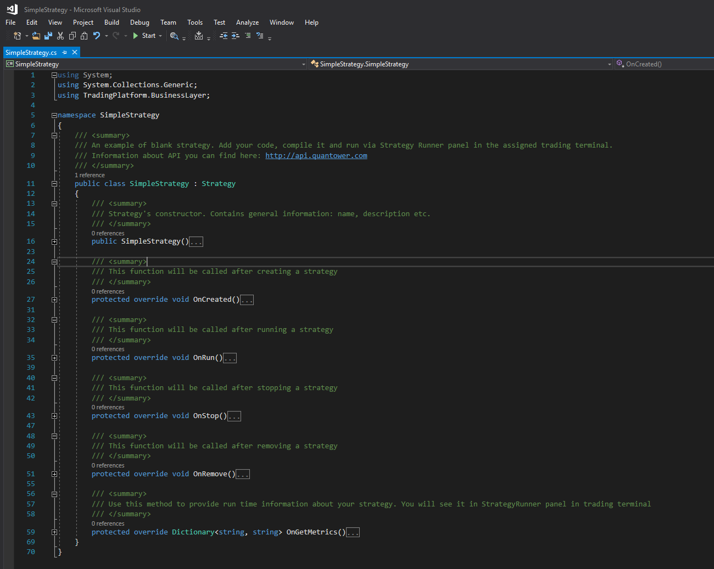
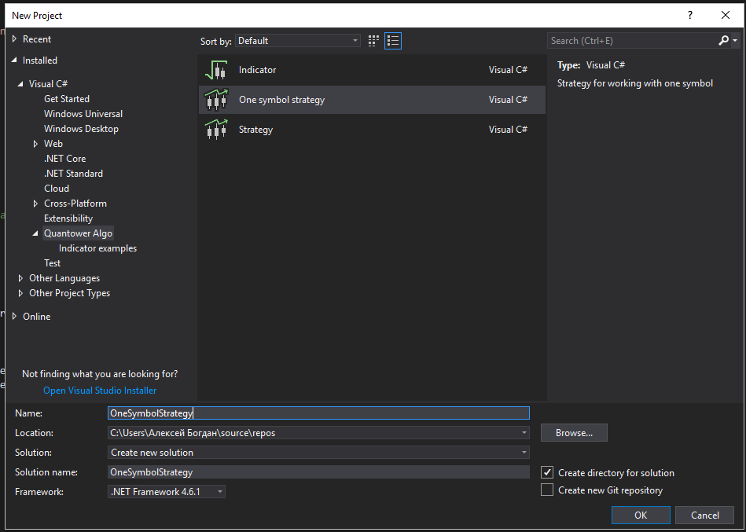
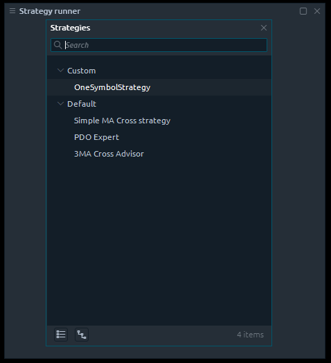
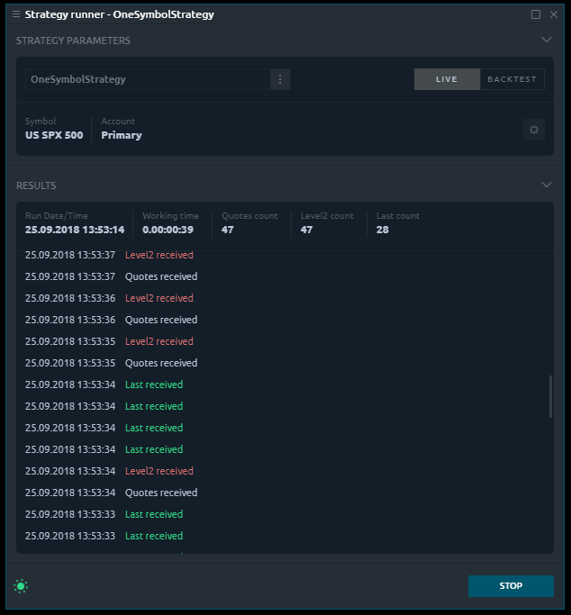

# Simple strategy

In our previous articles, we showed you how to use Quantower Algo extension and write your own indicators. Now we show you how to create you first strategy and run it the Quantower trading platform.


See examples of some strategies, integrations and indicators in our [Github repository](https://github.com/Quantower/Examples)


## What is a Strategy?

We use the name "Strategy" for code, that can implement absolutely any logic and can be executed in Quantower. You can use strategies for the realization of trading algorithms, a specific logic of controlling closing orders \(for example Trailing stop\), for arbitrage between different connections, etc. We don't have any restrictions or limitations for this, moreover, we provide you access to almost all functions from our trading core. 

Quantower Algo provides you with two predefined templates of strategies. We will start from a blank template, which contains only basic functions. Use "_**File -&gt; New project**_" in the main menu of Visual Studio to open "**New project**" window. Type "Strategy" and you will see special project type for blank strategy:


You will get generated code with a few empty functions:



As you can see, this blank version is not related to any trading functionality - it is a just general code-basis. It is inherited of class Strategy, by this Quantower recognize that your code is compatible and can be executed in Quantower. 

## Basic methods

Let's go deep into the code - it contains a few methods:

### **OnCreated**

Will be called when user select required strategy from Strategy lookup. Use this method to implement logic, that needs to be executed once on creation.

### **OnRun**

Will be called when user press Run button in Strategy Runner panel. Use this method to set initial values before running.

### **OnStop**

Will be called when user press Stop button in Strategy Runner panel. Use this method to clear state of your strategy \(if required\).

### **OnRemove**

Will be called when user close Strategy Runner Panel or select another strategy. Use this method for final clearing used resources.

### **OnGetMetrics**

Via this method, you can display the required information in the Strategy Panel and control your strategy. For example, you can display how many quotes were processes, or how many but or sell orders were sent, etc.


You don't need to add logic to all these methods, the most often used is a pair of **OnRun/OnStop** methods.


The most popular case is when you use strategy to implement some trading algorithm and you need only one instrument and one account for this. For this we have a predefined template - you can use it as a basis. Use "One symbol strategy" in "New project" window:



Now we have a little more code - strategy contains Symbol and Account input variables, which we described before. It subscribes to all type of quotes for selected symbol in **OnRun\(\)** method and you can receive and process them if it required by your algorithm.

## Example

Let's create some trivial example and try to run it in the Quantower platform. We will talk about retrieving current trading information and trading operations in our next articles, for the current moment, we just add counters for each type of quotes and strategy metrics for displaying in Strategy Runner panel. We will add examples of logs also - you should always use them, as it can help you to understand the current strategy state or display error information. You can specify a type of log: **Info, Error or Trading**.

```csharp
/// <summary>
/// Variables for counting quotes amount
/// </summary>
int quotesCount = 0;
int level2Count = 0;
int lastCount = 0;

/// <summary>
/// This method will be executed when strategy receive quote
/// </summary>        
private void SymbolOnNewQuote(Symbol symbol, Quote quote)
{
    // Increase quote counter
    quotesCount++;

    // An example of standard log
    Log("Quotes received", StrategyLoggingLevel.Info);
}

/// <summary>
/// This method will be executed when strategy receive level2 quote
/// </summary>        
private void SymbolOnNewLevel2(Symbol symbol, Level2Quote level2, DOMQuote dom)
{
    // Increase quote counter
    level2Count++;

    // An example of error log
    Log("Level2 received", StrategyLoggingLevel.Error);
}

/// <summary>
/// This method will be executed when strategy receive last quote
/// </summary>        
private void SymbolOnNewLast(Symbol symbol, Last last)
{
    // Increase quote counter
    lastCount++;

    // An example of trading log
    Log("Last received", StrategyLoggingLevel.Trading);
}

/// <summary>
/// Use this method to provide run time information about your strategy. You will see it in StrategyRunner panel in trading terminal
/// </summary>
protected override List<StrategyMetric> OnGetMetrics()
{
    List<StrategyMetric> result = base.OnGetMetrics();

    // Display our counters in Strategy Runner panel             
    result.Add(new StrategyMetric() { Name = "Quotes count", FormattedValue = quotesCount.ToString() });
    result.Add(new StrategyMetric() { Name = "Level2 count", FormattedValue = level2Count.ToString() });
    result.Add(new StrategyMetric() { Name = "Last count", FormattedValue = lastCount.ToString() });

    return result;
}
```

Build your project, and if your Quantower Algo is properly assigned to an instance of Quantower, your strategy will be automatically copied to an appropriate folder and you will see it in Strategy Lookup window:



You need to specify the required input parameters: symbol and account and then press the "**Run**" button. Now your strategy is running and you will see logs and metrics, that we have added:



It is a very simple example and it provides you only basic knowledge about how strategies are working in Quantower. In our further lessons, we will show you how to create real algorithms using analysis of your current trading portfolio and trading operations.

