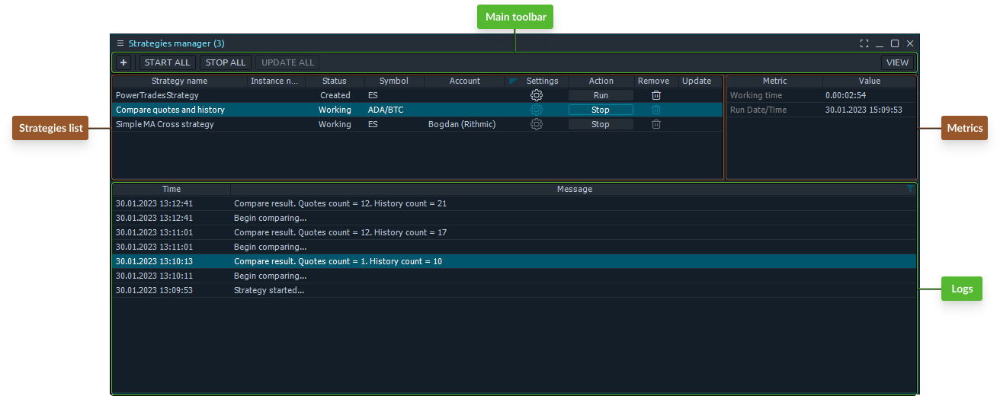

# Strategies manager

The primary purpose of the Strategies manager panel is to launch and monitor ready-to-use automated trading or analysis algorithms in a live environment. It allows you to add multiple strategies and manage them from one place.

## General view

Generally, this panel has two regions: the main toolbar and the strategies list. The other two sections show Metrics and Logs for the strategy selected in the list.

<figure><figcaption>
Strategies manager panel
</figcaption></figure>

### Main toolbar

The <mark style="color:blue;">**Main toolbar**</mark> consists of several buttons, as follows:

* <mark style="background-color:blue;">\[ + ]</mark> button for adding new strategies to the manager from the Strategies lookup screen.
* The <mark style="background-color:blue;">\[ Start all ]</mark> button will launch all inactive strategies on the list.
* The <mark style="background-color:blue;">\[ Stop all ]</mark> button stops all launched strategies
* The <mark style="background-color:blue;">\[ Update all ]</mark> button allows updating codes for added strategies to the latest versions (if there are any after an addition to the manager).
* The <mark style="background-color:blue;">\[ View ]</mark> button allows you to toggle the visibility of the Metrics and Logs sections.

You can hide this toolbar in the View section of the panel's Settings screen and perform the above actions from the right-click context menu.

### Strategies list

The <mark style="color:blue;">**Strategies list**</mark> section is the main working area of this panel. It holds the list of all added strategies with some info and quick management buttons:

* Strategy name.
* Instance name. Allows you to set a custom name if you add several versions of one strategy.
* Status. Created (once you’ve added a strategy to the list), Working (from the moment you’ve run it till stop), Stopped (once you’ve stopped the running strategy), Waiting for connection (in case there is no active connection in the terminal right now).
* Symbol. The working Symbol(s) that from the strategy’s parameters.
* Account. The working Account from the strategy’s parameters.
* Settings. This column holds a button for quick access to the parameters of the selected strategy.
* Action. Here you can Run or Stop the selected strategy.
* Remove. Allows you to remove the selected strategy from the manager’s list quickly.
* Update. Allows you to update the selected strategy’s code to the latest version if it has any changes after an addition to the manager.

### Metrics & Logs

The <mark style="color:blue;">**Metrics and Logs**</mark> sections are responsible for displaying the activity information of the selected strategy. Once you run some strategy, it will start updating its metrics and write activity logs, if there are any. The strategies manager will keep logs and metrics if you stop your strategy. On the next run, the metrics section will be updated, while logs will store all previous entries and append them with the new ones. The whole platform's restart will erase all logs and metrics.

## Settings & operation

The strategy settings screen is a separate screen that displays all the parameters required by the selected strategy. Please note that you can change these settings only before the strategy launch. Any further changes in settings will be applied after the strategy's restart only.

When you run any of your strategies, there will be a corresponding indicator (colored droid) in the status bar of the application’s Main toolbar.

<figure><figcaption>
Indicator of active strategies
</figcaption></figure>

## Relaunch on the platform’s restart

By default, if you close the whole application while having active strategies, they will be stopped and will not be resumed on the next platform’s launch (you need to restart them manually). If you want the Strategies manager to renew automatically, check the “<mark style="color:blue;">**Restore strategies state after shutdown**</mark>” in the General section of the panel’s settings screen.
