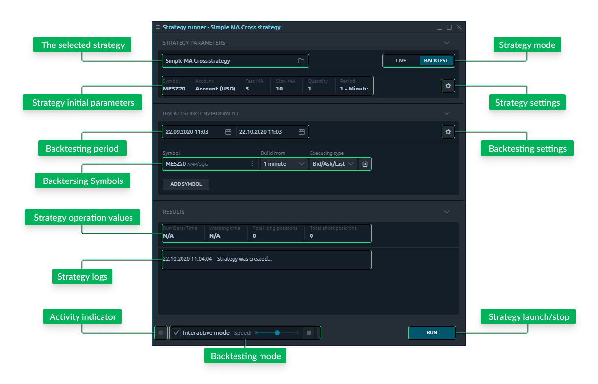
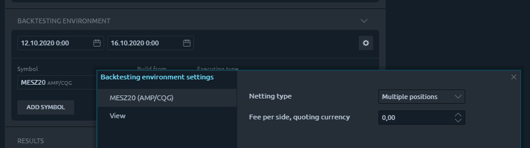

# Strategy runner

## **General usage**

Initially, this panel consists of two parts: Strategy parameters and Results.The parameters section represents the strategy operation settings and allows you to change them before launch. The Results section represents all of the information about strategy progress once it was launched. Right in the footer of the Strategy runner panel you can find the Run button, that will change to Stop after the strategy was launched.

In general, to start automated trading you should:

1. Launch the Strategy runner panel
2. Select the required strategy
3. Set up automated trading parameters
4. Press the Run button

## Strategy parameters

The strategy usually has its own input parameters, that were declared in its code. Usually, there are Symbol, Account, and some other parameters. 


Before launching the strategy in Live mode, **you must carefully check** and provide all of the required data. Please note that improperly configured ATS can lead to a huge money loss.


When you operate in Backtesting mode, the first selected for backtesting Symbol and its account will be automatically applied to strategy settings.

## Launch and stop

The **Run** button in the footer of the panel initiates the selected strategy launch \(including historical data loading\) and other preparation steps. Once the strategy was started, the Run button converts to a **Stop** button, allowing it to stop the process.

## Results

This section displays the general statistics of strategy operation, such as **Run Date/Time** \(when it was launched\), **Working time** \(how much time it works\), and any additional parameters, that are specific per each different strategy. The lowest section of the Results block is the **Logs** list, where the strategy will output all of the actions that it performs while working. 

## Backtesting mode

Another usage of this panel is a Backtesting mode. When you select a strategy, you will find a switcher with two options of strategy operation: Live & Backtest. The first option will launch your strategy with live trading data on the selected Account and Symbol. But if you switch to the Backtest mode, you will see an additional block, devoted to the backtesting environment. **This mode allows the user to test strategy before going live with it.** Actually, while in backtesting mode, all strategy’s actions will be fully emulated on some historical data.

### **Testing environment set up**

First, specify the **Historical period** for testing. This is the period of historical data that will be downloaded for the selected Symbol.

Next, specify a **Symbol** to test on. This is a Symbol of some data provider that you are currently connected to. Additionally, you can select the following Symbol’s data parameters:

* **Build from** option specifies how the historical data should be aggregated for testing purposes: 
  * _Ticks_ allow emulating the most accurate data flow, similar to “real” market behavior. Best for daily period testing and high-frequency trading strategies.
  * _1-minute_ aggregation is good for weekly testing. This aggregation allows us to reduce the historical data amount and speed up the backtesting process.
  * _1-day_ aggregation is the best for testing a long-range of historical data \(months, years\) and seasonal market changes.
* **Executing type** option specifies what data should be used for testing: Bid/Ask/Last or just Last market data. Depending on your data provider, you might not be able to get Bid/Ask/Last historical data.


Please note, that Ticks aggregation may lead to high internet traffic consumption and computer processor load while backtesting if used with a long historical period.


In case your strategy requires some additional data for analysis, you may specify **multiple symbols** for the testing environment. These symbols can be later used to specify in the strategy operation parameters section.

### Environment settings

There is also an **additional settings screen** allowing to set up some Exchange or Market-specific parameters in order to emulate the most accurate and “real” testing environment. There is a View tab, for general parameters, and Per-selected-symbol tabs, for specifying symbol-specific parameters.

* **Initial balance.** This field allows you to set an initial balance of your testing account.
* **Modelling scheme.**
* **Netting type.** This option specifies how your backtester should behave when you open multiple positions per one symbol
  * One position. All new positions will be combined with the one first opened.
  * Multiple per side. All new positions will be combined with the one first opened but separately per each trading Side.
  * Multiple positions. All new positions will be opened separately.
* **Fee per side.** You can set the value of the fee that will be added to each trade that your strategy will make. This value should be set in quoting currency \(e.g. currency of your testing account\).

### **Backtesting controllers**

Another feature of the "Strategy runner" panel is an **Interactive mode**. It is situated in the footer of the panel and is enabled by default. This mode allows us to track the testing process more precisely and even control its speed. 

The interactive mode gives a possibility to visualize the strategy’s actions using various panels of the Quantower terminal. The **Speed slider** slows down or makes faster the process of historical data playback. The lowest value of Speed pauses the strategy and activates the “per-tick” \(actually per “Build from” value\) playback button.


Please note, when you click the Stop button in backtesting mode, your strategy’s results will be erased and you won’t be able to access them anymore.


### **Backtesting results**

When you launch your strategy in backtesting mode, the backtesting environment section converts to the Progress section. Here you can see the history playback progress bar and **Visualizer button** on the right side of each symbol row. 

The Visualizer button allows us to open some Quantower panels and visually track the strategy operation during the history playback. The most interesting panels are Account performance, showing the trading results of your strategy, and Chart panel, which will display trades using a visual trading interface. You can also visualize the backtesting process in various panels such as Time&Sales, DOM Surface, and TPO Chart, etc. 

When you are working with your own code, you will constantly modify your strategy and need to inform the strategy runner to use the latest version. In this case, when you build your code you will notice the **“New version” button** right near the Run button. Apply new code by clicking this button and then you can test an updated strategy.

### **Quick backtesting**

Using an interactive mode, the backtesting process has a limited maximum speed, but what if we don’t need to visualize the strategy operation, but just get the final results? Turning the interactive mode off will **enable the maximum possible speed of the backtesting** and you will see that the same period of history was processed much faster. In this case, you won’t be able to visualize the backtesting process but only see the results after the selected period of history will be managed.

## **Risk notice**

All automated trading strategies carry risk, even if the long term profitability is positive. There is no perfect system, nor is there a system that always wins. Any investment in ATS carries great risks, and the performance shown should not blind the user from those risks. It is important to note that the worst losing streak of a system is most often yet to come, and can happen when the system is active in the user's account. The market circumstances can change from the period in which the system was designed, and the system’s rules which have given positive returns in the past can start giving negative returns.

Quantower trading platform performs the execution of orders, sent by ATS for User’s account on a "not held" basis, meaning Quantower shall not be held responsible for the execution of the order at the price indicated or otherwise; and shall not be responsible for the performance of the ATS, including any potential trading losses the user may sustain as a result of the use of the ATS.

In particular, Quantower is not responsible for any damages that may result from incorrect functioning of the ATS as well as any technical problem external to the Quantower trading platform.

## Video manual

This video describes the process of creation of a simple automated trading strategy as well as Strategy runner operation practices



