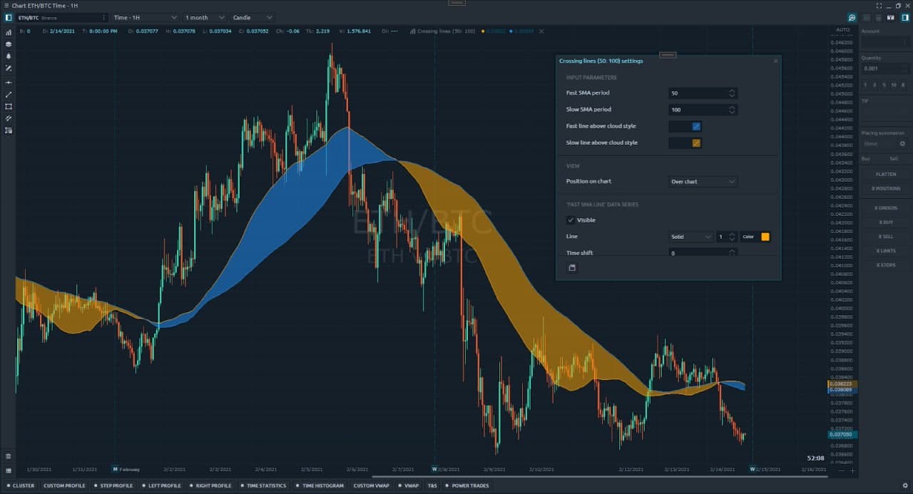

# Using Clouds in Indicator

## **Theory**

“Clouds” are areas highlighted with a special color drawn between two line series. Usually, they are used to highlight some special region on the chart. So, it’s one more great visual effect which can make your script more user friendly and even more useful.

To start drawing a cloud area we need to invoke the ‘[BeginCloud](https://api.quantower.com/docs/TradingPlatform.BusinessLayer.Indicator.html#TradingPlatform_BusinessLayer_Indicator_BeginCloud_System_Int32_System_Int32_System_Drawing_Color_System_Int32_)’ method and pass required parameters. If we want to end drawing the area - invoke ‘[EndCloud](https://api.quantower.com/docs/TradingPlatform.BusinessLayer.Indicator.html#TradingPlatform_BusinessLayer_Indicator_EndCloud_System_Int32_System_Int32_System_Drawing_Color_System_Int32_)’ method. These methods are available for every indicator.

Let’s figure out the meaning of these parameters:

```csharp
/// <summary>
/// Marks cloud begin between two line series with specific color
/// </summary>
/// <param name="line1Index">First line series index</param>
/// <param name="line2Index">Second line series index</param>
/// <param name="color">Cloud color</param>
/// <param name="offset">Offset</param>
protected void BeginCloud(int line1Index, int line2Index, Color color, int offset = 0)
```

```csharp
/// <summary>
///  Marks cloud end between two line series with specific color
/// </summary>
/// <param name="line1Index">First line series index</param>
/// <param name="line2Index">Second line series index</param>
/// <param name="color">Cloud color</param>
/// <param name="offset">Offset</param>
protected void EndCloud(int line1Index, int line2Index, Color color, int offset = 0)
```

## **Practice**

It will be a simple indicator that will draw two SMA lines with different periods and сloud areas between of them. Periods and colors can be changed in settings.



### Input parameters

Let’s create an empty indicator project and define input parameters.

```csharp
[InputParameter("Fast SMA period", 10, 1, 9999, 1, 0)]
public int FastPeriod = 50;

[InputParameter("Slow SMA period", 20, 1, 9999, 1, 0)]
public int SlowPeriod = 100;

[InputParameter("Fast line above cloud style", 30)]
public Color FastAboveCloudColor;

[InputParameter("Slow line above cloud style", 40)]
public Color SlowAboveCloudColor;

private Indicator fastSma;
private Indicator slowSma;
```

### Class constructor

Populate constructor of our class. Define script name, add line series and set default colors of cloud areas.

```csharp
this.Name = "Crossing lines";

// define two lines
this.AddLineSeries("Fast SMA line", Color.Red, 3, LineStyle.Solid);
this.AddLineSeries("Slow SMA line", Color.Green, 3, LineStyle.Solid);

// set default cloud colors
this.FastAboveCloudColor = Color.FromArgb(127, Color.Green);
this.SlowAboveCloudColor = Color.FromArgb(127, Color.Red);
```

### OnInit method

In the ‘OnInit ‘ method we create two SMA indicators and attach them to our main ‘HistoricalData’. 

> Notice, we use Quantower built-in indicator collection.

```csharp
protected override void OnInit()
{
     // create SMA indicators
     this.fastSma = Core.Instance.Indicators.BuiltIn.SMA(this.FastPeriod, PriceType.Close);
     this.slowSma = Core.Instance.Indicators.BuiltIn.SMA(this.SlowPeriod, PriceType.Close);

     // attach them to HistoricalData
     this.AddIndicator(this.fastSma);
     this.AddIndicator(this.slowSma);
}

```

### OnUpdate method

The main calculation is performed in the "OnUpdate" method. 

> Notice the line '20'. When lines are crossed we invoke the ‘EndCloud’ method to close the last area. After that we invoke ‘BeginCloud’ to start drawing the new area with specified color.

```csharp
protected override void OnUpdate(UpdateArgs args)
{
     // get current values (offset is '0' by default)
     var currFastValue = this.fastSma.GetValue();
     var currSlowValue = this.slowSma.GetValue();

     // get previous values (offset is '1')
     var prevFastValue = this.fastSma.GetValue(1);
     var prevSlowValue = this.slowSma.GetValue(1);

     // check if our lines are crossed.
     var isCrossing = currFastValue > currSlowValue && prevFastValue < prevSlowValue ||
                      currFastValue < currSlowValue && prevFastValue > prevSlowValue;

     // draw lines
     this.SetValue(currFastValue, 0);
     this.SetValue(currSlowValue, 1);

     // Notice!!!
     if (isCrossing)
     {
        // finish drawing the current cloud.
        this.EndCloud(0, 1, Color.Empty);

        // start drawing a new cloud.
        if (currFastValue > currSlowValue)
             this.BeginCloud(0, 1, this.FastAboveCloudColor);
        else if (currFastValue < currSlowValue)
             this.BeginCloud(0, 1, this.SlowAboveCloudColor);
     }
}
```

### OnClear method

Don’t forget to remove indicators we created in the method "OnClear"

```csharp
protected override void OnClear()
{
     this.RemoveIndicator(this.fastSma);
     this.RemoveIndicator(this.slowSma);
}
```

A complete example is available on our Github.

