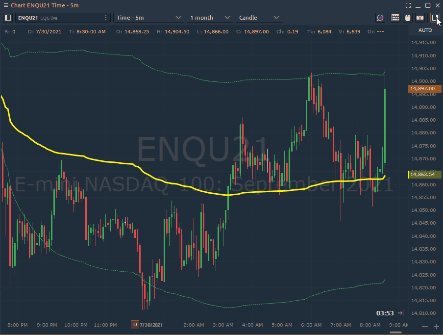
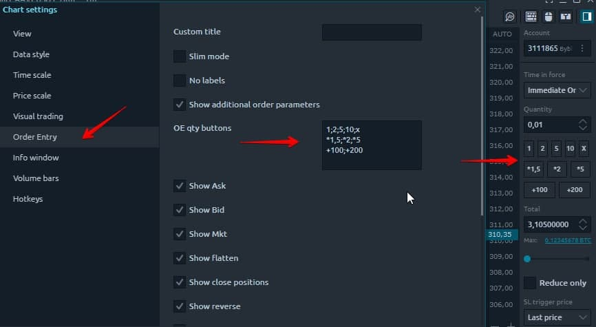
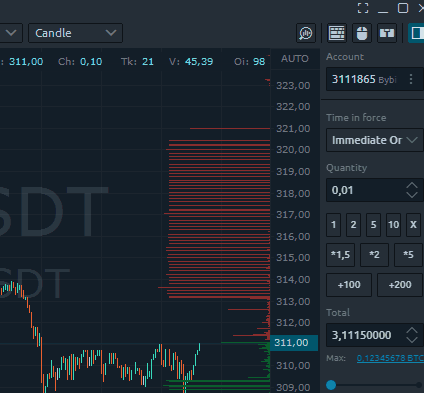
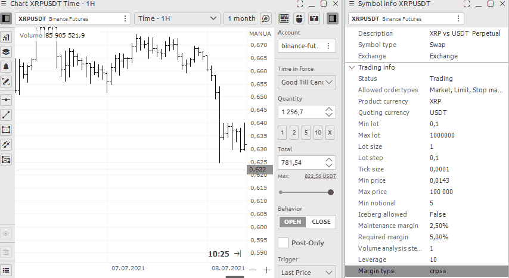

# Chart Trading

Placing orders on the Quantower platform can be done via different panels like Order Entry, DOM Trader, Chart. In this guide, we will show you how to place orders via Chart using the sidebar trading toolbar and mouse mode.

### **Chart Trading Toolbar**

* [How to open chart trading toolbar](chart-trading.md#how-to-open-quick-trade-toolbar)
* [How to manage Quick Order Quantity buttons](chart-trading.md#quick-change-order-amount-buttons)
* [Slider to enter the volume of the position](chart-trading.md#slider-to-enter-the-volume-of-the-position-in-dollars)
* [How to set up Take Profit and Stop Loss orders](chart-trading.md#how-to-set-up-profit-and-stop-orders)
* [How to set up  several Take profit and Stop Loss orders for one position](chart-trading.md#how-to-set-up-several-take-profit-and-stop-loss-orders-for-one-position)
* [A set of buttons for quick order and position management](chart-trading.md#a-set-of-buttons-for-quick-order-and-position-management)

[Quick order entry](chart-trading.md#quick-order-entry)

* [How to open Quick order entry](chart-trading.md#how-to-open-quick-order-entry)

[Mouse visual trading](chart-trading.md#mouse-trading)

* Chart trading mode with the mouse
* Quick order placement through the chart area with a mouse.
* How to set up many limit orders

[Keyboard trading](chart-trading.md#keyboard-trading)

* How to activate trading with hotkeys
* Setting and trading from the hotkeys.

## Chart Trading Toolbar

### How to open chart trading toolbar

To activate the quick trading toolbar, click on the button in the upper right corner.


The general view of Chart Trading Toolbar may differ depending on the available functions for each trade connection.\
This panel will be slightly different for crypto connections, as well as for those that do not allow to create Brackets or server-side Stop Loss / Take Profit orders. For more details about available order types for each connection, please check the [**Order Types section**](order-entry/order-types.md)****


### How to manage Quick Order Quantity buttons

Quick Order Quantity buttons will help you change the specified volume in one click, based on your trading strategy. You can set by default any parameters that you need to quickly change the values. Moreover, the buttons can change not only the specified position volume, but also apply any (!!!) formulas to calculate the order volume. To set your personal values for a quick change of the order, you need to go to the settings of the chart in the menu section "Order entry" and find the field "OE buttons"

You can set standard values of the order amount, which corresponds to your risks. This is very convenient for manual trading.


Buttons can change not only to a given amount of position, but also apply any formulas


### Default volume setting

By right-clicking you can save the default order entry settings for all symbols

.png>)

### Slider to enter the volume of the position in dollars

There are two ways to enter the quantity of a position 

* Entering an order in lots of a traded symbol or coin - this was described above
* Entering the amount of money planned to purchase that asset.


It is important to remember that if you use margin trading, the result is counted taking into account the leverage.



This example is for crypto markets


For example, at the moment you have $82 on your account and 10 leverage is set. It means that you have $820 available balance for trade. This is what you can see in the example.

### How to set up Profit and Stop orders

Then you can set** automatic stop loss and profit** in pips. It's very convenient to set the lot size and protect it. Specify your values in the appropriate fields.


Some brokers such as Binance do not allow stop orders for limit orders. (Until the position is NOT open) In this case, use limit orders of the opposite direction


.gif>)

* Use the Qquick Ttrade toolbar 
* Set your values for stop loss or profit. You can also use any one parameter only. 
* Use the button to activate the trade with the mouse to set a limit order


If you execute an order at market, the specified stop parameters will retain their values and will be set immediately.


### How to set up  several Take profit and Stop Loss orders for one position


This example is for connecting a CQG/AMP


* To set multiple stop orders for a single position, do the following Switch the bracket (stop) settings to multi mode 
* Enter data for setting the first limit orders and how many lots or coins should be closed 
* For the next stops, enter similar data on the next line.
*  You can set orders in multiples of your total volume

### A set of buttons for quick order and position management

1. Next comes a block of buttons for **quickly placing an orde**r into the betting slots at the appropriate price.

.png>)

2\.  Next comes a large block of functions for managing the current position. You can delete or limit orders or stops. You can also reverse your position with one button or set it to no loss. These are very functional buttons, do not miss them.

## Quick order entry

### How to open Quick order entry

To access the quick trade toolbar, click the button in the upper right corner.

.gif>)

## Mouse trading

Allows you to set limit and stop limit orders directly on the chart. To activate this function, click on the button in the upper right corner of the panel with the image of a mouse icon

.gif>)


To place several orders in a row hold down CTRL


If the mouse position i**s higher than the current price** then 

* right click of the mouse will set a **limit order ** 
* left click of the mouse will set a **Buy stop marke**t order

If position of the mouse is **under the current price **then

* right click of the mouse will set **Sell stop market **
* right click of the mouse will set **Buy limit order**

## Keyboard trading

### How to activate trading with hot keys

To access the quick trade toolbar, click the button in the upper right corner. If you don't see this button, turn it on in the[ settings](../analytics-panels/chart/chart-settings.md)

.png>)

You can set your own values for the hot buttons in the chart settings
