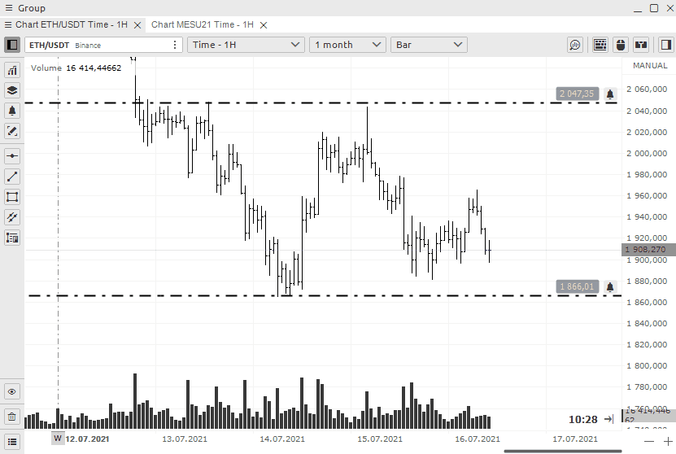

# Chart Trading

Entry of orders on the Quantower platform on the exchanges can be done in different ways, depending on the chosen trading style: 

Quick trading panel 

* How to open  quick trade toolbar
* Quick change order amount buttons and formulas in it
* **Slider to enter the volume of the position in dollars**
* **How to set up Profit and Stop orders**
* **How to set up  multiple Profit and Stop orders for one position**
* A set of buttons for quick order and position management

Quick order entry

* How to open Quick order entry
* How to set volume quantity
* Other features

Mouse trading

* From the chart trading mode with the mouse, visual trading.
* Quick order placement through the chart area with a mouse.
* How to set up many limit orders

Keyboard trading

* Setting and trading from the hotkeys.

## Quick trading panel

### How to open  quick trade toolbar

To access the quick trade toolbar, click the button in the upper right corner. If you don't see this button, turn it on in the[ settings](../analytics-panels/chart/chart-settings.md)

### Quick change order amount buttons 

The quick change order amount buttons will help you change the specified volume in one click, based on your trading strategy. You can set by default any parameters that you need to quickly change the values. Moreover, the buttons can change not only the specified position volume, but also apply any \(!!!\) formulas to calculate the order volume. To set your personal values for a quick change of the order, you need to go to the settings of the chart in the menu section "Order entry" and find the field "OE buttons"

You can set standard values of the order amount, which corresponds to your risks. This is very convenient for manual trading.


Buttons can change not only to a given amount of position, but also apply any formulas


### Default volume setting

By right-clicking you can save the default order entry settings for all symbols

### Slider to enter the volume of the position in dollars

There are two ways to enter the quantity of a position 

* Entering an order in lots of a traded symbol or coin - this was described above
* Entering the amount of money planned to purchase that asset.


It is important to remember that if you use margin trading, the result is counted taking into account the leverage.


 For example, at the moment you have $82 on your account and 10 leverage is set. It means that you have $820 available balance for trade. This is what you can see in the example.

### How to set up Profit and Stop orders

Then you can set **automatic stop loss and profit** in pips. It's very convenient to set the lot size and protect it. Specify your values in the appropriate fields.


Some brokers such as Binance do not allow stop orders for limit orders. \(Until the position is NOT open\) In this case, use limit orders of the opposite direction


* Use the Qquick Ttrade toolbar 
* Set your values for stop loss or profit. You can also use any one parameter only. 
* Use the button to activate the trade with the mouse to set a limit order


If you execute an order at market, the specified stop parameters will retain their values and will be set immediately.


### How to set up  multiple Profit and Stop orders for one position

* To set multiple stop orders for a single position, do the following Switch the bracket \(stop\) settings to multi mode 
* Enter data for setting the first limit orders and how many lots or coins should be closed 
* For the next stops, enter similar data on the next line.
*  You can set orders in multiples of your total volume

### A set of buttons for quick order and position management

1. Next comes a block of buttons for **quickly placing an orde**r into the betting slots at the appropriate price.

2.  Next comes a large block of functions for managing the current position. You can delete or limit orders or stops. You can also reverse your position with one button or set it to no loss. These are very functional buttons, do not miss them.

## Quick order entry

### How to open Quick order entry

To access the quick trade toolbar, click the button in the upper right corner. If you don't see this button, turn it on in the[ settings](../analytics-panels/chart/chart-settings.md)

### How to set volume quantity


Note that in order to make a transaction from the Quick order entry panel, you must enter the lot volume. And this volume does not coincide with the Quick trading panel 


### Other features 

You can set both limit and stop limit orders

## Mouse trading

