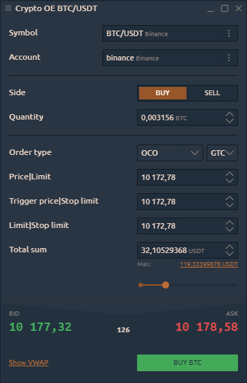
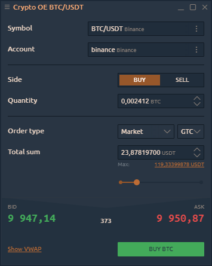

# Crypto Order Entry

Crypto Order Entry panel allows to create trading orders with different conditions, such as order quantity, price, side, order type and submit them on the market. From the Crypto Order Entry panel, you can supply all of the necessary information for an order and easily submit it by clicking the appropriate action button.

This panel is identical to the main [Order Entry panel](order-entry/), but it only works with an active trading connection to the crypto exchange.


If the crypto exchange is connected in the **Info mode**, the panel will not be active.


### **Order types and restrictions**

Crypto Order Entry automatically lists all exchange-supported order types available for the associated instrument under the selected connection. Within our existed connections we support:

* **Market order** is an order placed without a price with the intention of hitting the best Bid or taking the best Offer currently available in the market. The order fills at the current best price. Unlike limit orders, where orders are placed on the order book, market orders are executed instantly at the current market price, meaning that you pay the fees as a market taker.

* **Limit order** allows submitting an order at a specific limit price or better.

