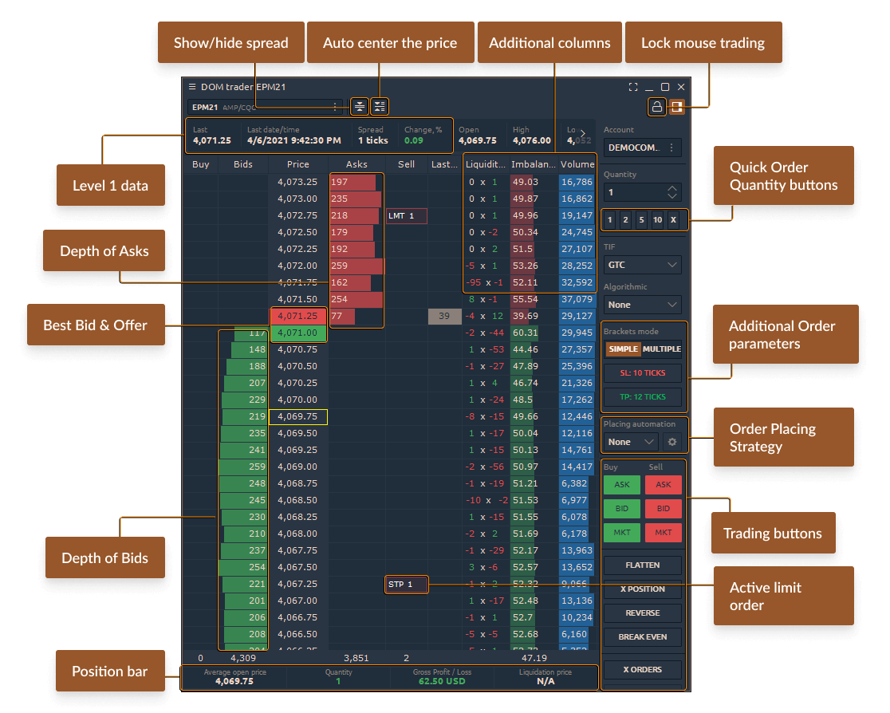
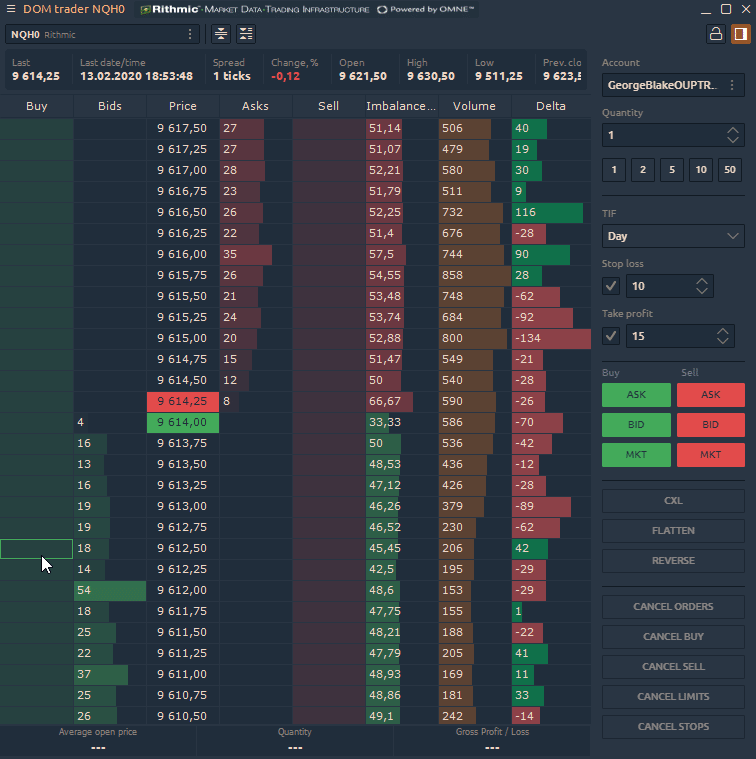
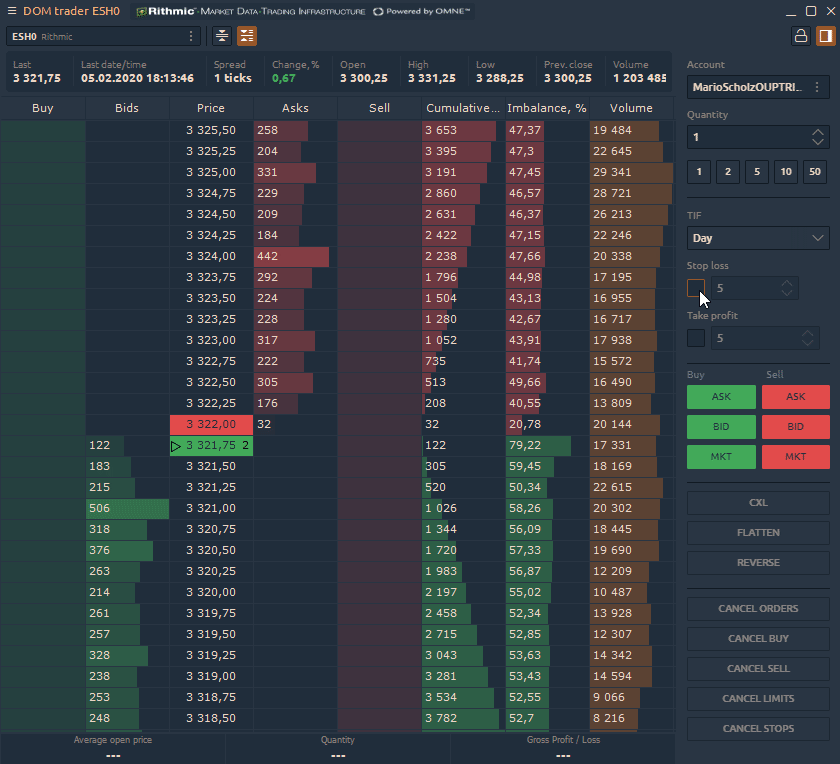
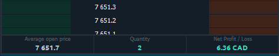

# DOM Trader

## General info about DOM Trader

**The Depth of Market** or **DOM Trader** panel shows the number of Buy and Sell orders placed at various price levels around the current price for a particular instrument \(most often for futures\). The more the number of orders is at a certain price level, the higher the interest in this level. The trading functionality of the panel allows you to quickly and efficiently place the required number of orders at the selected price, and also drag-and-drop, change or cancel them.

## Trading with DOM Trader

DOM Trader allows to send trading orders in three ways  — **Mouse Trading mode,** **Order Entry and Hotkeys.**

To place an order via Mouse Trading mode:

* Select an account and order restriction \(TIF\) in the order entry;
* Enter an order quantity;
* Left-click at a specific price in the left column will place a Buy Limit order \(below the current market price\);
* Left-click at specific prices in the right column will place a Sell Limit order \(above the current market price\). If you place the order below the current price it will be executed by market price;
* _To place a **Stop order**_ is necessary to press and hold down the _**Shift**_ key and click at a required price.

To place an order via Order Entry:

* Select an account and order restriction \(TIF\) in the order entry;
* Enter an order quantity;
* Click on the Bid, Ask or Market button to place your order;
* Set Stop Loss and Take Profit orders \(Bracket Orders\)
* Confirm your placement by first checking all the parameters.



## DOM Trader settings

Additional settings of the DOM Trader allow you to customize the general view for convenient display of data and the panel in general. To open DOM Trader settings, click on the Menu button on the left upper corner and select Settings item.

The general view of DOM Trader settings menu has the following subsections. Let's take a closer look at them:

* **View**
* **Columns**
* **Order Entry**
* **Positions Bar**
* **Hotkeys**

### View settings

* **Custom title.** You can rename the DOM Trader panel as you wish.
* **Refresh rate \(ms\)** controls the rate at which market data is updated. This determines how often the platform processes changes in depth of market. With a value of 1, all changes to the level2 data will be processed immediately. We recommend using value 50. 
* **Use custom tick size.** 
* **Short price format**
* **Split size columns.** A mode that allows you to place Ask and Bid volume on one or different sides of the Size column;
* **Custom session.** This item is for selecting trading sessions for Volume Analysis data primarily.
* **Full-size cells.** Color scheme for Size column;
* **Show order entry.** This option shows/hides an Order Entry on the panel for quick order placement;
* **Collapse spread.** Hide or show the spread between the current Bid / Ask prices on the price ladder;
* **Show day map.** Display the upper horizontal scale, which shows the current price position relative to the High and Low of the day;
* **Show toolbar.**  This option shows/hides the top toolbar with the trading symbol and expands the "useful" area of the panel. It is recommended to use this option with the symbol link.
* **Show Level 1 bar.** Shows/hides the header pane, which contains Level 1 market data for the selected instrument.

### Position Bar settings

At the bottom of the DOM Trader is the Position Bar, which displays brief info about an open position on the current trading instrument  — the number of contracts, the average open price, current Profit/Loss and Liquidation price.

### Hotkeys

This tab is for configuring your keyboard shortcuts. Here you can configure the order size with one button and place it to the market. Cancel orders and many other useful functions.

