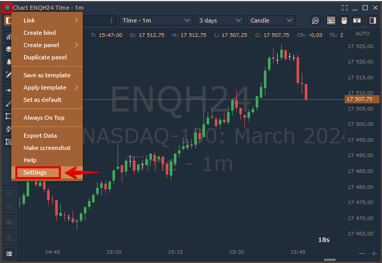

# DOM Trader Settings

Additional settings of the DOM Trader allow you to customize the general view for a convenient display of data and the panel in general.&#x20;

**1)** To open DOM Trader settings, click on the '<mark style="background-color:blue;">**Menu**</mark>**'** button on the left upper corner and select <mark style="background-color:blue;">**Settings**</mark> item.

<figure><figcaption>
DOM Trader Settings
</figcaption></figure>

**2)** Right-click on the price column and select the '<mark style="background-color:blue;">**Settings**</mark>' option.

<figure><figcaption>
DOM Trader Settings via the price column
</figcaption></figure>

The general view of DOM Trader settings menu has the following subsections. Let's take a closer look at them:

<table><thead><tr><th></th><th></th><th data-hidden></th></tr></thead><tbody><tr><td><strong>View</strong></td><td><strong>VWAP</strong></td><td></td></tr><tr><td><strong>Columns</strong></td><td><strong>Positions Bar</strong></td><td></td></tr><tr><td><strong>Order Entry</strong></td><td><strong>Hotkeys</strong></td><td></td></tr></tbody></table>

