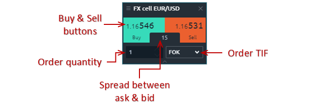

# FX Cell

### What is FX Cell

FX cell panel provides the combination of two important features - quote data and trading controls for order placement. It was designed with FX traders in mind but it can be used with any symbols for any market.

### Trading with FX Cell

* **Select a trading instrument and an account.** You can select a trading symbol manually or through linking to a Watchlist or to other panels.

* **Set the order size.** Click the size field and either type a new value or use the mouse wheel to move to a new value.
* **Set the order duration \(TIF\).** Depending on the selected connection, the TIF types may vary.
* **Place the order**. Orders are placed by clicking the buy or sell buttons. You must confirm the order before it is placed.

You can manage your open positions with the Position panel.

