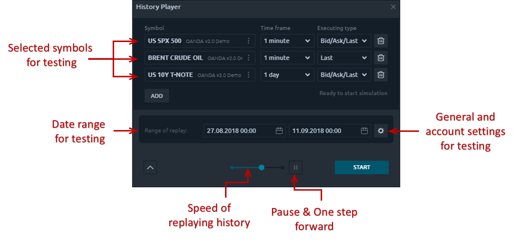
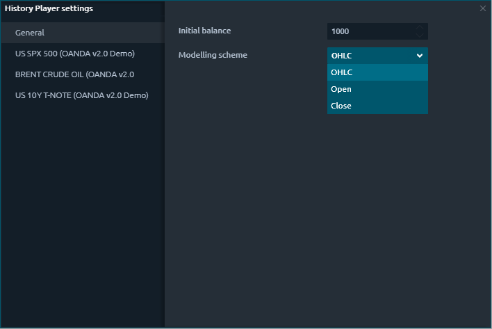

# History Player

### What is History Player

Testing of trading strategies is one of the most important and necessary steps for successful trading. If you are an experienced algotrader, then the automatic testing method is ideal and you can use our Extension for Visual Studio. But unfortunately, many traders don't know the programming language, which makes testing their strategies difficult.

Therefore Quantower provides the **History Player panel** for simple manual backtesting of any trading strategy.

History Player allows you to test on any trading instruments with any vendor or broker. This is especially useful when you have access to the data feed that does not allow execution of orders \(quotation date feeds like IQFeed, or crypto exchange\).

### First launch of the History Player

* Start the panel from the main application menu
* Add a trading instrument for testing
* Set the data type  — Tick, 1 minute, 1 day
* Set the execution type  — Last or Bid/Ask/Last

In our blog, we shown in detail the process of [manual backtesting of trading strategies using the History Player](https://www.quantower.com/blog/software-for-manual-backtesting-a-brief-review-of-history-player-plugin).

### General and instruments settings

Before you start testing the strategy, you need to set up an initial trading balance, a simulation \(or modelling\) scheme for downloaded data, a commission size for a trading instrument, and the netting type.

