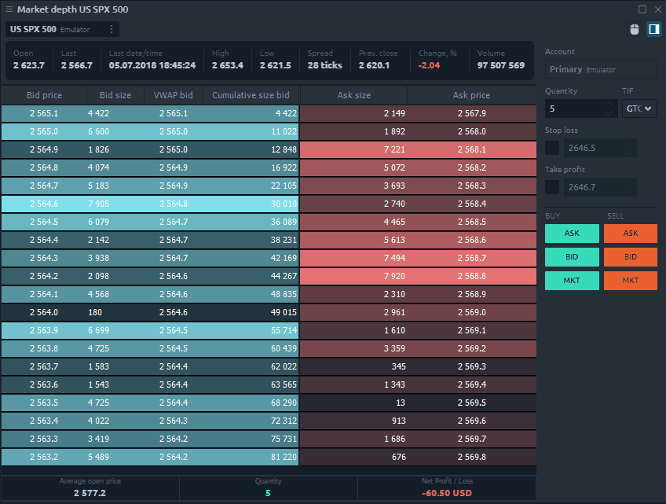
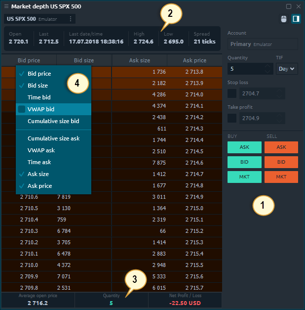
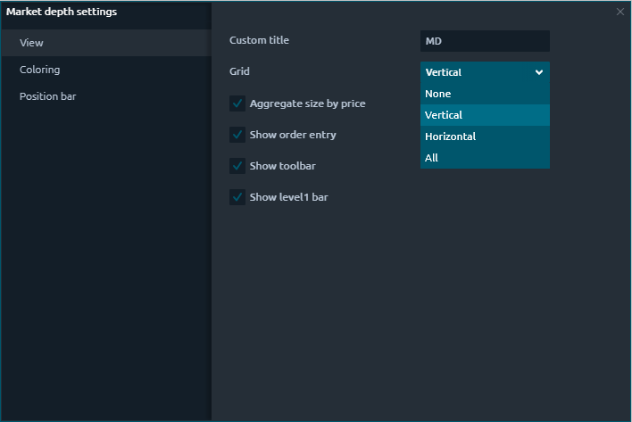
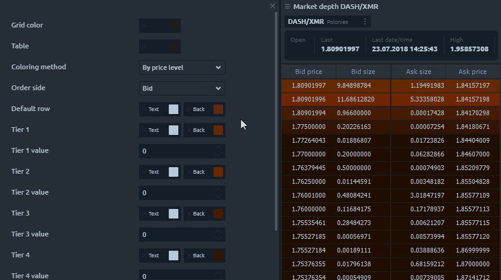
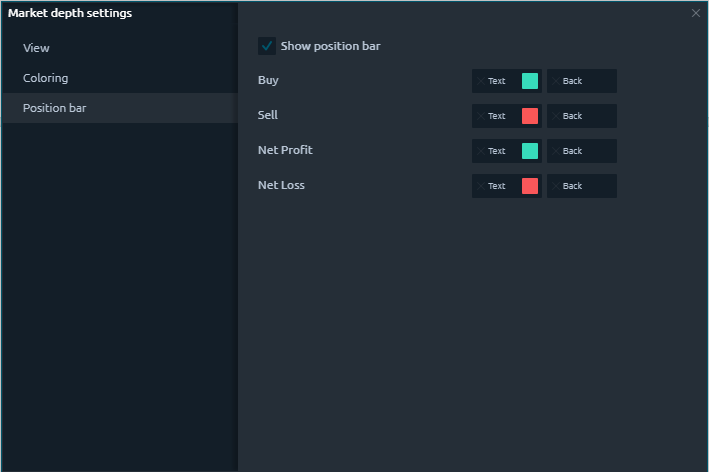

# Market depth

### General info

The Market Depth panel allows view the number of opening buy and sell orders at different price levels for a selected trading instrument. Thanks to this panel you can better understand the current market liquidity and determine where the supply and demand levels are.

### Main parts of MD panel

Market Depth panel consists of the following parts:

1. **Order Entry** where you can set the order quantity and other parameters before placing it.
2. **Level 1 bar** shows market data for the selected instrument for the current trading session.
3. **Position bar** displays a brief information about opened positions \(average open price, quantity and current P/L\)
4. **Additional columns** that can be activated to display the extended market data.

### Trading with Market Depth

Market depth panel gives you the ability to quickly and safely enter orders for an instrument with a single click. Using the order entry to configure an order in MD, you can select an account, order quantity, TIF and place an order by market or by Ask/Bid quote.

To enter an order in MD:

* Select an account and order restriction \(TIF\) in the order entry;
* Enter an order quantity;
* Click on the Bid, Ask or Market button to place your order;
* Confirm your placement by first checking all the parameters.

### Market Depth settings

Additional settings of the market depth allow you to customize the appearance of the panel, set the custom name of the panel, and also set the color schemes of the table.

#### View settings

* **Aggregate size by price.** Allows to merge Bid size and Ask size by the same price that came from different ECNs \(BATS, ARCA, IEX etc.\);
* **Show order entry.** This option shows/hides an Order Entry on the panel for quick order placement;
* **Show toolbar.** This option shows/hides the top toolbar with the trading symbol and expands the "useful" area of the panel. It is recommended to use this option with the symbol link;
* **Show Level 1.** Shows/hides the header pane, which contains Level 1 market data for the selected instrument.

#### Coloring settings

The Market depth panel has different coloring methods for Level 2 quotes which allow you to adjust the colors according to the specified conditions.

* **By price level.** Coloring system by color levels depending on price tier;
* **Relative to volume.** Level 2 quotes are colored on the assumption that the max volume has the most saturated color;
* **Step to max volume.** Level 2 quotes are colored on the assumption that the max volume value which is set in the settings has the most saturated color. Here you can set Max volume value and pick the most saturated Ask and Bid colors.

#### Position bar settings

At the bottom of the Market Depth is the Position Bar, which displays a brief info about an open position on the current trading instrument  — the number of contracts, the average open price, current profit and loss.

  

