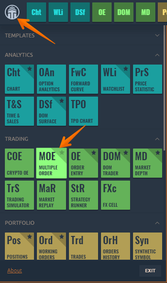

# Multiple Order Entry

Multiple Order Entry allows creating a predefined list of orders for different symbols, accounts, connections, combine them into groups, modify their parameters, and most importantly, place them to the market.



To open a new Multiple Order Entry panel, go to the _**Main menu**_ \(Logo icon\) and select _**Multiple Order Entry \(MOE\)**_ in the Trading section.

