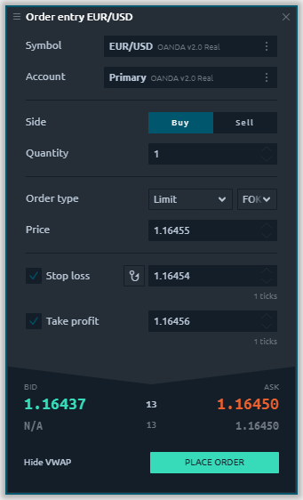
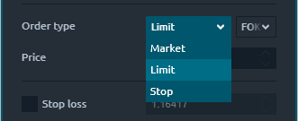
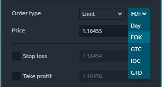
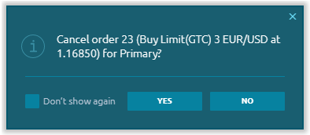

# Order Entry

### General info

Order entry panel allows to create trading orders with different conditions, such as order quantity, price, side, order type and submit them on the market. From the Order Entry panel, you can supply all of the necessary information for an order and easily submit it by clicking the appropriate action button.

The selection of a trading instrument can be performed manually through [Symbol Lookup](https://help.quantower.com/getting-started/instruments-lookup) or via linking the panel to other panels, for example, to the chart. Just select one link color in two panels and they will have a synchronized symbol parameter.

### **Order types and restrictions**

Order Entry automatically lists all exchange-supported order types available for the associated instrument under the selected connection. Within our existed connections we support:

* **Market order** is an order placed without a price with the intention of hitting the best Bid or taking the best Offer currently available in the market. The order fills at the current best price.
* **Limit order** allows to submit an order at a specific limit price or better.
* **Stop order** allows to submit a buy or sell market order if and when the stop trigger price is touched.

**Time-in-force** \(TIF\) instructions define the length of time over which an order will continue working before it is canceled. Within our existed connections we support many TIFs:

* **DAY** is an order will be canceled if it is not executed within the current trading day;
* **FOK** \(or Fill or Kill\) -  an order will be canceled if it is not executed in the entire volume as soon as it becomes available;
* **GTC** \(Good till cancelled\) orders will remain working until they are cancelled by trader or the contract expires;
* **IOC** \(Immediate or cancel\) requires that any portion of an order that is not filled as soon as it becomes available in the market is canceled;
* **GTD** \(Good till date\) order will remain working within the system and in the marketplace until it executes or until the close of the market on the date specified.


The TIF list can be different depends on connection, order type or instrument type!


### Order Confirmation

Once you have set all the necessary parameters of the order and clicked the _**Place Order**_ button, the order confirmation screen will appear.  
This window contains summary information about your order, which will allow you to verify the correctness of the entered data - order type, trade instrument, price, quantity, prices of take profit and stop loss.


If you activate the "_**Do not show again**_" checkbox, the confirmations will not be displayed and the orders will be immediately sent to the order book.   
In order to return these notifications it is necessary to activate the "_**Confirm order placement**_" checkbox in the [General settings](https://help.quantower.com/getting-started/general-settings#confirmations) of the application


