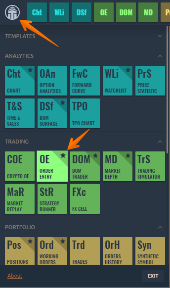

# Order entry for Bybit


Bybit - exchange for trading perpetual derivative contracts on cryptocurrencies with a leverage up to x100. Minimum contract from $1


In this article we will show: 

**How to create a Bybit order from the OE \(Order Entry\) panel** 

* How to open the Order Entry panel
* General view of the OE \(Order Entry\) panel for Bybit
* Selecting a symbol and a trading account;
*  Select order volume Order parameters - type, TIF, price, algorithmic settings TP \(take profit\) and SL stop limit \(stop loss\) of the order

**How to create a Bybit order from the quick trade panel from a chart** 

* General view of Bybit quick trade panel from a chart 
* Order volume selection 
* Buttons for fast change of order volume Order parameters - type, TIF, price, algorithmic settings TP \(take profit\) and SL stop limit \(stop loss\) orders

Entry of orders on the Quantower platform can be made in different ways, depending on the selected trading style: 

* from the Order Entry panel \(OE \) from the Quick Trader's panel from the chart trading mode with a mouse, visual trading. 
* Quick order placement through the chart area with a mouse. By setting up and trading from the hotkeys.

### How to open the Order Entry panel?

Open the main menu by clicking the logo and in the **Trading section** click on the OE icon.

## General view of the OE \(Order Entry\) panel for the Bybit exchange

The order entry panel allows you to create trade orders with different conditions, such as number of orders, price, side, order type, and send them to the market. On the order entry panel, you can provide all the necessary information for the order and easily submit it by clicking the appropriate action button

The entire panel is conventionally divided into several **zones**:

* choice of trading instrument and trading account;
* setting the required order quantity and the order side \(Buy or Sell\);
* choice of order type, its price and TIF condition;
* setting of stop loss and take profit prices;
* information on current Ask and Bid prices, spread size, VWAP prices, as well as an order placement button

### Selecting a symbol and an account and a trading account

 You can select a trading instrument manually through the Symbol Search or by linking a panel to other panels, such as a chart. Simply select the same color of link on the two panels and they will have a synchronized symbol option. 

### Select Order Volume

 You can enter an order volume by specifying the amount in the currency of the quote and as a percentage of the available margin. There are three ways to do this, as described below:

* Enter the desired amount of coins/lots based on the selected trading pair;
* Enter the total amount of the order. This field is very useful when you need to quickly specify the amount of entry into the transaction immediately in the currency of the balance, without recalculating the number of coins on the exchange rate; 
* Select with the slider the order amount in % of the total maximum available balance taking into account the set leverage.

### TP and SL orders from the OE panel \(order entry\)

 Bybit exchange allows users to calculate possible risks even **before opening a transaction \(!\)** and users can set their goals - TP \(Take Profit\) and limit losses with SL order \(Stop Loss\), simultaneously with order entry into position. To do this, on the order entry panel at the same time as setting an order, you can immediately set the necessary parameters TP and SL

### How to create a Bybit order from the quick order entry panel from the chart 

Below we will look at how to create an order on the Bybit exchange from the quick order entry panel from the chart. Before we do this, make sure that you have successfully connected to the Bybit exchange, and selected a trading pair from this connection.

You can open the Bybit chart quick order entry toolbar as shown in the figure below:

### General view of the quick trade panel from the chart for Bybit

 The general view of the order entry panel for Bybit connection looks like the following and is divided into the following categories: 

* Account and symbol selection 
* Order volume selection and direction selection
* Order parameters - type, TIF, price, algorithmic settings. 
* Mode for Stop Loss and Take Profit. 
* Order placement parameters \(strategy\)

### Order volume selection 

You can select the order volume by specifying the amount in the quote currency and in percentage of the available margin. This can be done as described below, depending on your trading style and type:

* enter the desired number of coins/lots based on the selected trading pair; 
* Using the quick change order amount buttons; 
* enter the total amount of the order. This field is extremely convenient when you need to quickly specify the amount of entry into the transaction immediately in the currency of the balance, without recalculating the number of coins on the exchange rate at the same time; 
* select with the slider the order amount in % of the total maximum available balance taking into account the set leverage.

### Quick change order amount buttons 

The quick change order amount buttons will help you change the specified volume in one click, based on your trading strategy. You can set by default any parameters that you need to quickly change the values. Moreover, the buttons can change not only the specified position volume, but also apply any \(!!!\) formulas to calculate the order volume. To set your personal values for a quick change of the order, you need to go to the settings of the chart in the menu section "Order entry" and find the field "OE buttons"

